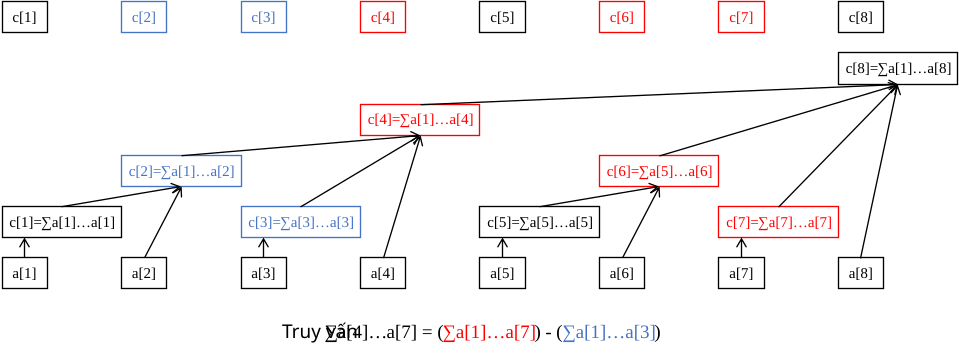

author: HeRaNO, Zhoier, Ir1d, Xeonacid, wangdehu, ouuan, ranwen, ananbaobeichicun, Ycrpro, dbxxx-oi, HowieHz, y-kx-b

## Giới thiệu

Cây Fenwick (Binary Indexed Tree, BIT) là một cấu trúc dữ liệu có lượng mã nhỏ, hỗ trợ **sửa đổi một điểm** và **truy vấn đoạn**.

??? note ""Sửa đổi một điểm" và "truy vấn đoạn" là gì?"
    Giả sử có bài toán như sau:
    
    Cho một dãy $a$, cần thực hiện hai loại thao tác:
    
    -   Cho $x, y$, tăng $a[x]$ thêm $y$.
    -   Cho $l, r$, tính tổng của $a[l \ldots r]$.
    
    Thao tác thứ nhất là "sửa đổi một điểm", thao tác thứ hai là "truy vấn đoạn".
    
    Tương tự, còn có "sửa đổi đoạn" và "truy vấn một điểm". Ví dụ:
    
    -   Sửa đổi đoạn: cho $l, r, x$, tăng mỗi số trong $a[l \ldots r]$ thêm $x$;
    -   Truy vấn một điểm: cho $x$, tính giá trị của $a[x]$.
    
    Cần chú ý rằng bài toán trên đoạn thường mạnh hơn hẳn bài toán trên một điểm, vì thao tác trên một điểm có thể xem là thao tác trên đoạn độ dài $1$.

Cây Fenwick thông thường yêu cầu thông tin và phép toán được duy trì phải thỏa mãn **tính kết hợp** và **có thể lấy sai phân**, chẳng hạn phép cộng (tổng), phép nhân (tích), xor, v.v.

-   Tính kết hợp: $(x \circ y) \circ z = x \circ (y \circ z)$, trong đó $\circ$ là một toán tử hai ngôi.
-   Có thể lấy sai phân: phép toán có phép nghịch đảo, tức biết $x \circ y$ và $x$ thì có thể suy ra $y$.

Cần chú ý:

-   Với phép nhân theo modulo, để có thể lấy sai phân thì cần bảo đảm mỗi số đều có nghịch đảo (luôn tồn tại khi modulo là số nguyên tố).
-   Các thông tin như $\gcd$, $\max$ không thể lấy sai phân, nên không thể xử lý bằng cây Fenwick thông thường. Tuy nhiên:
    -   Có thể dùng hai cây Fenwick để xử lý cực trị trên đoạn, xem [Efficient Range Minimum Queries using Binary Indexed Trees](http://history.ioinformatics.org/oi/files/volume9.pdf#page=41).
    -   Trang này cũng sẽ giới thiệu một mở rộng của cây Fenwick hỗ trợ truy vấn thông tin không thể lấy sai phân với độ phức tạp thời gian $\Theta(\log^2n)$.

Trên thực tế, tập bài toán mà cây Fenwick giải được là một tập con của tập bài toán mà cây phân đoạn giải được: những gì cây Fenwick làm được thì cây phân đoạn chắc chắn làm được; nhưng những gì cây phân đoạn làm được thì cây Fenwick chưa chắc làm được. Tuy vậy, mã của cây Fenwick ngắn hơn cây phân đoạn rất nhiều và hằng số thời gian cũng nhỏ hơn, nên vẫn rất đáng học.

Đôi khi, với sự hỗ trợ của mảng sai phân và mảng phụ, cây Fenwick còn có thể giải các bài toán mạnh hơn như **cộng đoạn, hỏi giá trị một điểm** và **cộng đoạn, hỏi tổng đoạn**.

## Cây Fenwick

### Cảm nhận ban đầu

Trước hết xét một ví dụ: nếu muốn biết tổng tiền tố $a[1 \ldots 7]$, ta làm thế nào?

Một cách là tính $a_1 + a_2 + a_3 + a_4 + a_5 + a_6 + a_7$, tức phải cộng $7$ số.

Nhưng nếu đã biết ba số $A$, $B$, $C$, trong đó $A$ là tổng của $a[1 \ldots 4]$, $B$ là tổng của $a[5 \ldots 6]$, còn $C$ là tổng của $a[7 \ldots 7]$ (thực ra chính là $a[7]$), ta sẽ tính thế nào? Chắc chắn là $A + B + C$, chỉ cần cộng $3$ số.

Đó là lý do cây Fenwick có thể trả lời nhanh: ta luôn có thể tách một tiền tố $[1, n]$ thành **không quá $\boldsymbol{\log n}$ đoạn**, sao cho thông tin của các đoạn này đều **đã biết**.

Khi đó, chỉ cần gộp thông tin của các đoạn này là có đáp án. So với việc gộp trực tiếp $n$ thông tin ban đầu, hiệu quả được cải thiện rất nhiều.

Dễ thấy thông tin cần thỏa mãn tính kết hợp; nếu không, ta không thể gộp như trên.

Hình dưới minh họa nguyên lý hoạt động của cây Fenwick:


Tám ô ở dưới cùng biểu diễn mảng dữ liệu ban đầu $a$. Các ô không đều ở phía trên (cùng là mảng với tám ô ở hàng trên cùng) biểu diễn mảng cấp trên của $a$, tức mảng $c$.

Mảng $c$ dùng để lưu tổng của một số đoạn trong mảng ban đầu $a$. Nói cách khác, thông tin của các đoạn này đã biết; mục tiêu của ta là tách tiền tố cần hỏi thành các đoạn nhỏ đó.

Ví dụ, từ hình có thể thấy:

-   $c_2$ quản lý $a[1 \ldots 2]$;
-   $c_4$ quản lý $a[1 \ldots 4]$;
-   $c_6$ quản lý $a[5 \ldots 6]$;
-   $c_8$ quản lý $a[1 \ldots 8]$;
-   các $c[x]$ còn lại đều quản lý chính $a[x]$ (có thể xem là đoạn nhỏ độ dài $1$, tức $a[x \ldots x]$).

Dễ thấy $c[x]$ luôn quản lý tổng thông tin của một đoạn có biên phải là $x$. Tạm thời chưa cần quan tâm biên trái; trước hết hãy xem cây Fenwick truy vấn như thế nào.

Ví dụ: tính tổng $a[1 \ldots 7]$.

Quá trình: bắt đầu nhảy lùi từ $c_{7}$, thấy $c_{7}$ chỉ quản lý phần tử $a_{7}$; tiếp theo tìm $c_{6}$, thấy $c_{6}$ quản lý $a[5 \ldots 6]$; sau đó nhảy tới $c_{4}$, thấy $c_{4}$ quản lý $a[1 \ldots 4]$; cuối cùng thử nhảy tới $c_0$, nhưng $c_0$ không tồn tại nên dừng.

Các phần tử $c$ vừa tìm được là $c_7, c_6, c_4$; thực ra đó chính là ba đoạn nhỏ tách ra từ $a[1 \ldots 7]$. Gộp lại ta được đáp án $c_7 + c_6 + c_4$.

Ví dụ: tính tổng $a[4 \ldots 7]$.

Ta vẫn bắt đầu từ $c_7$, nhảy tới $c_6$ rồi tới $c_4$. Lúc này ta thấy $c_4$ quản lý tổng của $a[1 \ldots 4]$, nhưng ta không muốn phần $a[1 \ldots 3]$. Xử lý rất đơn giản: trừ đi tổng $a[1 \ldots 3]$.

Vì vậy, ngay từ đầu có thể chuyển truy vấn tổng $a[4 \ldots 7]$ thành hai truy vấn tổng $a[1 \ldots 7]$ và $a[1 \ldots 3]$, rồi lấy hiệu hai kết quả.



### Đoạn quản lý

Vậy câu hỏi đặt ra là: đoạn mà $c[x](x \ge 1)$ quản lý kéo dài sang trái bao xa? Nói cách khác, độ dài đoạn là bao nhiêu?

Trong cây Fenwick, quy ước độ dài đoạn mà $c[x]$ quản lý là $2^{k}$, trong đó:

-   Nếu đánh số bit thấp nhất là bit $0$, thì $k$ chính là vị trí của bit `1` thấp nhất trong biểu diễn nhị phân của $x$;
-   $2^k$ (độ dài đoạn do $c[x]$ quản lý) chính là số tạo bởi bit `1` thấp nhất trong biểu diễn nhị phân của $x$ cùng toàn bộ các bit `0` phía sau nó.

Lấy ví dụ, $c_{88}$ quản lý đoạn nào?

Vì $88_{(10)}=01011000_{(2)}$, bit `1` thấp nhất cùng các bit `0` phía sau tạo thành nhị phân `1000`, tức $8$, nên $c_{88}$ quản lý $8$ phần tử trong mảng $a$.

Do đó, $c_{88}$ biểu diễn thông tin đoạn $a[81 \ldots 88]$.

Ký hiệu số tạo bởi bit `1` thấp nhất trong nhị phân của $x$ và các bit `0` phía sau là $\operatorname{lowbit}(x)$. Khi đó đoạn do $c[x]$ quản lý là $[x-\operatorname{lowbit}(x)+1, x]$.

???+ warning "Lưu ý"
    $\operatorname{lowbit}$ không chỉ vị trí $k$ của bit `1` thấp nhất, mà chỉ giá trị $2^k$ do bit `1` đó và toàn bộ các bit `0` phía sau tạo thành.

Tính `lowbit` thế nào? Từ kiến thức phép toán bit, ta có `lowbit(x) = x & -x`.

??? note "Nguyên lý của lowbit"
    Đảo tất cả bit trong biểu diễn nhị phân của `x`, rồi cộng thêm 1, ta nhận được mã nhị phân của `-x`. Ví dụ, mã nhị phân của $6$ là `110`; đảo toàn bộ bit được `001`, cộng `1` được `010`.
    
    Giả sử mã nhị phân ban đầu của `x` là `(...)10...00`; đảo toàn bộ bit được `[...]01...11`, cộng `1` được `[...]10...00`, tức mã nhị phân của `-x`. Ở đây bit `1` đầu tiên trong biểu diễn của `x` chính là bit `1` thấp nhất của `x`.
    
    Các bit bị lược trong `(...)` và `[...]` đối nhau từng cặp, nên `x & -x = (...)10...00 & [...]10...00 = 10...00`; kết quả thu được chính là `lowbit`.

???+ note "Cài đặt"
    === "C++"
        ```cpp
        int lowbit(int x) {
          // Số tạo bởi bit 1 thấp nhất trong nhị phân của x và mọi bit 0 phía sau.
          // lowbit(0b01011000) == 0b00001000
          //          ~~~~^~~~
          // lowbit(0b01110010) == 0b00000010
          //          ~~~~~~^~
          return x & -x;
        }
        ```
    
    === "Python"
        ```python
        def lowbit(x):
            """
            Số tạo bởi bit 1 thấp nhất trong nhị phân của x và mọi bit 0 phía sau.
            lowbit(0b01011000) == 0b00001000
                    ~~~~~^~~
            lowbit(0b01110010) == 0b00000010
                    ~~~~~~~^~
            """
            return x & -x
        ```

### Truy vấn đoạn

Tiếp theo hãy xem cách cài đặt các thao tác cụ thể của cây Fenwick, bắt đầu từ truy vấn đoạn.

Nhắc lại quá trình truy vấn $a[4 \ldots 7]$: ta chuyển nó thành hai bài toán con, truy vấn tổng $a[1 \ldots 7]$ và truy vấn tổng $a[1 \ldots 3]$, rồi lấy hiệu.

Thực ra truy vấn đoạn nào cũng có thể làm như vậy: tổng của $a[l \ldots r]$ bằng tổng của $a[1 \ldots r]$ trừ tổng của $a[1 \ldots l - 1]$. Nhờ đó, bài toán trên đoạn được chuyển thành bài toán tiền tố, thuận tiện hơn để xử lý.

Trong thi lập trình, việc chuyển truy vấn đoạn $l \ldots r$ thành hai truy vấn tiền tố $1 \ldots r$ và $1 \ldots l - 1$ rồi lấy sai phân là một kỹ thuật rất thường dùng.

Vậy truy vấn tiền tố làm thế nào? Nhắc lại quá trình truy vấn $a[1 \ldots 7]$:

> Nhảy lùi từ $c_{7}$, thấy $c_{7}$ chỉ quản lý phần tử $a_{7}$; sau đó tìm $c_{6}$, thấy $c_{6}$ quản lý $a[5 \ldots 6]$; tiếp tục nhảy tới $c_{4}$, thấy $c_{4}$ quản lý $a[1 \ldots 4]$; cuối cùng thử nhảy tới $c_0$, nhưng $c_0$ không tồn tại nên dừng.
>
> Các $c$ vừa tìm được là $c_7, c_6, c_4$; đó chính là ba đoạn nhỏ tách ra từ $a[1 \ldots 7]$. Gộp lại, đáp án là $c_7 + c_6 + c_4$.

Quan sát quá trình trên, mỗi lần nhảy lùi phải nhảy tới vị trí ngay bên trái biên trái của đoạn hiện tại, lấy nó làm biên phải của đoạn mới. Như vậy mới tách tiền tố thành các đoạn không trùng và không thiếu. Ví dụ, hiện tại $c_6$ quản lý $a[5 \ldots 6]$, nên lần sau nhảy tới $5 - 1 = 4$, tức truy cập $c_4$.

Ta có thể viết quá trình truy vấn $a[1 \ldots x]$ như sau:

-   Bắt đầu nhảy lùi từ $c[x]$, trong đó $c[x]$ quản lý $a[x-\operatorname{lowbit}(x)+1 \ldots x]$;
-   Gán $x \gets x - \operatorname{lowbit}(x)$. Nếu $x = 0$ nghĩa là đã nhảy tới cuối, kết thúc vòng lặp; nếu không thì quay lại bước đầu.
-   Gộp các $c$ đã nhảy tới.

Khi cài đặt, không nhất thiết phải lưu hết các $c$ rồi mới gộp; có thể vừa nhảy vừa gộp.

Ví dụ nếu thông tin cần duy trì là tổng, đặt ban đầu $\mathrm{ans} = 0$, rồi mỗi khi nhảy tới một $c[x]$ thì cập nhật $\mathrm{ans} \gets \mathrm{ans} + c[x]$. Cuối cùng $\mathrm{ans}$ chính là kết quả gộp.

???+ note "Cài đặt"
    === "C++"
        ```cpp
        int getsum(int x) {  // Tổng của a[1]..a[x]
          int ans = 0;
          while (x > 0) {
            ans = ans + c[x];
            x = x - lowbit(x);
          }
          return ans;
        }
        ```
    
    === "Python"
        ```python
        def getsum(x):  # Tổng của a[1]..a[x]
            ans = 0
            while x > 0:
                ans = ans + c[x]
                x = x - lowbit(x)
            return ans
        ```

### Cây Fenwick và các tính chất của dạng cây

Trước khi trình bày sửa đổi một điểm, hãy nói về một số tính chất cơ bản của cây Fenwick và nguồn gốc dạng cây của nó. Điều này giúp hiểu thao tác sửa đổi một điểm tốt hơn.

Ta quy ước:

-   $l(x) = x - \operatorname{lowbit}(x) + 1$. Tức $l(x)$ là biên trái của phạm vi do $c[x]$ quản lý.
-   Với mọi số nguyên dương $x$, luôn có thể biểu diễn $x$ dưới dạng $s \times 2^{k + 1} + 2^k$, trong đó $\operatorname{lowbit}(x) = 2^k$.
-   Bên dưới, "$c[x]$ và $c[y]$ không giao nhau" nghĩa là phạm vi quản lý của $c[x]$ và $c[y]$ không giao nhau, tức $[l(x), x]$ và $[l(y), y]$ không giao nhau. Các cách nói như "$c[x]$ nằm trong $c[y]$" được hiểu tương tự.

**Tính chất $\boldsymbol{1}$: với $\boldsymbol{x \le y}$, hoặc $\boldsymbol{c[x]}$ và $\boldsymbol{c[y]}$ không giao nhau, hoặc $\boldsymbol{c[x]}$ nằm trong $\boldsymbol{c[y]}$.**

??? note "Chứng minh"
    Giả sử $c[x]$ và $c[y]$ giao nhau, tức $[l(x), x]$ và $[l(y), y]$ giao nhau, khi đó chắc chắn có $l(y) \le x \le y$.
    
    Biểu diễn $y$ thành $s \times 2^{k +1} + 2^k$, khi đó $l(y) = s \times 2^{k + 1} + 1$. Vì vậy, $x$ có thể biểu diễn thành $s \times 2^{k +1} + b$, trong đó $1 \le b \le 2^k$.
    
    Dễ thấy $\operatorname{lowbit}(x) = \operatorname{lowbit}(b)$. Lại vì $b - \operatorname{lowbit}(b) \ge 0$,
    
    nên $l(x) = x - \operatorname{lowbit}(x) + 1 = s \times 2^{k +1} + b - \operatorname{lowbit}(b) +1 \ge s \times 2^{k +1} + 1 = l(y)$, tức $l(y) \le l(x) \le x \le y$.
    
    Vì vậy, nếu $c[x]$ và $c[y]$ giao nhau, phạm vi quản lý của $c[x]$ chắc chắn nằm hoàn toàn trong phạm vi quản lý của $c[y]$.

**Tính chất $\boldsymbol{2}$: $\boldsymbol{c[x]}$ là tập con thực sự của $\boldsymbol{c[x + \operatorname{lowbit}(x)]}$.**

??? note "Chứng minh"
    Đặt $y = x + \operatorname{lowbit}(x)$, $x = s \times 2^{k + 1} + 2^k$, khi đó $y = (s + 1) \times 2^{k +1}$ và $l(x) = s \times 2^{k + 1} + 1$.
    
    Dễ thấy $\operatorname{lowbit}(y) \ge 2^{k + 1}$, nên $l(y) = (s + 1) \times 2^{k + 1} - \operatorname{lowbit}(y) + 1 \le s \times 2^{k +1} + 1= l(x)$, tức $l(y) \le l(x) \le x < y$.
    
    Vì vậy, $c[x]$ là tập con thực sự của $c[x + \operatorname{lowbit}(x)]$.

**Tính chất $3$: với mọi $\boldsymbol{x < y < x + \operatorname{lowbit}(x)}$, $\boldsymbol{c[x]}$ và $\boldsymbol{c[y]}$ không giao nhau.**

??? note "Chứng minh"
    Đặt $x = s \times 2^{k + 1} + 2^k$, khi đó $y = x + b = s \times 2^{k + 1} + 2^k + b$, trong đó $1 \le b < 2^k$.
    
    Dễ thấy $\operatorname{lowbit}(y) = \operatorname{lowbit}(b)$. Lại vì $b - \operatorname{lowbit}(b) \ge 0$,
    
    nên $l(y) = y - \operatorname{lowbit}(y) + 1 = x + b - \operatorname{lowbit}(b) + 1 > x$, tức $l(x) \le x < l(y) \le y$.
    
    Vì vậy, $c[x]$ và $c[y]$ không giao nhau.

Sau ba tính chất làm nền, hãy xem dạng cây của cây Fenwick (bỏ qua các cạnh từ $a$ tới $c$).


Thực ra dạng cây của cây Fenwick là đồ thị thu được bằng cách nối cạnh từ $x$ tới $x + \operatorname{lowbit}(x)$, trong đó $x + \operatorname{lowbit}(x)$ là cha của $x$.

Cần chú ý rằng khi xét dạng cây của cây Fenwick, ta không xét ảnh hưởng của kích thước cây, tức xem nó như một cây vô hạn để tiện phân tích. Khi cài đặt thực tế, ta chỉ cần dùng các $c[x]$ với $x \le n$, trong đó $n$ là độ dài mảng ban đầu.

Cây này tự nhiên thỏa mãn nhiều tính chất đẹp. Dưới đây là một số tính chất (đặt $fa[u]$ là cha trực tiếp của $u$):

-   $u < fa[u]$.
-   $u$ lớn hơn mọi hậu duệ của $u$ và nhỏ hơn mọi tổ tiên của $u$.
-   $\operatorname{lowbit}$ của điểm $u$ nhỏ hơn nghiêm ngặt $\operatorname{lowbit}$ của $fa[u]$.

??? note "Chứng minh"
    Đặt $y = x + \operatorname{lowbit}(x)$, $x = s \times 2^{k + 1} + 2^k$, khi đó $y = (s + 1) \times 2^{k +1}$. Dễ thấy $\operatorname{lowbit}(y) \ge 2^{k + 1} > \operatorname{lowbit}(x)$, chứng minh xong.

-   Chiều cao của điểm $x$ là $\log_2\operatorname{lowbit}(x)$, tức vị trí của bit `1` thấp nhất trong biểu diễn nhị phân của $x$.

??? note "Định nghĩa chiều cao"
    Chiều cao $h(x)$ của điểm $x$ thỏa mãn: nếu $x \bmod 2 = 1$, thì $h(x) = 0$; ngược lại $h(x) = \max(h(y)) + 1$, trong đó $y$ chạy qua mọi con của $x$ (lúc này $x$ có ít nhất một con là $x - 1$).
    
    Nói cách khác, chiều cao của một điểm đúng bằng chiều cao lớn nhất trong các con của nó cộng thêm $1$. Nếu một điểm không có con, chiều cao của nó là $0$.
    
    Khái niệm chiều cao được đưa ra ở đây để phần giải thích độ phức tạp phía sau thuận tiện hơn.

-   $c[u]$ là tập con thực sự của $c[fa[u]]$ (tính chất $2$).
-   $c[u]$ là tập con thực sự của $c[v]$, trong đó $v$ là một tổ tiên bất kỳ của $u$ (quy nạp từ tính chất trước).
-   $c[u]$ chứa thực sự $c[v]$, trong đó $v$ là một hậu duệ bất kỳ của $u$ (đảo $u$, $v$ trong tính chất trên).
-   Với mọi $v' > u$, nếu $v'$ không phải tổ tiên của $u$, thì $c[u]$ và $c[v']$ không giao nhau.

??? note "Chứng minh"
    Trong $u$ và các tổ tiên của $u$, chắc chắn tồn tại một điểm $v$ sao cho $v < v' < fa[v]$. Theo tính chất $3$, $c[v']$ không giao với $c[v]$; mà $c[v]$ chứa $c[u]$, nên $c[v']$ không giao với $c[u]$.

-   Với mọi $v < u$, nếu $v$ không nằm trong cây con của $u$, thì $c[u]$ và $c[v]$ không giao nhau (đảo $u$, $v'$ trong tính chất trên).
-   Với mọi $v > u$, $c[u]$ là tập con thực sự của $c[v]$ khi và chỉ khi $v$ là tổ tiên của $u$ (tổng hợp các tính chất trên). Đây là nguyên lý cốt lõi của thao tác sửa đổi một điểm trong cây Fenwick.
-   Đặt $u = s \times 2^{k + 1} + 2^k$. Khi đó số con của nó là $k = \log_2\operatorname{lowbit}(u)$, được đánh số lần lượt là $u - 2^t(0 \le t < k)$.
    -   Ví dụ: giả sử $k = 3$, mã nhị phân của $u$ là `...1000`, thì $u$ có ba con với mã nhị phân lần lượt là `...0111`, `...0110`, `...0100`.

??? note "Chứng minh"
    Khi trừ $2^t$ khỏi một số $x$, bit thứ $t$ trong biểu diễn nhị phân của $x$ sẽ đảo, còn các bit thấp hơn giữ nguyên.
    
    Xét một con $v$ của $u$, ta có $v + \operatorname{lowbit}(v) = u$, tức $v = u - 2^t$ và $\operatorname{lowbit}(v) = 2^t$. Đặt $u = s \times 2^{k + 1} + 2^k$.
    
    **Xét $\boldsymbol{0 \le t < k}$**, bit thứ $t$ của $u$ và các bit phía sau đều là $0$, nên bit thứ $t$ của $v = u - 2^t$ trở thành $1$, các bit phía sau vẫn là $0$, do đó **thỏa mãn** $\operatorname{lowbit}(v) = 2^t$.
    
    **Xét $\boldsymbol{t = k}$**, khi đó $v = u - 2^k$, bit thứ $k$ của $v$ trở thành $0$, nên **không thỏa mãn** $\operatorname{lowbit}(v) = 2^t$.
    
    **Xét $\boldsymbol{t > k}$**, khi đó $v = u - 2^t$, bit thứ $k$ của $v$ là $1$, nên $\operatorname{lowbit}(v) = 2^k$, **không thỏa mãn** $\operatorname{lowbit}(v) = 2^t$.

-   Các đoạn quản lý bởi $c$ ứng với mọi con của $u$ ghép lại đúng bằng $[l(u), u - 1]$.
    -   Ví dụ: giả sử $k = 3$, mã nhị phân của $u$ là `...1000`, thì $u$ có ba con với mã nhị phân lần lượt là `...0111`, `...0110`, `...0100`.
    -   `c[...0100]` biểu diễn `a[...0001 ~ ...0100]`.
    -   `c[...0110]` biểu diễn `a[...0101 ~ ...0110]`.
    -   `c[...0111]` biểu diễn `a[...0111 ~ ...0111]`.
    -   Dễ thấy hợp của ba đoạn quản lý trên đúng bằng `a[...0001 ~ ...0111]`, tức $[l(u), u - 1]$.

??? note "Chứng minh"
    Con của $u$ luôn biểu diễn được dưới dạng $u - 2^t(0 \le t < k)$. Dễ thấy $t$ càng nhỏ thì $u - 2^t$ càng lớn, đoạn tương ứng càng nằm về bên phải. Đặt $f(t) = u - 2^t$, khi đó $f(k - 1), f(k - 2), \ldots, f(0)$ lần lượt là các con của $u$ từ trái sang phải.
    
    Dễ thấy $\operatorname{lowbit}(f(t)) = 2^t$, nên $l(f(t)) = u - 2^t - 2^t + 1 = u - 2^{t + 1} + 1$.
    
    Xét hai con kề nhau $f(t + 1)$ và $f(t)$. Biên phải của đoạn do con trước quản lý là $f(t + 1) = u - 2^{t + 1}$, còn biên trái của đoạn do con sau quản lý là $l(f(t)) = u - 2^{t + 1} + 1$, vừa đúng liền nhau.
    
    Xét con ngoài cùng bên trái $f(k - 1)$, biên trái quản lý của nó là $l(f(k - 1)) = u - 2^k + 1$, đúng bằng $l(u)$.
    
    Xét con ngoài cùng bên phải $f(0)$, biên phải quản lý của nó chính là $u - 1$.
    
    Do đó, các đoạn quản lý của những con này ghép lại vừa đúng thành $[l(u), u - 1]$.

### Sửa đổi một điểm

Bây giờ xét cách sửa đổi một điểm $a[x]$.

Mục tiêu là duy trì mảng $c$ nhanh và đúng. Để bảo đảm hiệu quả, ta chỉ cần duyệt và sửa mọi $c[y]$ có quản lý $a[x]$, vì các $c$ khác rõ ràng không thay đổi.

Mọi $c[y]$ quản lý $a[x]$ chắc chắn chứa $c[x]$ (theo tính chất $1$), nên $y$ là tổ tiên của $x$ trên dạng cây Fenwick. Vì vậy, ta bắt đầu từ $x$ và liên tục nhảy lên cha cho tới khi vượt quá độ dài mảng ban đầu.

Gọi $n$ là kích thước của $a$. Có thể viết quá trình sửa đổi một điểm $a[x]$ như sau:

-   Ban đầu đặt $x' = x$.
-   Sửa $c[x']$.
-   Gán $x' \gets x' + \operatorname{lowbit}(x')$. Nếu $x' > n$ nghĩa là đã nhảy tới cuối, kết thúc vòng lặp; nếu không, quay lại bước thứ hai.

Thông tin đoạn và loại sửa đổi một điểm cùng quyết định cách sửa $c[x']$. Một vài ví dụ:

-   Nếu $c[x']$ duy trì tổng đoạn, còn thao tác sửa là cộng $p$ vào $a[x]$, thì cách sửa là cộng $p$ vào mọi $c[x']$.
-   Nếu $c[x']$ duy trì tích đoạn, còn thao tác sửa là nhân $a[x]$ với $p$, thì cách sửa là nhân mọi $c[x']$ với $p$.

Tuy nhiên, do sửa đổi một điểm khá linh hoạt, loại sửa đổi và thông tin được duy trì không nhất thiết phải là cùng một phép toán. Ví dụ, nếu $c[x']$ duy trì tổng đoạn, còn thao tác sửa là gán $a[x]$ thành $p$, ta có thể chuyển thành cộng $p - a[x]$ vào $a[x]$. Nếu thao tác là nhân $a[x]$ với $p$, có thể chuyển thành cộng $a[x] \times p - a[x]$ vào $a[x]$.

Dưới đây là cài đặt mẫu cho trường hợp duy trì tổng đoạn và cộng một điểm.

???+ note "Cài đặt"
    === "C++"
        ```cpp
        void add(int x, int k) {
          while (x <= n) {  // Không được vượt biên.
            c[x] = c[x] + k;
            x = x + lowbit(x);
          }
        }
        ```
    
    === "Python"
        ```python
        def add(x, k):
            while x <= n:  # Không được vượt biên.
                c[x] = c[x] + k
                x = x + lowbit(x)
        ```

### Xây cây

Tức xây cây Fenwick từ dãy ban đầu (tiền xử lý toàn bộ $c$).

Thông thường có thể chuyển trực tiếp thành $n$ lần sửa đổi một điểm, độ phức tạp thời gian $\Theta(n \log n)$ (phân tích độ phức tạp ở phần sau).

Ví dụ, nếu cần xây cây cho dãy $a = (5, 1, 4)$, có thể xem như cộng $5$ vào $a[1]$, cộng $1$ vào $a[2]$, và cộng $4$ vào $a[3]$.

Cũng có cách xây cây $\Theta(n)$, xem phần [$\Theta(n)$ xây cây](#thetan-xây-cây) trên trang này.

### Phân tích độ phức tạp

Độ phức tạp không gian rõ ràng là $\Theta(n)$.

Độ phức tạp thời gian:

-   Với thao tác truy vấn đoạn: toàn bộ quá trình lặp $x \gets x - \operatorname{lowbit}(x)$ có thể xem là quá trình đổi dần mọi bit `1` trong nhị phân của $x$ thành `0` từ thấp lên cao. Số đoạn tách ra bằng số bit `1` trong biểu diễn nhị phân của $x$ (tức $\operatorname{popcount}(x)$). Vì vậy, độ phức tạp mỗi truy vấn là $\Theta(\log n)$.
-   Với thao tác sửa đổi một điểm: khi nhảy lên cha, chiều cao của các điểm được truy cập luôn tăng nghiêm ngặt và luôn có $x \le n$. Vì chiều cao của điểm $x$ là $\log_2\operatorname{lowbit}(x)$, nên chiều cao nhảy tới không vượt quá $\log_2n$, số lượng $c$ được truy cập ở cấp $\log n$. Vì vậy, độ phức tạp mỗi lần sửa đổi một điểm là $\Theta(\log n)$.

## Cộng đoạn, hỏi tổng đoạn

Kiến thức cần có: [tổng tiền tố & sai phân](../basic/prefix-sum.md).

Bài toán này có thể được giải bằng hai cây Fenwick duy trì mảng sai phân.

Xét mảng sai phân $d$ của dãy $a$, trong đó $d[i] = a[i] - a[i - 1]$. Vì tổng tiền tố của mảng sai phân chính là mảng ban đầu, nên $a_i=\sum_{j=1}^i d_j$.

Tương tự, ta xét việc chuyển truy vấn tổng đoạn thành truy vấn tổng tiền tố bằng sai phân. Với truy vấn tổng của $a[1 \ldots r]$, tức $\sum_{i=1}^{r} a_i$, ta suy diễn:

$$
\begin{aligned}
&\sum_{i=1}^{r} a_i\\=&\sum_{i=1}^r\sum_{j=1}^i d_j
\end{aligned}
$$

Quan sát công thức này, dễ thấy mỗi $d_j$ được cộng tổng cộng $r - j + 1$ lần. Tiếp tục suy diễn:

$$
\begin{aligned}
&\sum_{i=1}^r\sum_{j=1}^i d_j\\=&\sum_{i=1}^r d_i\times(r-i+1)
\\=&\sum_{i=1}^r d_i\times (r+1)-\sum_{i=1}^r d_i\times i
\end{aligned}
$$

Từ $\sum_{i=1}^r d_i$ không thể suy ra giá trị của $\sum_{i=1}^r d_i \times i$, nên cần dùng hai cây Fenwick để lần lượt duy trì thông tin tổng của $d_i$ và $d_i \times i$.

Vậy cộng đoạn làm thế nào? Xét ảnh hưởng của việc cộng $v$ vào đoạn $a[l \ldots r]$ của mảng ban đầu đối với $d$.

Vì sai phân là $d[i] = a[i] - a[i - 1]$:

-   $a[l]$ tăng thêm $v$ còn $a[l - 1]$ không đổi, nên giá trị $d[l]$ tăng thêm $v$.
-   $a[r + 1]$ không đổi còn $a[r]$ tăng thêm $v$, nên giá trị $d[r + 1]$ giảm đi $v$.
-   Với mọi $i$ khác $l$ và khác $r+1$, $a[i]$ và $a[i - 1]$ hoặc đều không đổi, hoặc đều tăng thêm $v$; $a[i] + v - (a[i - 1] + v)$ vẫn là $a[i] - a[i - 1]$, nên các $d[i]$ khác đều không đổi.

Từ đó dễ nghĩ ra cách duy trì: với cây Fenwick duy trì $d_i$, cộng một điểm $v$ tại $l$ và cộng một điểm $-v$ tại $r + 1$; với cây Fenwick duy trì $d_i \times i$, cộng một điểm $v \times l$ tại $l$ và cộng một điểm $-v \times (r + 1)$ tại $r + 1$.

Bài toán yếu hơn, "cộng đoạn, hỏi giá trị một điểm", chỉ cần dùng một cây Fenwick duy trì mảng sai phân $d_i$. Khi hỏi giá trị một điểm $a[x]$, chỉ cần tính tổng của $d[1 \ldots x]$.

Dưới đây là mã cho bài toán "cộng đoạn, hỏi tổng đoạn":

???+ note "Cài đặt"
    === "C++"
        ```cpp
        int t1[MAXN], t2[MAXN], n;
        
        int lowbit(int x) { return x & (-x); }
        
        void add(int k, int v) {
          int v1 = k * v;
          while (k <= n) {
            t1[k] += v, t2[k] += v1;
            // Chú ý không được viết t2[k] += k * v, vì k không còn là chỉ số ban đầu.
            k += lowbit(k);
          }
        }
        
        int getsum(int *t, int k) {
          int ret = 0;
          while (k) {
            ret += t[k];
            k -= lowbit(k);
          }
          return ret;
        }
        
        void add1(int l, int r, int v) {
          add(l, v), add(r + 1, -v);  // Tách cộng đoạn thành hai lần cộng tiền tố.
        }
        
        long long getsum1(int l, int r) {
          return (r + 1ll) * getsum(t1, r) - 1ll * l * getsum(t1, l - 1) -
                 (getsum(t2, r) - getsum(t2, l - 1));
        }
        ```
    
    === "Python"
        ```python
        t1 = [0] * MAXN
        t2 = [0] * MAXN
        n = 0
        
        
        def lowbit(x):
            return x & (-x)
        
        
        def add(k, v):
            v1 = k * v
            while k <= n:
                t1[k] = t1[k] + v
                t2[k] = t2[k] + v1
                k = k + lowbit(k)
        
        
        def getsum(t, k):
            ret = 0
            while k:
                ret = ret + t[k]
                k = k - lowbit(k)
            return ret
        
        
        def add1(l, r, v):
            add(l, v)
            add(r + 1, -v)
        
        
        def getsum1(l, r):
            return (
                (r) * getsum(t1, r)
                - l * getsum(t1, l - 1)
                - (getsum(t2, r) - getsum(t2, l - 1))
            )
        ```

Theo nguyên lý này, ta cũng có thể cài đặt "nhân đoạn, hỏi tích đoạn", "xor một số trên đoạn, hỏi xor đoạn", v.v., miễn là thông tin được duy trì và thao tác trên đoạn thuộc cùng một phép toán. Bạn đọc quan tâm có thể tự thử.

## Cây Fenwick hai chiều

### Sửa đổi một điểm, truy vấn ma trận con

Cây Fenwick hai chiều còn được gọi là cây Fenwick lồng cây Fenwick, dùng để duy trì các bài toán sửa đổi một điểm và thông tin tiền tố trên mảng hai chiều.

Tương tự cây Fenwick một chiều, ta dùng $c(x, y)$ để biểu diễn tổng thông tin của ma trận $a(x - \operatorname{lowbit}(x) + 1, y - \operatorname{lowbit}(y) + 1) \ldots a(x, y)$, tức ma trận có góc dưới phải là $a(x, y)$, cao $\operatorname{lowbit}(x)$ và rộng $\operatorname{lowbit}(y)$.

Với thao tác sửa đổi một điểm, đặt:

$$
f(x, i) = \begin{cases}x &i = 0\\f(x, i - 1) + \operatorname{lowbit}(f(x, i - 1)) & i > 0\\\end{cases}
$$

Tức $f(x, i)$ là tổ tiên cấp $i$ của $x$ trên dạng cây Fenwick (tổ tiên cấp $0$ là chính nó).

Khi đó chỉ các phần tử $c(f(x, i), f(y, j))$ mới quản lý $a(x, y)$. Khi sửa $a(x, y)$, chỉ cần sửa tất cả $c(f(x, i), f(y, j))$ với $f(x, i) \le n$, $f(y, j) \le m$.

??? note "Chứng minh tính đúng đắn"
    Giả sử $c(p, q)$ quản lý $a(x, y)$, ta cần tìm phạm vi giá trị của $p$ và $q$.
    
    Xét một cây Fenwick một chiều $c_1$ kích thước $n$ (ứng với mảng gốc $a_1$) và một cây Fenwick một chiều $c_2$ kích thước $m$ (ứng với mảng gốc $a_2$).
    
    Khi đó mệnh đề tương đương với điều kiện: $c_1(p)$ quản lý $a_1[x]$ và $c_2(q)$ quản lý $a_2[y]$.
    
    Nói cách khác, trên dạng cây Fenwick, $p$ là một điểm trong $x$ và các tổ tiên của nó, còn $q$ là một điểm trong $y$ và các tổ tiên của nó.
    
    Vì vậy $p = f(x, i)$, $q = f(y, j)$.

Với truy vấn, đặt:

$$
g(x, i) = \begin{cases}x &i = 0\\g(x, i - 1) - \operatorname{lowbit}(g(x, i - 1)) & i, g(x, i - 1) > 0\\0&\text{otherwise.}\end{cases}
$$

Khi đó gộp mọi $c(g(x, i), g(y, j))$ với $g(x, i), g(y, j) > 0$.

??? note "Chứng minh tính đúng đắn"
    Gọi $\circ$ là toán tử gộp hai thông tin (ví dụ, nếu thông tin là tổng đoạn thì $\circ = +$).
    
    Xét một cây Fenwick một chiều $c_1$. Biểu thức $c_1[g(x, 0)] \circ c_1[g(x, 1)] \circ c_1[g(x, 2)] \circ \cdots$ biểu diễn đúng thông tin đoạn $[1 \ldots x]$ trên mảng gốc.
    
    Tương tự, đặt $t(x) = c(x, g(y, 0)) \circ c(x, g(y, 1)) \circ c(x, g(y, 2)) \circ \cdots$, khi đó $t(x)$ biểu diễn đúng thông tin của ma trận $a(x - \operatorname{lowbit}(x) + 1, 1) \ldots a(x, y)$.
    
    Tương tự thêm lần nữa, $t(g(x, 0)) \circ t(g(x, 1)) \circ t(g(x, 2)) \circ \cdots$ biểu diễn thông tin của ma trận $a(1, 1) \ldots a(x, y)$.
    
    Nếu xem hàm $t(x)$ ở đây như một cây Fenwick, thì cấu trúc này tương đương với một cây Fenwick lồng trong một cây Fenwick khác; đây chính là nguồn gốc của tên gọi "cây Fenwick lồng cây Fenwick".

Dưới đây là mã cho thao tác cộng một điểm và truy vấn tổng ma trận con.

???+ note "Cài đặt"
    === "Cộng một điểm"
        ```cpp
        void add(int x, int y, int v) {
          for (int i = x; i <= n; i += lowbit(i)) {
            for (int j = y; j <= m; j += lowbit(j)) {
              // Ở đây phải tạo biến vòng lặp, không thể dùng trực tiếp while (x <= n) như mảng một chiều.
              c[i][j] += v;
            }
          }
        }
        ```
    
    === "Truy vấn tổng ma trận con"
        ```cpp
        int sum(int x, int y) {
          int res = 0;
          for (int i = x; i > 0; i -= lowbit(i)) {
            for (int j = y; j > 0; j -= lowbit(j)) {
              res += c[i][j];
            }
          }
          return res;
        }
        
        int ask(int x1, int y1, int x2, int y2) {
          // Truy vấn tổng ma trận con
          return sum(x2, y2) - sum(x2, y1 - 1) - sum(x1 - 1, y2) + sum(x1 - 1, y1 - 1);
        }
        ```

### Cộng ma trận con, hỏi tổng ma trận con

Kiến thức cần có: [tổng tiền tố & sai phân](../basic/prefix-sum.md) và phần [cộng đoạn, hỏi tổng đoạn](#cộng-đoạn-hỏi-tổng-đoạn) trên trang này.

Tương tự bài toán "cộng đoạn, hỏi tổng đoạn" của cây Fenwick một chiều, ta xét việc duy trì mảng sai phân.

Mảng sai phân trên mảng hai chiều được định nghĩa như sau:

$$
d(i, j) = a(i, j) - a(i - 1, j) - a(i, j - 1) + a(i - 1, j - 1).
$$

??? note "Vì sao định nghĩa như vậy?"
    Lý do là trong trạng thái lý tưởng, lấy tổng tiền tố hai chiều trên ma trận sai phân phải thu được ma trận ban đầu, vì đây là một cặp phép toán nghịch đảo.
    
    Công thức tổng tiền tố hai chiều là:
    
    $s(i, j) = s(i - 1, j) + s(i, j - 1) - s(i - 1, j - 1) + a(i, j)$.
    
    Vì vậy, nếu $a$ là mảng gốc và $d$ là mảng sai phân, ta có:
    
    $a(i, j) = a(i - 1, j) + a(i, j - 1) - a(i - 1, j - 1) + d(i, j)$
    
    Chuyển vế sẽ thu được công thức sai phân hai chiều.
    
    $d(i, j) = a(i, j) - a(i - 1, j) - a(i, j - 1) + a(i - 1, j - 1)$.

Như vậy, cộng $v$ vào ma trận con có góc trên trái $(x_1, y_1)$ và góc dưới phải $(x_2, y_2)$ tương đương với việc cộng một điểm $v$ vào $d(x_1, y_1)$ và $d(x_2 + 1, y_2 + 1)$, đồng thời cộng một điểm $-v$ vào $d(x_2 + 1, y_1)$ và $d(x_1, y_2 + 1)$ trên mảng sai phân.

Lý do là chỉ cần viết bốn giá trị $d$ này theo định nghĩa rồi phân tích biến thiên của từng hạng.

Lấy ví dụ, ban đầu mảng sai phân toàn $0$. Sau khi cộng $v$ vào ma trận con $a(2, 2) \ldots a(3, 4)$, mảng sai phân trở thành:

$$
\begin{pmatrix}0&0&0&0&0\\0&v&0&0&-v\\0&0&0&0&0\\0&-v&0&0&v\end{pmatrix}
$$

(Trong đó ma trận con $a(2, 2) \ldots a(3, 4)$ đúng là ma trận kích thước $2 \times 3$ nằm ở trung tâm phía trên.)

Do đó, cách làm cộng ma trận con là chuyển thành bốn thao tác cộng một điểm trên mảng sai phân.

Bây giờ xét truy vấn tổng ma trận con.

Với điểm $(x, y)$, tổng tiền tố hai chiều của nó có thể biểu diễn là:

$$
\sum_{i = 1}^x\sum_{j = 1}^y\sum_{h = 1}^i\sum_{k = 1}^j d(h, k)
$$

Lý do là tổng tiền tố của tổng tiền tố trên sai phân chính là tổng tiền tố ban đầu.

Tương tự bài toán "cộng đoạn, hỏi tổng đoạn" của cây Fenwick một chiều, số lần xuất hiện của $d(h, k)$ là $(x - h + 1) \times (y - k + 1)$.

Tiếp tục suy diễn:

$$
\begin{aligned}
&\sum_{i = 1}^x\sum_{j = 1}^y\sum_{h = 1}^i\sum_{k = 1}^j d(h, k)
\\=&\sum_{i = 1}^x\sum_{j = 1}^y d(i, j) \times (x - i + 1) \times (y - j + 1)
\\=&\sum_{i = 1}^x\sum_{j = 1}^y d(i, j) \times (xy + x + y + 1) - d(i, j) \times i \times (y + 1) - d(i, j) \times j \times (x + 1) + d(i, j) \times i \times j
\end{aligned}
$$

Vì vậy, ta cần duy trì bốn cây Fenwick, lần lượt duy trì thông tin tổng của $d(i, j)$, $d(i, j) \times i$, $d(i, j) \times j$, $d(i, j) \times i \times j$.

Dĩ nhiên, tương tự trường hợp một chiều, nếu chỉ cần cộng ma trận con và hỏi giá trị một điểm, duy trì một mảng sai phân rồi truy vấn tiền tố là đủ.

Dưới đây là mã:

???+ note "Cài đặt"
    ```cpp
    using ll = long long;
    ll t1[N][N], t2[N][N], t3[N][N], t4[N][N];
    
    void add(ll x, ll y, ll z) {
      for (int X = x; X <= n; X += lowbit(X))
        for (int Y = y; Y <= m; Y += lowbit(Y)) {
          t1[X][Y] += z;
          t2[X][Y] += z * x;  // Chú ý là z * x chứ không phải z * X; phía sau tương tự.
          t3[X][Y] += z * y;
          t4[X][Y] += z * x * y;
        }
    }
    
    void range_add(ll xa, ll ya, ll xb, ll yb,
                   ll z) {  // Ma trận con từ (xa, ya) tới (xb, yb)
      add(xa, ya, z);
      add(xa, yb + 1, -z);
      add(xb + 1, ya, -z);
      add(xb + 1, yb + 1, z);
    }
    
    ll ask(ll x, ll y) {
      ll res = 0;
      for (int i = x; i; i -= lowbit(i))
        for (int j = y; j; j -= lowbit(j))
          res += (x + 1) * (y + 1) * t1[i][j] - (y + 1) * t2[i][j] -
                 (x + 1) * t3[i][j] + t4[i][j];
      return res;
    }
    
    ll range_ask(ll xa, ll ya, ll xb, ll yb) {
      return ask(xb, yb) - ask(xb, ya - 1) - ask(xa - 1, yb) + ask(xa - 1, ya - 1);
    }
    ```

## Cây Fenwick theo giá trị và ứng dụng

Ta biết rằng cây Fenwick thông thường được xây trực tiếp trên dãy ban đầu; $c_6$ biểu diễn thông tin đoạn $a[5 \ldots 6]$.

Tuy nhiên, ta cũng có thể xây cây Fenwick trên mảng tần suất giá trị của dãy ban đầu; đây chính là cây Fenwick theo giá trị.

??? note "Mảng tần suất giá trị là gì?"
    Mảng tần suất giá trị $b$ của một dãy $a$ thỏa mãn: giá trị $b[x]$ là số lần $x$ xuất hiện trong $a$.
    
    Ví dụ: với $a = (1, 3, 4, 3, 4)$, mảng tần suất giá trị là $b = (1, 0, 2, 2)$.
    
    Rõ ràng kích thước của $b$ liên quan tới miền giá trị của $a$.
    
    Nếu miền giá trị của dãy ban đầu quá lớn, và điều quan trọng không phải giá trị cụ thể mà là quan hệ thứ tự tương đối giữa các giá trị, ta thường [rời rạc hóa](../misc/discrete.md) mảng ban đầu rồi mới xây mảng tần suất giá trị.
    
    Ngoài ra, mảng tần suất giá trị là một cách biểu diễn bỏ qua thứ tự của mảng gốc: nó tập trung mô tả nội dung phần tử của mảng và bỏ qua thứ tự. Nếu hai mảng chỉ khác thứ tự nhưng chứa cùng các phần tử, mảng tần suất giá trị của chúng giống nhau.
    
    Vì vậy, với các bài toán mà thứ tự của mảng cho trước không ảnh hưởng đến đáp án, suy nghĩ dựa trên mảng tần suất giá trị thường trực quan hơn, ví dụ [\[NOIP2021\] Dãy số](https://www.luogu.com.cn/problem/P7961).

Dùng cây Fenwick theo giá trị, ta có thể giải một số bài toán kinh điển.

### Sửa đổi một điểm, truy vấn phần tử nhỏ thứ $k$ toàn cục

Ở đây chỉ thảo luận phần tử nhỏ thứ $k$; bài toán phần tử lớn thứ $k$ có thể chuyển thành phần tử nhỏ thứ $k$ bằng tính toán đơn giản.

Bài toán này có thể rời rạc hóa. Nếu miền giá trị của dãy gốc $a$ quá lớn, hãy rời rạc hóa rồi xây mảng tần suất giá trị $b$. Chú ý cũng phải rời rạc hóa cả các giá trị xuất hiện trong thao tác sửa đổi một điểm, không thể chỉ rời rạc hóa các phần tử ban đầu của mảng $a$.

Với sửa đổi một điểm, chỉ cần chuyển thao tác sửa trên dãy gốc thành thao tác sửa trên mảng tần suất giá trị. Cụ thể, nếu $a[x]$ trong mảng gốc được đổi từ $y$ thành $z$, thì trên mảng tần suất $b$ ta giảm $b[y]$ đi $1$ và tăng $b[z]$ thêm $1$.

Với truy vấn phần tử nhỏ thứ $k$, có thể nhị phân $x$, truy vấn tổng tiền tố $[1, x]$ trong mảng tần suất giá trị, rồi tìm $x_0$ sao cho tổng tiền tố $[1, x_0] < k$ còn tổng tiền tố $[1, x_0 + 1] \ge k$. Khi đó phần tử nhỏ thứ $k$ là $x_0 + 1$ (quy ước tổng tiền tố $[1, 0]$ là $0$).

Cách này có độ phức tạp thời gian $\Theta(\log^2n)$.

Xét dùng nhân đôi thay cho nhị phân.

Đặt $x = 0$, $\mathrm{sum} = 0$, duyệt $i$ từ $\log_2n$ giảm xuống $0$:

-   Truy vấn tổng đoạn $[x + 1 \ldots x + 2^i]$ trong mảng tần suất giá trị, gọi là $t$.
-   Nếu $\mathrm{sum} + t < k$, mở rộng thành công, đặt $x \gets x + 2^i$, $\mathrm{sum} \gets \mathrm{sum} + t$; nếu không, mở rộng thất bại và không làm gì.

Giá trị $x$ thu được là giá trị lớn nhất sao cho tổng tiền tố $[1 \ldots x] < k$, nên cuối cùng $x + 1$ là đáp án.

Thoạt nhìn cách này không cải thiện thời gian, nhưng thực ra truy vấn tổng đoạn $[x + 1 \ldots x + 2^i]$ chỉ cần truy cập giá trị $c[x + 2^i]$.

Lý do rất đơn giản: xét $\operatorname{lowbit}(x + 2^i)$, nó chắc chắn là $2^i$, vì trước đó $x$ chỉ cộng các $2^j$ với $j > i$. Do đó, đoạn mà $c[x + 2^i]$ biểu diễn chính là $[x + 1 \ldots x + 2^i]$.

Như vậy, độ phức tạp thời gian giảm xuống $\Theta(\log n)$.

???+ note "Cài đặt"
    === "C++"
        ```cpp
        // Cây Fenwick theo giá trị truy vấn phần tử nhỏ thứ k
        int kth(int k) {
          int sum = 0, x = 0;
          for (int i = log2(n); ~i; --i) {
            x += 1 << i;                   // Thử mở rộng.
            if (x > n || sum + t[x] >= k)  // Nếu mở rộng thất bại.
              x -= 1 << i;
            else
              sum += t[x];
          }
          return x + 1;  // Nếu không tìm được thì trả về n + 1.
        }
        ```
    
    === "Python"
        ```python
        # Cây Fenwick theo giá trị truy vấn phần tử nhỏ thứ k
        def kth(k):
            sum = 0
            x = 0
            i = int(log2(n))
            while ~i:
                x = x + (1 << i)  # Thử mở rộng.
                if x > n or sum + t[x] >= k:  # Nếu mở rộng thất bại.
                    x = x - (1 << i)
                else:
                    sum = sum + t[x]
                i = i - 1
            return x + 1  # Nếu không tìm được thì trả về n + 1.
        ```

### Cặp nghịch thế toàn cục (thứ tự bộ phận hai chiều toàn cục)

Đọc thêm và cài đặt tham khảo: [cặp nghịch thế](../math/permutation.md#số-nghịch-thế)

Cặp nghịch thế toàn cục cũng có thể được giải khéo léo bằng cây Fenwick theo giá trị. Bài toán như sau: cho dãy $a$ độ dài $n$, hãy tính số cặp $(i, j)$ trong $a$ thỏa mãn $i < j$ và $a[i] > a[j]$.

Bài toán này có thể rời rạc hóa. Nếu miền giá trị của dãy gốc $a$ quá lớn, hãy rời rạc hóa rồi xây mảng tần suất giá trị $b$.

Ta xét duyệt ngược $i$ từ $n$ về $1$, xem $i$ là chỉ số của phần tử đầu tiên trong cặp nghịch thế, rồi tính có bao nhiêu $j > i$ thỏa mãn $a[j] < a[i]$, cuối cùng cộng dồn vào đáp án.

Thực ra chỉ cần làm như sau (giả sử hiện tại $a[i] = x$):

-   Truy vấn tổng tiền tố $b[1 \ldots x - 1]$, đó chính là số cặp nghịch thế có đầu trái là $a[i]$.
-   Tăng $b[x]$ thêm $1$.

Lý do rất tự nhiên: các phần tử xuất hiện trong $b[1 \ldots x-1]$ chắc chắn nhỏ hơn $x = a[i]$ hiện tại, còn việc duyệt ngược $i$ bảo đảm những phần tử đã có trong mảng tần suất giá trị có chỉ số $j$ trong mảng gốc lớn hơn chỉ số $i$ đang duyệt.

Minh họa bằng ví dụ $a = (4, 3, 1, 2, 1)$.

Quét $i$ theo thứ tự $5 \to 1$:

-   $a[5] = 1$, truy vấn tổng tiền tố $b[1 \ldots 0]$ được $0$, tăng $b[1]$ thêm $1$, $b = (1, 0, 0, 0)$.
-   $a[4] = 2$, truy vấn tổng tiền tố $b[1 \ldots 1]$ được $1$, tăng $b[2]$ thêm $1$, $b = (1, 1, 0, 0)$.
-   $a[3] = 1$, truy vấn tổng tiền tố $b[1 \ldots 0]$ được $0$, tăng $b[1]$ thêm $1$, $b = (2, 1, 0, 0)$.
-   $a[2] = 3$, truy vấn tổng tiền tố $b[1 \ldots 2]$ được $3$, tăng $b[3]$ thêm $1$, $b = (2, 1, 1, 0)$.
-   $a[1] = 4$, truy vấn tổng tiền tố $b[1 \ldots 3]$ được $4$, tăng $b[4]$ thêm $1$, $b = (2, 1, 1, 1)$.

Vì vậy đáp án cuối cùng là $0 + 1 + 0 + 3 + 4 = 8$.

Chú ý rằng hai bước truy vấn $b[1 \ldots x - 1]$ và tăng $b[x]$ sau khi duyệt $i$ có thể đổi thứ tự thành tăng $b[x]$ trước rồi truy vấn $b[1 \ldots x - 1]$, mà không ảnh hưởng đáp án. Có thể giải thích từ hai góc độ:

-   Việc sửa $b[x]$ không ảnh hưởng tới truy vấn $b[1 \ldots x - 1]$.
-   Sau khi đổi thứ tự, thực chất ta đang đếm số cặp thỏa mãn $i \le j$ và $a[i] > a[j]$; nhưng khi $i = j$ không thể có $a[i] > a[j]$, nên $i \le j$ tương đương $i < j$. Vì vậy nó tương đương với bài toán nghịch thế ban đầu.

Nếu cần đếm số cặp nghịch thế không nghiêm ngặt ($i < j$ và $a[i] \ge a[j]$), thì phải đổi thành truy vấn tổng $b[1 \ldots x]$. Lúc này không thể đổi thứ tự hai bước. Vẫn có hai cách giải thích:

-   Việc sửa $b[x]$ **ảnh hưởng** tới truy vấn $b[1 \ldots x]$.
-   Sau khi đổi thứ tự, thực chất ta đang đếm số cặp thỏa mãn $i \le j$ và $a[i] \ge a[j]$; nhưng khi $i = j$ luôn có $a[i] \ge a[j]$, nên $i \le j$ **không tương đương** với $i < j$, và **không tương đương** với bài toán gốc.

Nếu cần đếm số cặp thỏa mãn $i \le j$ và $a[i] \ge a[j]$, thì hai bước này cần được đổi thứ tự.

Ngoài ra, với bài toán nghịch thế ban đầu còn có một cách khác: duyệt xuôi $j$, truy vấn có bao nhiêu $i < j$ thỏa mãn $a[i] > a[j]$. Cách làm như sau (đặt $x = a[j]$):

-   Truy vấn tổng đoạn $b[x + 1 \ldots V]$ ($V$ là kích thước của $b$, tức miền giá trị của $a$ hoặc miền giá trị sau rời rạc hóa).
-   Tăng $b[x]$ thêm $1$.

Lý do: các phần tử xuất hiện trong $b[x + 1 \ldots V]$ chắc chắn lớn hơn $x = a[j]$ hiện tại, còn việc duyệt xuôi $j$ bảo đảm những phần tử đã có trong mảng tần suất giá trị có chỉ số $i$ trong mảng gốc nhỏ hơn chỉ số $j$ đang duyệt.

Ngoài ra, việc đếm nghịch thế cũng có thể giải bằng [sắp xếp trộn](../basic/merge-sort.md#nghịch-thế). Cách này tránh được rời rạc hóa, và độ phức tạp thời gian cũng là $O(n\log n)$. Cài đặt tham khảo của cả hai thuật toán đều nằm trong chương [nghịch thế](../math/permutation.md#số-nghịch-thế).

## Cây Fenwick duy trì thông tin không thể lấy sai phân

Ví dụ như duy trì cực trị trên đoạn.

Chú ý rằng tuy phương pháp này có lượng mã nhỏ, độ phức tạp thời gian của cả sửa đổi một điểm và truy vấn đoạn đều là $\Theta(\log^2n)$, kém hơn độ phức tạp $\Theta(\log n)$ khi dùng cây phân đoạn.

### Truy vấn đoạn

Ta vẫn dựa trên ý tưởng trước đó: từ $r$ liên tục nhảy lùi theo $\operatorname{lowbit}$, nhưng không được nhảy sang bên trái $l$.

Do đó, nếu ta nhảy tới $c[x]$, trước hết kiểm tra vị trí lần sau sẽ nhảy tới, $x - \operatorname{lowbit}(x)$, có nhỏ hơn $l$ hay không:

-   Nếu nhỏ hơn $l$, ta gộp trực tiếp **một điểm $\boldsymbol{a[x]}$** vào tổng thông tin, rồi nhảy tới $c[x - 1]$.
-   Nếu lớn hơn hoặc bằng $l$, nghĩa là không vượt biên, cứ gộp $c[x]$ bình thường rồi nhảy tới $c[x - \operatorname{lowbit}(x)]$.

Dưới đây là mã ví dụ cho truy vấn giá trị lớn nhất trên đoạn:

???+ note "Cài đặt"
    ```cpp
    int getmax(int l, int r) {
      int ans = 0;
      while (r >= l) {
        ans = max(ans, a[r]);
        --r;
        for (; r - lowbit(r) >= l; r -= lowbit(r)) {
          // Chú ý, điều kiện vòng lặp không được viết thành r - lowbit(r) + 1 >= l.
          // Nếu không, khi l = 1, r nhảy tới 0 sẽ gây vòng lặp vô hạn.
          ans = max(ans, C[r]);
        }
      }
      return ans;
    }
    ```

Có thể chứng minh độ phức tạp thời gian của thuật toán trên là $\Theta(\log^2n)$.

??? note "Chứng minh độ phức tạp thời gian"
    Xét bit cao nhất mà $r$ và $l$ khác nhau. Chắc chắn $r$ có bit này bằng $1$, còn $l$ có bit này bằng $0$ (vì $r \ge l$).
    
    Nếu phía sau bit này của $r$ vẫn còn bit $1$, chắc chắn có $r - \operatorname{lowbit}(r) \ge l$, nên bước tiếp theo chắc chắn đổi bit `1` thấp nhất của $r$ thành `0`.
    
    Nếu bit $1$ này của $r$ chính là bit `1` thấp nhất của $r$, thì dù thực hiện $r \gets r - \operatorname{lowbit}(r)$ hay $r \gets r - 1$, bit $1$ này của $r$ chắc chắn sẽ trở thành $0$.
    
    Vì vậy, sau nhiều nhất $\log n$ lần biến đổi, bit cao nhất mà $r$ và $l$ khác nhau chắc chắn có thể giảm xuống một vị trí. Do đó, tổng độ phức tạp thời gian là $\Theta(\log^2n)$.

### Cập nhật một điểm

???+ note "Chú ý"
    Hãy hiểu hai tính chất sau của dạng cây Fenwick trước khi học phần này.
    
    -   Đặt $u = s \times 2^{k + 1} + 2^k$. Khi đó số con của nó là $k = \log_2\operatorname{lowbit}(u)$, được đánh số lần lượt là $u - 2^t(0 \le t < k)$.
    -   Các đoạn quản lý bởi $c$ ứng với mọi con của $u$ ghép lại đúng bằng $[l(u), u - 1]$.
    
    Ý nghĩa và chứng minh của hai tính chất này đều có trong phần [cây Fenwick và các tính chất của dạng cây](#cây-fenwick-và-các-tính-chất-của-dạng-cây) trên trang này.

Sau khi cập nhật $a[x]$, ta chỉ cần cập nhật các $c[y]$ sao cho trên dạng cây Fenwick, $y$ là tổ tiên của $x$.

Với cực trị (lấy giá trị lớn nhất làm ví dụ), một suy nghĩ sai thường gặp là: nếu sửa $a[x]$ thành $p$, thì cập nhật mọi $c[y]$ thành $\max(c[y], p)$. Phản ví dụ: trong $(1, 2, 3, 4, 5)$, sửa $5$ thành $4$ thì giá trị lớn nhất là $4$, nhưng cách cập nhật trên vẫn cho kết quả $5$. Cập nhật trực tiếp $c[y]$ thành $p$ cũng sai; một phản ví dụ là sửa $3$ trong ví dụ trên thành $4$.

Thực ra với thông tin không thể lấy sai phân, không tồn tại cách sửa trực tiếp $c[y]$ chỉ dựa vào $p$. Lý do là thao tác sửa tương đương với việc "loại bỏ" số cũ khỏi đoạn gốc rồi thêm một số mới. Ảnh hưởng của bước "loại bỏ" lên thông tin đoạn tương đương với thực hiện "phép nghịch đảo"; nhưng thông tin không thể lấy sai phân không có "phép nghịch đảo", nên không thể sửa trực tiếp $c[y]$.

Nói cách khác, với mỗi $c[y]$ bị ảnh hưởng, ta bắt buộc phải dựng lại thông tin của đoạn đó.

Xét các con của $c[y]$. Thông tin của chúng chắc chắn đúng (vì ta cập nhật con trước rồi cập nhật cha), và các con này ghép lại đúng đoạn quản lý $[l(y), y - 1]$. Khi gộp thêm một điểm $a[y]$, ta thu được thông tin của $[l(y), y]$, tức $c[y]$. Như vậy, mỗi $c$ cần sửa có thể được dựng lại bằng cách gộp nhiều nhất $\log n$ đoạn.

???+ note "Cài đặt"
    ```cpp
    void update(int x, int v) {
      a[x] = v;
      for (int i = x; i <= n; i += lowbit(i)) {
        // Duyệt các đoạn bị ảnh hưởng.
        C[i] = a[i];
        for (int j = 1; j < lowbit(i); j *= 2) {
          C[i] = max(C[i], C[i - j]);
        }
      }
    }
    ```

Dễ thấy thuật toán trên có độ phức tạp thời gian $\Theta(\log^2n)$.

### Xây cây

Có thể tách thành $n$ lần sửa đổi một điểm, xây cây trong $\Theta(n\log^2n)$.

Cũng có cách xây cây $\Theta(n)$, xem phương pháp một trong phần [$\Theta(n)$ xây cây](#thetan-xây-cây) trên trang này.

## Tricks

### $\Theta(n)$ xây cây

Lấy việc duy trì tổng đoạn làm ví dụ.

Phương pháp một:

Giá trị của mỗi nút thu được bằng cách cộng giá trị của mọi con trực tiếp của nó. Vì vậy, có thể xét đóng góp theo chiều ngược: mỗi khi xác định xong giá trị của một con, dùng giá trị của nó để cập nhật cha trực tiếp.

???+ note "Cài đặt"
    === "C++"
        ```cpp
        // Xây cây Θ(n)
        void init() {
          for (int i = 1; i <= n; ++i) {
            t[i] += a[i];
            int j = i + lowbit(i);
            if (j <= n) t[j] += t[i];
          }
        }
        ```
    
    === "Python"
        ```python
        # Xây cây Θ(n)
        def init():
            for i in range(1, n + 1):
                t[i] = t[i] + a[i]
                j = i + lowbit(i)
                if j <= n:
                    t[j] = t[j] + t[i]
        ```

Phương pháp hai:

Phía trước đã nói đoạn mà $c[i]$ biểu diễn là $[i-\operatorname{lowbit}(i)+1, i]$, nên ta có thể tiền xử lý một mảng tổng tiền tố $\mathrm{sum}$ rồi tính mảng $c$.

???+ note "Cài đặt"
    === "C++"
        ```cpp
        // Xây cây Θ(n)
        void init() {
          for (int i = 1; i <= n; ++i) {
            t[i] = sum[i] - sum[i - lowbit(i)];
          }
        }
        ```
    
    === "Python"
        ```python
        # Xây cây Θ(n)
        def init():
            for i in range(1, n + 1):
                t[i] = sum[i] - sum[i - lowbit(i)]
        ```

### Tối ưu bằng dấu thời gian

Đây là kỹ thuật rất thường gặp khi xử lý nhiều bộ dữ liệu. Nếu mỗi lần nhập dữ liệu mới đều xóa thô toàn bộ cây Fenwick, có thể bị quá thời gian. Vì vậy, ta dùng nhãn $\mathrm{tag}$ để lưu thời điểm sử dụng gần nhất của nút hiện tại (tức lần gần nhất nó được dùng ở bộ dữ liệu thứ mấy). Mỗi lần thao tác, kiểm tra thời gian trong $\mathrm{tag}$ tại vị trí này có bằng thời gian hiện tại hay không, từ đó biết vị trí này nên được xem là $0$ hay là giá trị trong mảng.

???+ note "Cài đặt"
    === "C++"
        ```cpp
        // Tối ưu bằng dấu thời gian
        int tag[MAXN], t[MAXN], Tag;
        
        void reset() { ++Tag; }
        
        void add(int k, int v) {
          while (k <= n) {
            if (tag[k] != Tag) t[k] = 0;
            t[k] += v, tag[k] = Tag;
            k += lowbit(k);
          }
        }
        
        int getsum(int k) {
          int ret = 0;
          while (k) {
            if (tag[k] == Tag) ret += t[k];
            k -= lowbit(k);
          }
          return ret;
        }
        ```
    
    === "Python"
        ```python
        # Tối ưu bằng dấu thời gian
        tag = [0] * MAXN
        t = [0] * MAXN
        Tag = 0
        
        
        def reset():
            Tag = Tag + 1
        
        
        def add(k, v):
            while k <= n:
                if tag[k] != Tag:
                    t[k] = 0
                t[k] = t[k] + v
                tag[k] = Tag
                k = k + lowbit(k)
        
        
        def getsum(k):
            ret = 0
            while k:
                if tag[k] == Tag:
                    ret = ret + t[k]
                k = k - lowbit(k)
            return ret
        ```

## Bài tập

-   [Cây Fenwick 1: sửa đổi một điểm, truy vấn đoạn](https://loj.ac/problem/130)
-   [Cây Fenwick 2: sửa đổi đoạn, truy vấn một điểm](https://loj.ac/problem/131)
-   [Cây Fenwick 3: sửa đổi đoạn, truy vấn đoạn](https://loj.ac/problem/132)
-   [Cây Fenwick hai chiều 1: sửa đổi một điểm, truy vấn đoạn](https://loj.ac/problem/133)
-   [Cây Fenwick hai chiều 2: sửa đổi đoạn, truy vấn một điểm](https://loj.ac/problem/134)
-   [Cây Fenwick hai chiều 3: sửa đổi đoạn, truy vấn đoạn](https://loj.ac/problem/135)
