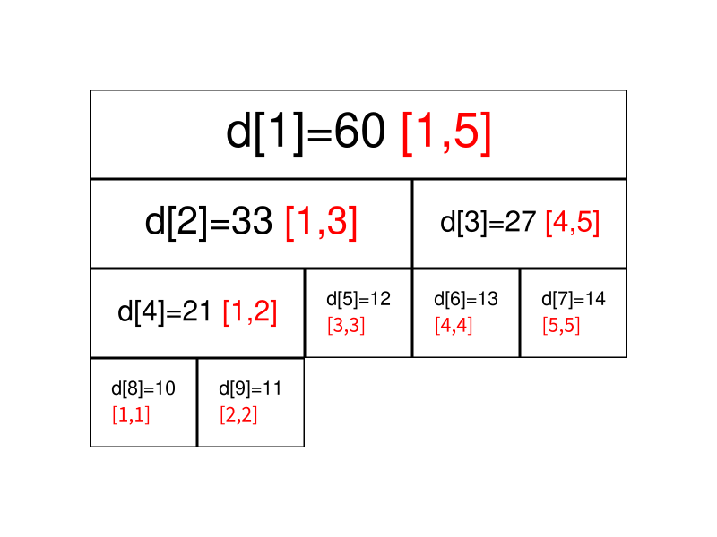
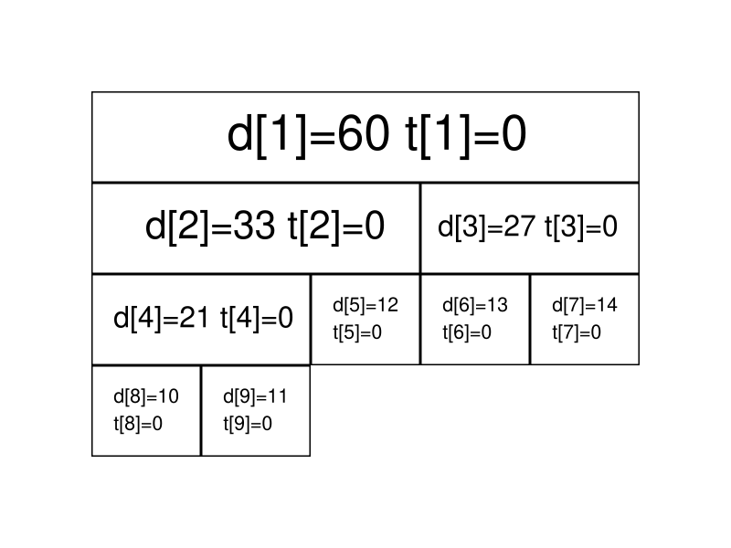
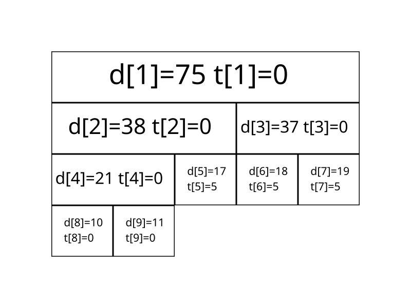
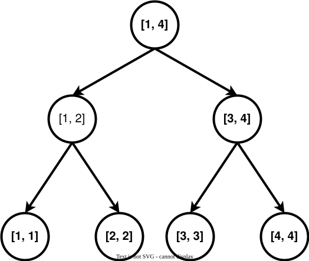
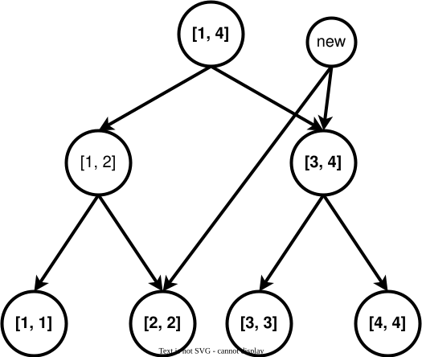

author: Marcythm, Ir1d, Ycrpro, Xeonacid, konnyakuxzy, CJSoft, HeRaNO, ethan-enhe, ChungZH, Chrogeek, hsfzLZH1, billchenchina, orzAtalod, luoguojie, Early0v0, wy-luke

## Giới thiệu

Cây phân đoạn là một cấu trúc dữ liệu thường dùng trong lập trình thi đấu để duy trì **thông tin trên đoạn**.

Cây phân đoạn có thể thực hiện các thao tác như sửa đổi một điểm, sửa đổi đoạn, truy vấn đoạn (tính tổng đoạn, tìm giá trị lớn nhất/nhỏ nhất trên đoạn) trong thời gian $O(\log N)$.

## Cấu trúc cơ bản và xây cây

### Quy trình

Cây phân đoạn chia mỗi đoạn có độ dài khác $1$ thành hai đoạn trái/phải và giải đệ quy, từ đó biến toàn bộ đoạn thành một cấu trúc dạng cây. Thông tin của một đoạn được tính bằng cách hợp nhất thông tin của hai đoạn con trái/phải. Cấu trúc dữ liệu này xử lý thuận tiện phần lớn các thao tác trên đoạn.

Với mảng kích thước $5$ là $a=\{10,11,12,13,14\}$, để chuyển nó thành cây phân đoạn, ta làm như sau: đặt nút gốc của cây phân đoạn có số hiệu $1$, dùng mảng $d$ để lưu cây phân đoạn, và $d_i$ lưu giá trị của nút có số hiệu $i$ trên cây phân đoạn (ở đây giá trị mà mỗi nút duy trì là tổng đoạn mà nút đó biểu diễn).

Trước hết, hình dạng của cây phân đoạn này như sau:



Trong hình, đoạn được đánh dấu bằng chữ đỏ trong mỗi nút biểu thị phạm vi vị trí trên mảng $a$ mà nút đó quản lý. Chẳng hạn, đoạn do $d_1$ quản lý là $[1,5]$ ($a_1,a_2, \cdots ,a_5$), tức giá trị được lưu trong $d_1$ là $a_1+a_2+ \cdots +a_5$; $d_1=60$ nghĩa là $a_1+a_2+ \cdots +a_5=60$.

Quan sát dễ thấy, con trái của $d_i$ là $d_{2\times i}$, còn con phải của $d_i$ là $d_{2\times i+1}$. Nếu $d_i$ biểu diễn đoạn $[s,t]$ (tức $d_i=a_s+a_{s+1}+ \cdots +a_t$), thì con trái của $d_i$ biểu diễn đoạn $[ s, \frac{s+t}{2} ]$, còn con phải của $d_i$ biểu diễn đoạn $[ \frac{s+t}{2} +1,t ]$.

Khi cài đặt, ta thường xây cây bằng đệ quy. Giả sử nút gốc hiện tại là $p$. Nếu đoạn mà nút gốc quản lý đã có độ dài $1$, có thể khởi tạo trực tiếp nút này bằng giá trị tại vị trí tương ứng trong mảng $a$. Ngược lại, ta chia đoạn này tại trung điểm thành hai đoạn con, lần lượt đi vào con trái và con phải để xây cây đệ quy, cuối cùng hợp nhất thông tin của hai nút con.

### Cài đặt

Dưới đây là mã cài đặt; có thể đọc thêm các chú thích để hiểu:

=== "C++"
    ```cpp
    void build(int s, int t, int p) {
      // Xây cây phân đoạn cho đoạn [s,t], nút gốc hiện tại có số hiệu p.
      if (s == t) {
        d[p] = a[s];
        return;
      }
      int m = s + ((t - s) >> 1);
      // Toán tử dịch bit có độ ưu tiên thấp hơn cộng/trừ, nên cần ngoặc.
      // Viết (s + t) >> 1 có thể vượt phạm vi int.
      build(s, m, p * 2), build(m + 1, t, p * 2 + 1);
      // Xây đệ quy cho hai đoạn trái/phải.
      d[p] = d[p * 2] + d[(p * 2) + 1];
    }
    ```

=== "Python"
    ```python
    def build(s, t, p):
        # Xây cây phân đoạn cho đoạn [s,t], nút gốc hiện tại có số hiệu p.
        if s == t:
            d[p] = a[s]
            return
        m = s + ((t - s) >> 1)
        # Toán tử dịch bit có độ ưu tiên thấp hơn cộng/trừ, nên cần ngoặc.
        # Viết (s + t) >> 1 có thể vượt phạm vi int.
        build(s, m, p * 2)
        build(m + 1, t, p * 2 + 1)
        # Xây đệ quy cho hai đoạn trái/phải.
        d[p] = d[p * 2] + d[(p * 2) + 1]
    ```

Về bộ nhớ của cây phân đoạn: nếu dùng cách lưu kiểu heap ($2p$ là con trái của $p$, $2p+1$ là con phải của $p$), khi có $n$ nút lá thì kích thước lớn nhất cần cho mảng $d$ là $2^{\left\lceil\log{n}\right\rceil+1}$.

Phân tích: dễ thấy độ sâu của cây phân đoạn là $\left\lceil\log{n}\right\rceil$. Khi lưu kiểu heap, số nút lá (kể cả các nút lá vô dụng) là $2^{\left\lceil\log{n}\right\rceil}$. Vì đây là một cây nhị phân đầy đủ, tổng số nút là $2^{\left\lceil\log{n}\right\rceil+1}-1$. Dĩ nhiên nếu không muốn tính kỹ, có thể đặt độ dài mảng là $4n$, vì giá trị lớn nhất của $\frac{2^{\left\lceil\log{n}\right\rceil+1}-1}{n}$ đạt được khi $n=2^{x}+1(x\in N_{+})$; khi đó số nút là $2^{\left\lceil\log{n}\right\rceil+1}-1=2^{x+2}-1=4n-5$.

Vì lưu kiểu heap có các nút lá vô dụng, có thể cân nhắc dùng bộ nhớ dạng pool để quản lý nút cây phân đoạn, mỗi khi cần tạo nút mới thì lấy từ pool. Xét từ dưới lên, cứ hai nút tầng dưới sẽ hợp nhất thành một nút tầng trên, nên có thể chứng minh tương tự cây Huffman rằng nếu có $n$ nút lá, cây phân đoạn như vậy có tổng cộng $2n-1$ nút. Hiệu quả bộ nhớ của cách này tốt hơn lưu kiểu heap và có thể là tối ưu.

Cây phân đoạn kiểu này có thể được duy trì từ dưới lên; tham khảo "[Sức mạnh của thống kê - Zhang Kunwei](https://github.com/hzwer/shareOI/blob/master/%E6%95%B0%E6%8D%AE%E7%BB%93%E6%9E%84/%E7%BB%9F%E8%AE%A1%E7%9A%84%E5%8A%9B%E9%87%8F%E2%80%94%E2%80%94%E7%BA%BF%E6%AE%B5%E6%A0%91%E5%85%A8%E6%8E%A5%E8%A7%A6_%E5%BC%A0%E6%98%86%E7%8E%AE.pptx)".

## Truy vấn đoạn trên cây phân đoạn

### Quy trình

Truy vấn đoạn là các thao tác như tính tổng đoạn $[l,r]$ (tức $a_l+a_{l+1}+ \cdots +a_r$), tìm giá trị lớn nhất/nhỏ nhất trên đoạn, v.v.


Vẫn lấy hình ban đầu làm ví dụ, nếu cần truy vấn tổng đoạn $[1,5]$, chỉ cần lấy trực tiếp giá trị của $d_1$ ($60$).

Nếu đoạn cần truy vấn là $[3,5]$, lúc này không thể lấy trực tiếp giá trị của đoạn. Tuy nhiên $[3,5]$ có thể tách thành $[3,3]$ và $[4,5]$, rồi hợp nhất đáp án của hai đoạn này để thu được đáp án của cả đoạn.

Nói chung, nếu đoạn cần truy vấn là $[l,r]$, ta có thể tách nó thành nhiều nhất $O(\log n)$ đoạn **cực đại**, rồi hợp nhất các đoạn đó để tính đáp án của $[l,r]$.

### Cài đặt

Dưới đây là mã cài đặt; có thể đọc thêm các chú thích để hiểu:

=== "C++"
    ```cpp
    int getsum(int l, int r, int s, int t, int p) {
      // [l, r] là đoạn truy vấn, [s, t] là đoạn của nút hiện tại, p là số hiệu nút.
      if (l <= s && t <= r)
        return d[p];  // Nếu đoạn hiện tại nằm trong đoạn hỏi, trả về tổng của nó.
      int m = s + ((t - s) >> 1), sum = 0;
      if (l <= m) sum += getsum(l, r, s, m, p * 2);
      // Nếu đoạn [s, m] của con trái giao với đoạn hỏi, truy vấn đệ quy con trái.
      if (r > m) sum += getsum(l, r, m + 1, t, p * 2 + 1);
      // Nếu đoạn [m + 1, t] của con phải giao với đoạn hỏi, truy vấn đệ quy con phải.
      return sum;
    }
    ```

=== "Python"
    ```python
    def getsum(l, r, s, t, p):
        # [l, r] là đoạn truy vấn, [s, t] là đoạn của nút hiện tại, p là số hiệu nút.
        if l <= s and t <= r:
            return d[p]  # Nếu đoạn hiện tại nằm trong đoạn hỏi, trả về tổng của nó.
        m = s + ((t - s) >> 1)
        sum = 0
        if l <= m:
            sum = sum + getsum(l, r, s, m, p * 2)
        # Nếu đoạn [s, m] của con trái giao với đoạn hỏi, truy vấn đệ quy con trái.
        if r > m:
            sum = sum + getsum(l, r, m + 1, t, p * 2 + 1)
        # Nếu đoạn [m + 1, t] của con phải giao với đoạn hỏi, truy vấn đệ quy con phải.
        return sum
    ```

## Sửa đổi đoạn và nhãn lười trên cây phân đoạn

### Quy trình

Nếu cần sửa đoạn $[l,r]$, việc duyệt và sửa mọi nút nằm trong đoạn $[l,r]$ sẽ có độ phức tạp không chấp nhận được. Vì vậy, ta cần đưa vào một thứ gọi là **nhãn lười**.

Nói ngắn gọn, nhãn lười trì hoãn việc thay đổi thông tin của nút, qua đó giảm số thao tác có thể không cần thiết. Mỗi lần thực hiện sửa đổi, ta gắn nhãn để biểu thị đoạn tương ứng với nút này đã bị thay đổi trong một thao tác nào đó, nhưng chưa cập nhật thông tin của các nút con. Việc sửa đổi thực sự chỉ được thực hiện vào lần sau khi ta truy cập một nút đang mang nhãn.

Vẫn lấy hình ban đầu làm ví dụ. Ta sẽ thực hiện một số thao tác cộng một giá trị vào mọi số trong đoạn. Bây giờ, thêm vào mỗi nút một $t_i$, biểu thị giá trị nhãn mà nút đó đang mang.

Ban đầu tình hình như sau (để tiết kiệm không gian, ở đây không hiển thị đoạn do từng nút quản lý):



Bây giờ ta chuẩn bị cộng $5$ vào mọi số trên $[3,5]$. Dựa vào kinh nghiệm truy vấn đoạn phía trước, ta nhanh chóng tìm được hai đoạn cực đại $[3,3]$ và $[4,5]$ (lần lượt tương ứng với nút số $5$ và nút số $3$ trên cây phân đoạn).

Ta sửa trực tiếp hai nút này và gắn nhãn cho chúng:


Ta thấy thông tin của nút số $3$ tuy đã bị sửa (vì đoạn này quản lý hai số, nên lượng cộng vào $d_3$ là $5 \times 2=10$), nhưng hai nút con của nó vẫn chưa được cập nhật và vẫn giữ thông tin trước khi sửa. Tuy nhiên không cần lo: dù việc sửa chưa được thực hiện xuống dưới, khi cần truy vấn thông tin của hai nút con này, ta sẽ dùng nhãn để sửa thông tin của chúng, bảo đảm kết quả truy vấn vẫn chính xác.

Tiếp theo, hãy truy vấn tổng các số trên đoạn $[4,4]$.

Ta tìm được đoạn $[4,5]$ bằng đệ quy, phát hiện đoạn này không phải đoạn mục tiêu và vẫn đang có nhãn. Lúc này cần đẩy nhãn xuống. Ta cập nhật thông tin của hai đoạn con của đoạn này và xóa nhãn trên đoạn hiện tại.



Bây giờ giá trị của hai nút $6$ và $7$ đã là giá trị mới nhất, nên kết quả truy vấn cũng chính xác.

### Cài đặt

Tiếp theo là cài đặt tham khảo cho sửa đổi đoạn và truy vấn đoạn khi có nhãn.

Sửa đổi đoạn (cộng một giá trị vào đoạn):

=== "C++"
    ```cpp
    // [l, r] là đoạn cần sửa, c là lượng thay đổi của phần tử,
    // [s, t] là đoạn của nút hiện tại, p là số hiệu nút hiện tại.
    void update(int l, int r, int c, int s, int t, int p) {
      // Nếu đoạn hiện tại nằm trong đoạn cần sửa, sửa trực tiếp nút hiện tại,
      // gắn nhãn rồi kết thúc.
      if (l <= s && t <= r) {
        d[p] += (t - s + 1) * c, b[p] += c;
        return;
      }
      int m = s + ((t - s) >> 1);
      if (b[p] && s != t) {
        // Nếu nhãn lười của nút hiện tại không rỗng, cập nhật giá trị và nhãn của hai con.
        d[p * 2] += b[p] * (m - s + 1), d[p * 2 + 1] += b[p] * (t - m);
        b[p * 2] += b[p], b[p * 2 + 1] += b[p];  // Đẩy nhãn xuống các con.
        b[p] = 0;                                // Xóa nhãn của nút hiện tại.
      }
      if (l <= m) update(l, r, c, s, m, p * 2);
      if (r > m) update(l, r, c, m + 1, t, p * 2 + 1);
      d[p] = d[p * 2] + d[p * 2 + 1];
    }
    ```

=== "Python"
    ```python
    def update(l, r, c, s, t, p):
        # [l, r] là đoạn cần sửa, c là lượng thay đổi của phần tử,
        # [s, t] là đoạn của nút hiện tại, p là số hiệu nút hiện tại.
        if l <= s and t <= r:
            d[p] = d[p] + (t - s + 1) * c
            b[p] = b[p] + c
            return
        # Nếu đoạn hiện tại nằm trong đoạn cần sửa, sửa nút hiện tại,
        # gắn nhãn rồi kết thúc.
        m = s + ((t - s) >> 1)
        if b[p] and s != t:
            # Nếu nhãn lười của nút hiện tại không rỗng, cập nhật giá trị và nhãn của hai con.
            d[p * 2] = d[p * 2] + b[p] * (m - s + 1)
            d[p * 2 + 1] = d[p * 2 + 1] + b[p] * (t - m)
            # Đẩy nhãn xuống các con.
            b[p * 2] = b[p * 2] + b[p]
            b[p * 2 + 1] = b[p * 2 + 1] + b[p]
            # Xóa nhãn của nút hiện tại.
            b[p] = 0
        if l <= m:
            update(l, r, c, s, m, p * 2)
        if r > m:
            update(l, r, c, m + 1, t, p * 2 + 1)
        d[p] = d[p * 2] + d[p * 2 + 1]
    ```

Truy vấn đoạn (tính tổng đoạn):

=== "C++"
    ```cpp
    int getsum(int l, int r, int s, int t, int p) {
      // [l, r] là đoạn truy vấn, [s, t] là đoạn của nút hiện tại, p là số hiệu nút.
      if (l <= s && t <= r) return d[p];
      // Nếu đoạn hiện tại nằm trong đoạn hỏi, trả về tổng của nó.
      int m = s + ((t - s) >> 1);
      if (b[p]) {
        // Nếu nhãn lười của nút hiện tại không rỗng, cập nhật giá trị và nhãn của hai con.
        d[p * 2] += b[p] * (m - s + 1), d[p * 2 + 1] += b[p] * (t - m);
        b[p * 2] += b[p], b[p * 2 + 1] += b[p];  // Đẩy nhãn xuống các con.
        b[p] = 0;                                // Xóa nhãn của nút hiện tại.
      }
      int sum = 0;
      if (l <= m) sum = getsum(l, r, s, m, p * 2);
      if (r > m) sum += getsum(l, r, m + 1, t, p * 2 + 1);
      return sum;
    }
    ```

=== "Python"
    ```python
    def getsum(l, r, s, t, p):
        # [l, r] là đoạn truy vấn, [s, t] là đoạn của nút hiện tại, p là số hiệu nút.
        if l <= s and t <= r:
            return d[p]
        # Nếu đoạn hiện tại nằm trong đoạn hỏi, trả về tổng của nó.
        m = s + ((t - s) >> 1)
        if b[p]:
            # Nếu nhãn lười của nút hiện tại không rỗng, cập nhật giá trị và nhãn của hai con.
            d[p * 2] = d[p * 2] + b[p] * (m - s + 1)
            d[p * 2 + 1] = d[p * 2 + 1] + b[p] * (t - m)
            # Đẩy nhãn xuống các con.
            b[p * 2] = b[p * 2] + b[p]
            b[p * 2 + 1] = b[p * 2 + 1] + b[p]
            # Xóa nhãn của nút hiện tại.
            b[p] = 0
        sum = 0
        if l <= m:
            sum = getsum(l, r, s, m, p * 2)
        if r > m:
            sum = sum + getsum(l, r, m + 1, t, p * 2 + 1)
        return sum
    ```

Nếu cần gán cả đoạn thành một giá trị thay vì cộng thêm một giá trị, mã như sau:

=== "C++"
    ```cpp
    void update(int l, int r, int c, int s, int t, int p) {
      if (l <= s && t <= r) {
        d[p] = (t - s + 1) * c, b[p] = c, v[p] = 1;
        return;
      }
      int m = s + ((t - s) >> 1);
      // Mảng phụ lưu việc có nhãn gán giá trị hay không.
      if (v[p]) {
        d[p * 2] = b[p] * (m - s + 1), d[p * 2 + 1] = b[p] * (t - m);
        b[p * 2] = b[p * 2 + 1] = b[p];
        v[p * 2] = v[p * 2 + 1] = 1;
        v[p] = 0;
      }
      if (l <= m) update(l, r, c, s, m, p * 2);
      if (r > m) update(l, r, c, m + 1, t, p * 2 + 1);
      d[p] = d[p * 2] + d[p * 2 + 1];
    }
    
    int getsum(int l, int r, int s, int t, int p) {
      if (l <= s && t <= r) return d[p];
      int m = s + ((t - s) >> 1);
      if (v[p]) {
        d[p * 2] = b[p] * (m - s + 1), d[p * 2 + 1] = b[p] * (t - m);
        b[p * 2] = b[p * 2 + 1] = b[p];
        v[p * 2] = v[p * 2 + 1] = 1;
        v[p] = 0;
      }
      int sum = 0;
      if (l <= m) sum = getsum(l, r, s, m, p * 2);
      if (r > m) sum += getsum(l, r, m + 1, t, p * 2 + 1);
      return sum;
    }
    ```

=== "Python"
    ```python
    def update(l, r, c, s, t, p):
        if l <= s and t <= r:
            d[p] = (t - s + 1) * c
            b[p] = c
            v[p] = 1
            return
        m = s + ((t - s) >> 1)
        if v[p]:
            d[p * 2] = b[p] * (m - s + 1)
            d[p * 2 + 1] = b[p] * (t - m)
            b[p * 2] = b[p * 2 + 1] = b[p]
            v[p * 2] = v[p * 2 + 1] = 1
            v[p] = 0
        if l <= m:
            update(l, r, c, s, m, p * 2)
        if r > m:
            update(l, r, c, m + 1, t, p * 2 + 1)
        d[p] = d[p * 2] + d[p * 2 + 1]
    
    
    def getsum(l, r, s, t, p):
        if l <= s and t <= r:
            return d[p]
        m = s + ((t - s) >> 1)
        if v[p]:
            d[p * 2] = b[p] * (m - s + 1)
            d[p * 2 + 1] = b[p] * (t - m)
            b[p * 2] = b[p * 2 + 1] = b[p]
            v[p * 2] = v[p * 2 + 1] = 1
            v[p] = 0
        sum = 0
        if l <= m:
            sum = getsum(l, r, s, m, p * 2)
        if r > m:
            sum = sum + getsum(l, r, m + 1, t, p * 2 + 1)
        return sum
    ```

## Cây phân đoạn mở nút động

Phía trước đã nói rằng khi lưu kiểu heap, cần cấp mảng kích thước $4n$ cho cây phân đoạn. Để tiết kiệm bộ nhớ, ta có thể không xây toàn bộ cây ngay từ đầu, mà ban đầu chỉ tạo một nút gốc biểu diễn toàn bộ đoạn. Khi cần truy cập một đoạn con nào đó, ta mới tạo nút con biểu diễn đoạn đó. Như vậy, ta không còn dùng $2p$ và $2p+1$ để biểu diễn các con của nút $p$, mà dùng $\text{ls}$ và $\text{rs}$ để ghi số hiệu con. Tóm lại, ý tưởng cốt lõi của cây phân đoạn mở nút động là: **nút chỉ được tạo khi thật sự cần**.

Độ phức tạp của một thao tác không đổi, vẫn là $O(\log n)$. Vì mỗi thao tác đều có thể tạo và truy cập một loạt nút mới, sau $m$ thao tác một điểm, số lượng nút có quy mô $O(m\log n)$. Tối đa cũng chỉ cần $2n-1$ nút, không lãng phí.

Sửa đổi một điểm:

```cpp
// root biểu thị nút gốc của toàn bộ cây phân đoạn; cnt là số nút hiện có.
int n, cnt, root;
int sum[n * 2], ls[n * 2], rs[n * 2];

// Cách dùng: update(root, 1, n, x, f); trong đó x là số hiệu nút cần sửa.
void update(int& p, int s, int t, int x, int f) {  // Truyền tham chiếu.
  if (!p) p = ++cnt;  // Khi nút rỗng, tạo một nút mới.
  if (s == t) {
    sum[p] += f;
    return;
  }
  int m = s + ((t - s) >> 1);
  if (x <= m)
    update(ls[p], s, m, x, f);
  else
    update(rs[p], m + 1, t, x, f);
  sum[p] = sum[ls[p]] + sum[rs[p]];  // pushup
}
```

Truy vấn đoạn:

```cpp
// Cách dùng: query(root, 1, n, l, r);
int query(int p, int s, int t, int l, int r) {
  if (!p) return 0;  // Nếu nút rỗng, trả về 0.
  if (s >= l && t <= r) return sum[p];
  int m = s + ((t - s) >> 1), ans = 0;
  if (l <= m) ans += query(ls[p], s, m, l, r);
  if (r > m) ans += query(rs[p], m + 1, t, l, r);
  return ans;
}
```

Sửa đổi đoạn cũng tương tự, nhưng khi đẩy nhãn xuống cần chú ý: nếu thiếu con thì tạo trực tiếp một con mới. Hoặc có thể dùng kỹ thuật vĩnh cửu hóa nhãn.

## Một số tối ưu

Dưới đây là một số tối ưu cho cây phân đoạn:

-   Không cần đẩy nhãn lười ở nút lá, nên nhãn lười có thể không cần được đẩy xuống nút lá.

-   Có thể viết một hàm riêng `pushdown` để đẩy nhãn lười xuống, và một hàm riêng `maintain` (hoặc đối xứng là `pushup`) để cập nhật nút hiện tại từ các nút con, giúp giảm độ khó khi viết mã.

-   Vĩnh cửu hóa nhãn: nếu chắc chắn nhãn lười không bị cộng dồn đến mức tràn (tức vượt quá miền biểu diễn của kiểu dữ liệu), có thể vĩnh cửu hóa nhãn. Vĩnh cửu hóa nhãn tránh việc đẩy nhãn lười xuống; khi truy vấn chỉ cần cộng ảnh hưởng của nhãn vào đáp án, nhờ đó giảm hằng số chương trình. Cách xử lý cụ thể phụ thuộc vào đặc điểm bài toán. Đây cũng là một kỹ thuật được dùng trong cây lồng cây và cấu trúc dữ liệu bền vững.

## Mẫu C++

??? note "SegTreeLazyRangeAdd: mẫu cây phân đoạn hỗ trợ cộng đoạn/tính tổng"
    ```cpp
    --8<-- "docs/ds/code/seg/seg_4.hpp"
    ```

??? note "SegTreeLazyRangeSet: mẫu cây phân đoạn hỗ trợ gán đoạn/tính tổng"
    ```cpp
    --8<-- "docs/ds/code/seg/seg_5.hpp"
    ```

## Bài mẫu

???+ note "[Luogu P3372 [Mẫu] Cây phân đoạn 1](https://www.luogu.com.cn/problem/P3372)"
    Cho một dãy số, cần thực hiện hai loại thao tác sau:
    
    -   Cộng $k$ vào mỗi số trong một đoạn.
    
    -   Tính tổng các số trong một đoạn.
    
    ??? note "Mã tham khảo"
        ```cpp
        --8<-- "docs/ds/code/seg/seg_1.cpp"
        ```

???+ note "[Luogu P3373 [Mẫu] Cây phân đoạn 2](https://www.luogu.com.cn/problem/P3373)"
    Cho một dãy số, cần thực hiện ba loại thao tác sau:
    
    -   Nhân mỗi số trong một đoạn với $x$.
    
    -   Cộng $x$ vào mỗi số trong một đoạn.
    
    -   Tính tổng các số trong một đoạn.
    
    ??? note "Mã tham khảo"
        ```cpp
        --8<-- "docs/ds/code/seg/seg_2.cpp"
        ```

???+ note "[HihoCoder 1078 Sửa đổi đoạn bằng cây phân đoạn](https://vjudge.net/problem/HihoCoder-1078)"
    Giả sử trên kệ có $N$ loại hàng hóa xếp từ trái sang phải, được đánh số lần lượt từ $1$ đến $N$; giá của hàng hóa số $i$ là $Pi$. Mỗi thao tác của Hi nhỏ có một trong hai loại. Loại thứ nhất là sửa giá: Hi nhỏ cho một đoạn $[L, R]$ và một giá mới $\textit{NewP}$, mọi hàng hóa có số hiệu trong đoạn này đều đổi giá thành $\textit{NewP}$. Loại thứ hai là hỏi: Hi nhỏ cho một đoạn $[L, R]$, còn Ho nhỏ cần tính tổng giá của mọi hàng hóa có số hiệu trong đoạn này rồi nói cho Hi nhỏ biết.
    
    ??? note "Mã tham khảo"
        ```cpp
        --8<-- "docs/ds/code/seg/seg_3.cpp"
        ```

???+ note "[2018 Multi-University Training Contest 5 Problem G. Glad You Came](https://acm.hdu.edu.cn/showproblem.php?pid=6356)"
    ??? note "Ý tưởng giải"
        Chỉ cần duy trì nhãn vĩnh cửu cho mỗi đoạn, cuối cùng chạy một lần DFS trên cây phân đoạn để thống kê kết quả. Chú ý thêm tối ưu cắt tỉa khi gắn nhãn, nếu không sẽ TLE.

## Mở rộng

Cây phân đoạn có phạm vi ứng dụng rất rộng; một số mở rộng và biến thể thường gặp gồm:

-   [Cây phân đoạn bền vững](./persistent-seg.md)
-   Các loại cây lồng cây:
    -   [Cây phân đoạn lồng cây phân đoạn](./seg-in-seg.md)
    -   [Cây Fenwick lồng cây phân đoạn](./seg-in-bit.md)
    -   [Cây phân đoạn lồng cây cân bằng](./balanced-in-seg.md)
    -   [Cây cân bằng lồng cây Fenwick](./seg-in-balanced.md)
-   [Cây phân đoạn Li Chao](./li-chao-tree.md)
-   [Cây mèo](./cat-tree.md)
-   [Segment Tree Beats](./seg-beats.md)

Chi tiết xem các trang tương ứng.

## Ứng dụng: tối ưu xây đồ thị bằng cây phân đoạn

Trong quá trình xây đồ thị và nối cạnh, đôi khi ta gặp các bài toán kiểu: một điểm nối cạnh tới mọi điểm trong một đoạn liên tiếp, hoặc mọi điểm trong một đoạn liên tiếp nối cạnh tới một điểm. Nếu thật sự nối từng cạnh một, khi số điểm lớn thì độ phức tạp sẽ bùng nổ. Lúc này cần dùng tính chất đoạn của cây phân đoạn để tối ưu quá trình xây đồ thị.

Dưới đây là một cây phân đoạn.



Mỗi nút đều biểu diễn một đoạn. Giả sử ta muốn nối cạnh tới đoạn $[2, 4]$.



Trong một số bài, cũng có trường hợp một đoạn nối tới một điểm. Khi đó chỉ cần đảo chiều toàn bộ các cạnh có hướng trong hình đầu tiên ở trên. Cây phía trên gọi là cây vào, còn cây dưới đây gọi là cây ra.


???+ note "[Legacy](https://codeforces.com/problemset/problem/786/B)"
    Tóm tắt đề bài: có $n$ điểm và $q$ thao tác. Mỗi thao tác thuộc một trong ba loại sau:
    
    -   Loại một: nối một cạnh có hướng $u \rightarrow v$ với trọng số $w$.
    -   Loại hai: với mọi $i \in [l,r]$, nối một cạnh có hướng $u \rightarrow i$ với trọng số $w$.
    -   Loại ba: với mọi $i \in [l,r]$, nối một cạnh có hướng $i \rightarrow u$ với trọng số $w$.
    
    Tìm đường đi ngắn nhất từ điểm $s$ tới các điểm khác.
    
    $1 \le n,q \le 10^5, 1 \le w \le 10^9$．
    
    ??? note "Mã tham khảo"
        ```cpp
        --8<-- "docs/ds/code/seg/seg_8.cpp"
        ```

## Bài tập

-   [Luogu P3372 [Mẫu] Cây phân đoạn 1](https://www.luogu.com.cn/problem/P3372)
-   [Luogu P13825 Cây phân đoạn 1.5 [cây phân đoạn mở nút động]](https://www.luogu.com.cn/problem/P13825)
-   [Luogu P3373 [Mẫu] Cây phân đoạn 2](https://www.luogu.com.cn/problem/P3373)
-   [Luogu P4588 [TJOI2018] Tính toán toán học](https://www.luogu.com.cn/problem/P4588)
-   [Luogu P5490 [Mẫu] Đường quét & hợp diện tích hình chữ nhật](https://www.luogu.com.cn/problem/P5490)
-   [Luogu P1471 Phương sai](https://www.luogu.com.cn/problem/P1471)
