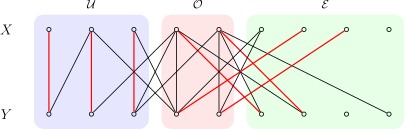

author: accelsao, thallium, Chrogeek, Enter-tainer, ksyx, StudyingFather, H-J-Granger, Henry-ZHR, countercurrent-time, william-song-shy, 5ab-juruo, XiaoQuQuSD, hhc0001, GCVillager

Kiến thức cần biết: [đồ thị hai phía](../bi-graph.md), [ghép cặp trên đồ thị](./graph-match.md)

## Dẫn nhập

Bài viết này thảo luận bài toán ghép cặp lớn nhất trên đồ thị hai phía $G=(X,Y,E)$.

Một ví dụ điển hình của ghép cặp trên đồ thị hai phía trong đời sống là ghép đôi nam nữ. Giả sử có một số nam sinh ($X$) và nữ sinh ($Y$), mỗi người chỉ có thể được ghép cặp một lần, và các cặp được phép ghép đã được giới hạn bởi một danh sách nào đó ($E$). Khi đó, thuật toán ghép cặp lớn nhất trên đồ thị hai phía cần tìm số cặp ghép nhiều nhất dưới các ràng buộc này, sao cho có nhiều người được ghép cặp nhất có thể.

???+ info "Gợi ý"
    Bài viết này giả sử đã biết một cách chia (tô màu) tập đỉnh $V$ của đồ thị hai phía: $V=X\cup Y$. Nếu ban đầu chưa biết cách chia tập đỉnh $V$ của đồ thị hai phía, có thể dùng [thuật toán tô màu đồ thị hai phía](../bi-graph.md#kiểm-tra) để tìm một cách chia như vậy trong thời gian $O(|V|+|E|)$.

## Thuật toán Kuhn

Thuật toán Kuhn là một ứng dụng trực tiếp của [bổ đề Berge](./graph-match.md#bổ-đề-berge). Nó cũng là một phần của [thuật toán Hungarian](./bigraph-weight-match.md#hungarian-algorithmkuhnmunkres-algorithm).

### Quy trình

Để tìm ghép cặp lớn nhất, thuật toán lần lượt xét tất cả các đỉnh, tìm một đường tăng xuất phát từ đỉnh đó rồi tăng ghép cặp theo đường này. Vì độ dài của đường tăng luôn là số lẻ, nên trong đồ thị hai phía, hai đầu mút của nó nằm ở hai phía khác nhau. Do đó, chỉ cần xét các đường tăng xuất phát từ phía trái.

Để tìm đường tăng, có thể định hướng đồ thị hai phía dựa trên ghép cặp hiện tại $M$. Trong một đường tăng xuất phát từ một đỉnh chưa ghép ở phía trái (hoặc trong bất kỳ đường luân phiên nào), đường đi chỉ có thể theo cạnh không thuộc ghép cặp từ trái sang phải, rồi theo cạnh thuộc ghép cặp từ phải về trái. Vì vậy, có thể quy định mọi cạnh không thuộc ghép cặp đều hướng sang phải, còn mọi cạnh thuộc ghép cặp đều hướng sang trái. Khi đó, bài toán tìm đường tăng trở thành bài toán tìm một đường đi đơn trong đồ thị có hướng, xuất phát từ một đỉnh chưa ghép ở phía trái và đi tới một đỉnh chưa ghép nào đó. Bài toán này có thể giải bằng [DFS](../dfs.md) hoặc [BFS](../bfs.md) trong thời gian $O(|E|)$.


(Trong hình, đỉnh màu đậm là đỉnh đã ghép, đỉnh màu nhạt là đỉnh chưa ghép, cạnh đỏ là cạnh thuộc ghép cặp, cạnh đen là cạnh không thuộc ghép cặp, mũi tên biểu thị hướng tương ứng với ghép cặp hiện tại. Đường $1\rightarrow 8\rightarrow 3\rightarrow 11\rightarrow 6\rightarrow 12$ là một đường tăng đối với ghép cặp hiện tại.)

Khi thuật toán bắt đầu, mọi cạnh đều hướng sang phải. Sau mỗi lần tìm được đường tăng, cần đảo hướng tất cả các cạnh trên đường tăng đó để biểu thị rằng trạng thái ghép cặp của chúng đã được lật. Khi thuật toán kết thúc, mọi cạnh hướng sang trái chính là các cạnh thuộc ghép cặp.

Vì nhiều nhất chỉ cần xét $O(|V|)$ đỉnh phía trái [mỗi đỉnh một lần](./graph-match.md#bổ-đề-berge), nên độ phức tạp thời gian tổng cộng của thuật toán là $O(|V||E|)$.

### Tối ưu

Có một số kỹ thuật đơn giản giúp tối ưu hằng số của thuật toán Kuhn:

1.  Thuật toán Kuhn dựa trên bổ đề Berge, mà bổ đề này không yêu cầu phải cho trước hai phía trái và phải của đồ thị hai phía. Vì vậy, ngay cả khi hai phía chưa được phân chia sẵn, thuật toán Kuhn vẫn chạy đúng miễn là bản thân đồ thị là đồ thị hai phía. Tuy nhiên, tô màu đồ thị hai phía trước để xác định phía trái và phía phải thường hiệu quả hơn.
2.  Vì độ phức tạp thời gian của thuật toán Kuhn mô tả ở trên là $O(|X||E|)$, nên có thể chọn phía nhỏ hơn trong hai phía của đồ thị hai phía làm phía trái $X$.
3.  Khi tìm đường tăng, không cần xóa dấu đánh dấu tránh thăm lặp ngay sau mỗi lần DFS. Có thể thử tìm đường tăng cho tất cả các đỉnh chưa ghép ở phía trái rồi mới xóa dấu. Trong một lượt tìm như vậy, mỗi cạnh được thăm nhiều nhất một lần, nên độ phức tạp vẫn là $O(|E|)$; nhưng một lượt có thể tìm được nhiều đường tăng, do đó tổng số lượt $k$ không vượt quá $|M|+1$, trong đó $M$ là ghép cặp lớn nhất. Tương ứng, độ phức tạp toàn bộ thuật toán giảm xuống $O(k|E|)$.
4.  Khi tìm đường tăng, ưu tiên xét các đỉnh chưa ghép ở phía phải, vì điều này thường tạo ra đường tăng ngắn hơn.
5.  Vì bổ đề Berge không yêu cầu ghép cặp ban đầu phải rỗng, khi bắt đầu thuật toán Kuhn có thể chọn ngẫu nhiên một số cạnh đôi một không chung đỉnh làm ghép cặp ban đầu để giảm số lần tìm kiếm sau đó. Nếu đã áp dụng tối ưu 3, có thể bỏ qua tối ưu này.

Mặc dù độ phức tạp xấu nhất vẫn là $O(|V||E|)$, thuật toán Kuhn sau khi tối ưu thường chạy khá tốt. Tuy nhiên, để tránh một số dữ liệu đặc biệt đẩy thuật toán tới độ phức tạp xấu nhất, trước khi ghép cặp nên xáo trộn ngẫu nhiên thứ tự cạnh hoặc thứ tự đỉnh.

### Cài đặt tham khảo

Khi cài đặt, không cần thật sự duy trì hướng của các cạnh; chỉ cần lưu đỉnh được ghép với từng đỉnh.

??? example "Bài mẫu [Library Checker - Ghép cặp trên đồ thị hai phía](https://judge.yosupo.jp/problem/bipartitematching)"
    ```cpp
    --8<-- "docs/graph/code/graph-matching/bigraph-match/bigraph-match_1.cpp"
    ```

## Thuật toán Hopcroft-Karp

Thuật toán Hopcroft-Karp tiếp tục tối ưu quá trình tìm đường tăng của thuật toán Kuhn, giảm tổng số lượt xuống $O(|V|^{1/2})$, nhờ đó đạt độ phức tạp thời gian $O(|V|^{1/2}|E|)$. Thuật toán này chính là một trường hợp đặc biệt của [thuật toán Dinic](../flow/max-flow.md#thuật-toán-dinic).

### Quy trình

Thuật toán vẫn tìm đường tăng, nhưng để hoàn thành ghép cặp trong ít lượt hơn, mỗi lượt thuật toán dùng chiến lược sau:

1.  Định hướng các cạnh thuộc ghép cặp về phía trái, các cạnh không thuộc ghép cặp về phía phải.
2.  Xuất phát từ tất cả các đỉnh chưa ghép ở phía trái, chạy BFS trên đồ thị có hướng, ghi lại tầng $d(v)$ của mỗi đỉnh được thăm, cho tới khi một tầng nào đó xuất hiện đỉnh chưa ghép ở phía phải. Nếu BFS kết thúc mà vẫn không tìm được đỉnh chưa ghép ở phía phải, ghép cặp hiện tại đã là ghép cặp lớn nhất.
3.  Lần lượt xuất phát từ từng đỉnh chưa ghép ở phía trái và chạy DFS để tìm đường tăng rồi tăng ghép cặp. Khi DFS, chỉ mở rộng theo các cạnh đi sang tầng kế tiếp (tức $d(v') = d(v) + 1$), đồng thời chỉ thăm các đỉnh chưa được thăm trong lượt DFS hiện tại. Đặc biệt, DFS sẽ không thăm các đỉnh mà bước BFS trước đó chưa thăm.

Theo thuật ngữ luồng mạng, bước 2 xây dựng một đồ thị phân tầng, còn bước 3 tìm một luồng chặn trên đồ thị phân tầng đó. Đồ thị phân tầng là đồ thị mà mỗi cạnh đều đi từ tầng hiện tại sang tầng kế tiếp; còn luồng chặn, trong ngữ cảnh này, là một nhóm cực đại các đường tăng đôi một không có đỉnh chung. Nhóm đường tăng thu được ở bước 3 chắc chắn là cực đại: nếu vẫn còn một đường tăng mới, thì khi thuật toán xét tới đỉnh đầu của đường đó, lẽ ra nó đã tìm được đường này.

So với thuật toán Kuhn ở phần trước, thay đổi then chốt của thuật toán Hopcroft-Karp là thêm bước xây dựng đồ thị phân tầng trước khi tìm luồng chặn. DFS dựa trên đồ thị phân tầng tương đương với việc buộc thuật toán luôn đi theo đường ngắn nhất để tới các đỉnh. Lợi ích của cách làm này là giữa các lượt khác nhau của thuật toán, độ dài các đường tăng tìm được tăng nghiêm ngặt. Hơn nữa, có thể chứng minh rằng cho tới khi tìm được ghép cặp lớn nhất, độ dài đường tăng tăng nhiều nhất $3|M|^{1/2}$ lần, trong đó $|M|$ là kích thước của ghép cặp lớn nhất. Vì vậy, tổng số lượt tăng được khống chế trong $O(|M|^{1/2})$, suy ra độ phức tạp thời gian $O(|M|^{1/2}|E|)$. Do $2|M|\le |V|$, độ phức tạp thời gian cũng có thể viết dưới dạng cận trên lỏng hơn là $O(|V|^{1/2}|E|)$.

??? note "Chứng minh"
    Trước hết chứng minh rằng giữa các lượt khác nhau của thuật toán, độ dài các đường tăng mà thuật toán tìm được tăng nghiêm ngặt.

    Giả sử trong BFS của lượt hiện tại, các đỉnh được mở rộng $\ell$ tầng. Vì các đỉnh chưa ghép ở phía phải được BFS tìm thấy đều nằm trên cùng một tầng, nên mọi đường tăng mà DFS trong lượt này có thể tìm được đều có độ dài $\ell$. Cần chứng minh rằng sau khi tăng ghép cặp theo nhóm đường tăng $\{P_i\}$ tìm được trong lượt này và định hướng lại đồ thị, sẽ không còn tồn tại đường tăng nào có độ dài không quá $\ell$.

    Thật vậy, nếu $P$ là đường tăng ngắn nhất đối với $M$, còn $P'$ là một đường tăng đối với $M\oplus P$, thì luôn có $|P'|\ge |P| + 2|P\cap P'|$. Lý do là $N=(M\oplus P)\oplus P'$ đã tăng ghép cặp hai lần so với $M$, nên tương tự [chứng minh bổ đề Berge](./graph-match.md#bổ-đề-berge), có thể chỉ ra rằng hiệu đối xứng $M\oplus N=P\oplus P'$ chứa ít nhất hai đường tăng rời nhau $P_1$ và $P_2$ đối với $M$. Do tính ngắn nhất của $P$, có

    $$
    2|P|\le |P_1|+|P_2|\le |P\oplus P'| = |P| + |P'| - 2|P\cap P'|.
    $$

    Suy ra $|P'|\ge |P| + 2|P\cap P'|$. Vì vậy, nếu sau khi thêm xong các đường tăng $\{P_i\}$ mà một đường tăng mới $P'$ vẫn có cùng độ dài với chúng, thì $P'$ phải rời nhau với từng đường trong nhóm, mâu thuẫn với tính cực đại của $\{P_i\}$. Mâu thuẫn này cho thấy sau khi tăng theo luồng chặn, đường tăng mới phải dài hơn nghiêm ngặt.

    Cuối cùng, cần chứng minh rằng độ dài đường tăng tăng nhiều nhất $3|M|^{1/2}$ lần.

    Đặt $p=\lfloor|M|^{1/2}\rfloor$. Sau khi kết thúc $p$ lượt đầu tiên, độ dài của các đường tăng còn lại ít nhất là $|M|^{1/2}$. Gọi ghép cặp hiện tại là $M_p$. Tương tự tình huống ở trên, có thể chứng minh rằng trong đồ thị $(V,M\oplus M_p)$ có $|M|-|M_p|$ đường tăng đôi một không có đỉnh chung đối với $M_p$. Mỗi đường tăng dùng ít nhất $|M|^{1/2}/2$ cạnh ghép cặp trong $M$, nên tổng số đường tăng này không vượt quá $2|M|^{1/2}$, tức là $|M|-|M_p|\le 2|M|^{1/2}$. Điều này cho thấy bắt đầu từ $M_p$, nhiều nhất chỉ có thể tăng thêm $2|M|^{1/2}$ lần, đồng nghĩa thuật toán nhiều nhất cũng chỉ chạy thêm $2|M|^{1/2}$ lượt tăng. Do đó, tổng cộng độ dài đường tăng tăng nhiều nhất $3|M|^{1/2}$ lần.

Đây chỉ là ước lượng độ phức tạp xấu nhất của thuật toán Hopcroft-Karp. Tuy nhiên, với đồ thị ngẫu nhiên, thuật toán Hopcroft-Karp có xác suất lớn chạy trong thời gian $O(|E|\log |V|)$[^hk-comp-ref].

### Tối ưu

Khi xây dựng đồ thị phân tầng, giống như thuật toán Dinic thông thường, thuật toán Hopcroft-Karp dừng lại ngay khi tới được một đỉnh chưa ghép ở phía phải. Tuy nhiên, riêng với bài toán ghép cặp trên đồ thị hai phía, điều này không cần thiết. Hơn nữa, vì BFS dừng quá sớm và giới hạn phạm vi DFS về sau, số đường tăng tìm được trong mỗi lượt bị hạn chế, khiến hiệu quả ghép cặp tổng thể chậm lại. Trên một số đồ thị, cách này thậm chí còn kém hiệu quả hơn thuật toán Kuhn đã tối ưu. Vì vậy, một cải tiến đơn giản là không dừng BFS sớm, mà xây dựng đồ thị phân tầng cho mọi đỉnh có thể tới được.

??? note "Chứng minh tính đúng đắn"
    Trong thuật toán đã tối ưu, các đường tăng trong luồng chặn không còn có cùng độ dài, nên chứng minh độ phức tạp ở phần trước cũng không còn áp dụng trực tiếp. Tuy nhiên, bằng cách xây dựng một đồ thị phụ cho mỗi lượt của thuật toán, vẫn có thể thiết lập kết luận độ dài đường tăng ngắn nhất tăng nghiêm ngặt, từ đó bảo đảm độ phức tạp xấu nhất vẫn đúng.

    Giả sử đồ thị hai phía là $G=(X,Y,E)$ và ghép cặp hiện tại là $M$. Gọi $W\subseteq Y$ là tập các đỉnh chưa ghép ở phía phải có thể được BFS thăm tới, và độ dài đường tăng ngắn nhất tới $y\in W$ là $d(y)$. Đặt $d_\text{max} = \max_{y\in W}d(y)$.

    Với mỗi $y\in W$, tạo thêm một đường nối phụ bắt đầu từ $y$ có độ dài $d_\text{max} - d(y)$. Các đỉnh mới lần lượt được đánh dấu là đỉnh phía trái và đỉnh phía phải, các cạnh mới lần lượt được đánh dấu là cạnh thuộc ghép cặp và cạnh không thuộc ghép cặp. Gọi đồ thị thu được là $G'=(X',Y',E')$, ghép cặp là $M'$, và độ dài đường tăng ngắn nhất là $d_\text{max}$.

    Khi đó, các đường tăng đối với $M$ trong đồ thị $G$ mà có thể tìm được theo đồ thị phân tầng, tức các đường tăng ngắn nhất tới đỉnh tương ứng, song ánh với các đường tăng ngắn nhất toàn cục đối với $M'$ trong đồ thị $G'$. Vì vậy, việc tìm luồng chặn trong đồ thị phân tầng của $G$ rồi tăng ghép cặp tương đương với việc tìm luồng chặn trong đồ thị phân tầng của $G'$ rồi tăng ghép cặp.

    Theo chứng minh ở trên, sau khi tăng, trong đồ thị $G'$ sẽ không còn đường tăng nào có độ dài $d_\text{max}$. Do đó, trong đồ thị $G$ cũng không còn đường tăng nào có độ dài $d_\text{min}=\min_{y\in W} d(y)$: bởi một đường tăng như vậy, sau khi nối thêm đường luân phiên mới, sẽ tương ứng với một đường tăng có độ dài $d_\text{max}$ trong $G'$. Như vậy lại thu được kết luận rằng giữa các lượt khác nhau của thuật toán, độ dài đường tăng ngắn nhất tăng nghiêm ngặt. Vì thế, độ phức tạp tổng thể vẫn là $O(|M|^{1/2}|E|)$.

### Cài đặt tham khảo

??? example "Bài mẫu [Library Checker - Ghép cặp trên đồ thị hai phía](https://judge.yosupo.jp/problem/bipartitematching)"
    ```cpp
    --8<-- "docs/graph/code/graph-matching/bigraph-match/bigraph-match_2.cpp"
    ```

## Quy về bài toán luồng cực đại

Bài toán ghép cặp lớn nhất trên đồ thị hai phía có thể quy về bài toán luồng cực đại.


Như hình minh họa, thêm hai đỉnh lần lượt làm nguồn và đích. Từ nguồn, nối một cạnh tới mỗi đỉnh phía trái; từ mỗi đỉnh phía phải, nối một cạnh tới đích; với mỗi cạnh vô hướng trong đồ thị hai phía, nối một cạnh có hướng từ đỉnh phía trái sang đỉnh phía phải. Dung lượng của tất cả các cạnh đều là $1$. Mỗi luồng mạng trong đồ thị có hướng thu được tương ứng một-một với một ghép cặp trong đồ thị hai phía, và giá trị luồng chính là kích thước của ghép cặp tương ứng. Vì vậy, giải ghép cặp lớn nhất trên đồ thị hai phía tương đương với giải luồng cực đại trên đồ thị có hướng tương ứng.

Bất kỳ thuật toán nào giải được bài toán luồng cực đại đều có thể dùng để giải bài toán ghép cặp lớn nhất trên đồ thị hai phía. Thuật toán Kuhn và thuật toán Hopcroft-Karp đều là các trường hợp đặc biệt của những thuật toán tương ứng trong bài toán luồng cực đại. Tương tự, [thuật toán đẩy tiền luồng](../flow/max-flow.md#thuật-toán-đẩy-tiền-luồng-push-relabel) cũng có thể dùng để giải bài toán ghép cặp lớn nhất trên đồ thị hai phía. Tuy nhiên, khi áp dụng bất kỳ thuật toán luồng cực đại nào cho bài toán ghép cặp lớn nhất trên đồ thị hai phía, cần tối ưu có mục tiêu để tránh hằng số quá lớn.

### Dạng quy hoạch tuyến tính

Giống như các bài toán luồng cực đại khác, bài toán ghép cặp lớn nhất trên đồ thị hai phía $G=(V,E)$ có thể viết thành một bài toán quy hoạch tuyến tính. Nếu dùng $x_e\in\{0,1\}$ để biểu thị cạnh $e$ có thuộc ghép cặp hay không, nhận được bài toán quy hoạch tuyến tính sau:

$$
\begin{aligned}
\max_{\{x_e\}}\;& \sum_{e\in E}x_e \\
\text{với ràng buộc } & \sum_{e\sim v} x_{e} \le 1,~\forall v\in V,\\
& x_e\ge 0,~\forall e\in E.
\end{aligned}
$$

Trong đó, $e\sim v$ biểu thị quan hệ liên thuộc, tức đỉnh $v$ là một trong hai đầu mút của cạnh $e$. Ngoài ràng buộc không âm, các ràng buộc của bài toán còn yêu cầu tại mỗi đỉnh $v\in V$ có nhiều nhất một cạnh liên thuộc, đúng với định nghĩa của ghép cặp. Vì vậy, mọi ghép cặp đều tương ứng với một điểm nguyên trong miền khả thi của quy hoạch tuyến tính này.

Chiều ngược lại thì không đúng. Trong nghiệm khả thi, $x_e$ có thể là số thập phân, và điều đó không biểu thị một ghép cặp thực sự nào. Dù vậy, đối với đồ thị hai phía $G$, mọi nghiệm cực biên của quy hoạch tuyến tính trên đều là điểm nguyên. Điều này nghĩa là giá trị tối ưu của hàm mục tiêu luôn có thể đạt được tại một điểm nguyên, không cần xét các trường hợp không nguyên. Tính chất này không đúng với đồ thị tổng quát, nên quy hoạch tuyến tính trên không tương đương với bài toán ghép cặp lớn nhất trong đồ thị tổng quát.

Bài toán đối ngẫu của quy hoạch tuyến tính này có thể viết như sau:

$$
\begin{aligned}
\min_{\{y_v\}}\;& \sum_{v\in V}y_v \\
\text{với ràng buộc } & y_u+y_v \ge 1,~\forall (u,v)\in E,\\
& y_v\ge 0,~\forall v\in V.
\end{aligned}
$$

Phần sau sẽ cho thấy đây chính là bài toán phủ đỉnh nhỏ nhất trên đồ thị hai phía.

<span id="dulmage-mendelsohn-decomposition"></span>
## Phân rã Dulmage-Mendelsohn

Dựa vào một ghép cặp lớn nhất của đồ thị hai phía, có thể chia các đỉnh thành nhiều tập con rời nhau, qua đó mô tả phân bố và cấu trúc của tất cả các ghép cặp lớn nhất trong đồ thị hai phía đó. Đây gọi là phân rã Dulmage-Mendelsohn. Trong lập trình thi đấu, phân rã này có thể dùng để nhận diện các đỉnh và cạnh then chốt trong ghép cặp lớn nhất, từ đó phán đoán tính duy nhất của ghép cặp lớn nhất hoặc giải các bài toán trò chơi trên đồ thị hai phía.

### Cách xây dựng

Xét một ghép cặp lớn nhất $M$ của đồ thị hai phía $G=(X,Y,E)$.



Như hình minh họa, có thể định nghĩa ba tập con sau cho toàn bộ tập đỉnh $V=X\cup Y$:

-   Tập đỉnh tới được với độ dài chẵn $\mathcal E$, tức tập tất cả các đỉnh có thể tới được từ một đỉnh chưa ghép bằng một đường luân phiên có độ dài chẵn;
-   Tập đỉnh tới được với độ dài lẻ $\mathcal O$, tức tập tất cả các đỉnh có thể tới được từ một đỉnh chưa ghép bằng một đường luân phiên có độ dài lẻ;
-   Tập đỉnh không tới được $\mathcal U$, tức tập tất cả các đỉnh không thể tới được từ một đỉnh chưa ghép bằng đường luân phiên.

Có thể chứng minh rằng ba tập đỉnh $\mathcal E,\mathcal O,\mathcal U$ thu được như vậy có các tính chất sau:

???+ note "Tính chất"
    1.  Các tập $\mathcal E,\mathcal O,\mathcal U$ tạo thành một phân hoạch của tập đỉnh, và phân hoạch này không phụ thuộc vào cách chọn ghép cặp lớn nhất $M$.
    2.  Mọi ghép cặp lớn nhất của đồ thị $G$ đều chứa một ghép cặp hoàn hảo giữa các đỉnh của $\mathcal U$, đồng thời ghép mỗi đỉnh trong $\mathcal O$ với một đỉnh trong $\mathcal E$. Nói cách khác, kích thước ghép cặp lớn nhất của đồ thị $G$ bằng $|\mathcal O|+|\mathcal U|/2$.
    3.  Trong đồ thị $G$ không tồn tại cạnh nối một đỉnh trong $\mathcal E$ với một đỉnh trong $\mathcal E\cup\mathcal U$.

??? note "Chứng minh"
    1.  Theo định nghĩa, $\mathcal U$ rời với $\mathcal E\cup\mathcal O$. Chỉ cần chứng minh $\mathcal E$ và $\mathcal O$ rời nhau. Giả sử ngược lại, với một đỉnh $v\in\mathcal E\cap\mathcal O$, tồn tại một đường luân phiên độ dài chẵn từ đỉnh chưa ghép $a$ tới $v$, đồng thời tồn tại một đường luân phiên độ dài lẻ từ đỉnh chưa ghép $b$ tới $v$. Vì đồ thị $G$ là đồ thị hai phía, $a\neq b$, và hai đường đi tới $v$ kết thúc bằng các loại cạnh khác nhau: một đường kết thúc bằng cạnh thuộc ghép cặp, đường còn lại kết thúc bằng cạnh không thuộc ghép cặp. Do đó, nối hai đường này lại sẽ thu được một đường luân phiên từ $a$ qua $v$ tới $b$. Đây là một đường tăng. Điều này mâu thuẫn với việc $M$ là ghép cặp lớn nhất. Vì vậy, $\mathcal E\cap\mathcal O=\varnothing$.

        Gọi $M'$ là một ghép cặp lớn nhất khác với $M$. Lặp lại [chứng minh bổ đề Berge](./graph-match.md#bổ-đề-berge), có thể chỉ ra rằng $M'\oplus M$ chỉ gồm các đường đi độ dài chẵn và các chu trình chẵn. Xuất phát từ ghép cặp lớn nhất $M$, nếu lần lượt lật các cạnh trong những thành phần liên thông này (đường đi và chu trình), tức hoán đổi cạnh thuộc ghép cặp với cạnh không thuộc ghép cặp, sẽ nhận được ghép cặp lớn nhất $M'$. Khi lật một chu trình chẵn, các đỉnh chưa ghép vẫn là chưa ghép, và tính chẵn lẻ của độ dài đường luân phiên xuất phát từ chúng cũng không đổi; khi lật một đường đi độ dài chẵn, trạng thái ghép cặp của hai đầu mút hoán đổi, nhưng tính chẵn lẻ của độ dài đường đi từ chúng tới bất kỳ đỉnh nào trên đường cũng nhất quán. Vì vậy, trong quá trình lật, các tập $\mathcal E,\mathcal O,\mathcal U$ luôn giữ nguyên. Điều này chứng tỏ phân rã không phụ thuộc vào cách chọn ghép cặp lớn nhất $M$.
    2.  Nếu một cạnh thuộc ghép cặp xuất hiện trong một đường luân phiên xuất phát từ một đỉnh chưa ghép $v$, thì tính chẵn lẻ của khoảng cách từ hai đầu mút của cạnh đó tới $v$ khác nhau, nên chúng lần lượt thuộc $\mathcal E$ và $\mathcal O$; nếu không, hai đầu mút của cạnh đó đều nằm trong $\mathcal U$. Điều này cho thấy các cạnh thuộc ghép cặp trong ghép cặp lớn nhất chỉ có thể là cạnh $\mathcal E\mathcal O$ hoặc cạnh $\mathcal U\mathcal U$. Ngược lại, một đỉnh chưa ghép có thể tới chính nó bằng đường luân phiên độ dài không, nên chỉ có thể xuất hiện trong $\mathcal E$. Do đó, mọi đỉnh trong $\mathcal O$ và $\mathcal U$ đều là đỉnh đã ghép. Đếm đơn giản suy ra kích thước của ghép cặp lớn nhất là $|\mathcal O|+|\mathcal U|/2$.
    3.  Theo định nghĩa, mọi đỉnh $a$ trong $\mathcal E$ đều có thể tới được từ một đỉnh chưa ghép $v$ bằng một đường luân phiên độ dài chẵn; nói cách khác, đỉnh trong $\mathcal E$ hoặc là đỉnh chưa ghép, hoặc đường luân phiên $P$ tới đỉnh đó kết thúc bằng một cạnh thuộc ghép cặp. Nếu trong đồ thị $G$ tồn tại một cạnh nối $a$ với một đỉnh $b$ trong $\mathcal E\cup\mathcal U$, thì theo thảo luận ở đoạn trước, cạnh này không thuộc ghép cặp, và có thể dùng nó để kéo dài đường luân phiên $P$. Điều này cho thấy đỉnh $b$ cũng thuộc $\mathcal O$, mâu thuẫn với tính chất thứ nhất. Vì vậy, trong đồ thị $G$ không tồn tại cạnh nối đỉnh trong $\mathcal E$ với đỉnh trong $\mathcal E\cup\mathcal U$.

Phân rã tập đỉnh $V=\mathcal E\cup\mathcal O\cup\mathcal U$ thu được như trên được gọi là **phân rã Dulmage-Mendelsohn**. Sau khi dùng các thuật toán ở trên để tìm một ghép cặp lớn nhất, có thể dùng BFS để tìm phân rã Dulmage-Mendelsohn trong thời gian $O(|V|+|E|)$.

### Đỉnh then chốt của ghép cặp lớn nhất

Nếu một đỉnh $v$ luôn là đỉnh đã ghép trong mọi ghép cặp lớn nhất của đồ thị hai phía $G$, thì nó được gọi là đỉnh then chốt của ghép cặp lớn nhất. Kết luận dưới đây cho biết: một đỉnh là đỉnh then chốt khi và chỉ khi trong một ghép cặp lớn nhất, không tồn tại đường luân phiên độ dài chẵn xuất phát từ một đỉnh chưa ghép và đi tới đỉnh đó.

???+ note "Định lý"
    Giả sử phân rã Dulmage-Mendelsohn của đồ thị hai phía $G=(X,Y,E)$ là $V=\mathcal E\cup\mathcal O\cup\mathcal U$. Khi đó, đỉnh $v\in V$ là đỉnh then chốt khi và chỉ khi $v\in\mathcal O\cup \mathcal U$.

??? note "Chứng minh"
    Theo các tính chất của phân rã Dulmage-Mendelsohn, trong mọi ghép cặp lớn nhất của đồ thị $G$, các đỉnh trong $\mathcal O$ và $\mathcal U$ đều là đỉnh đã ghép. Vì vậy, các đỉnh trong $\mathcal O\cup \mathcal U$ là đỉnh then chốt. Tiếp theo, cần chứng minh rằng trong tập $\mathcal E$ không có đỉnh then chốt. Nếu trong ghép cặp lớn nhất $M$, đỉnh $a\in\mathcal E$ là đỉnh then chốt, thì tồn tại một đường luân phiên độ dài chẵn $P$ nối đỉnh $a$ với một đỉnh chưa ghép $b\in\mathcal E$. Lật tất cả các cạnh trên đường này sẽ nhận được ghép cặp lớn nhất $M\oplus P$, trong đó đỉnh $a$ trở thành đỉnh chưa ghép. Vì vậy, trong tập $\mathcal E$ không có đỉnh then chốt.

Do đó, để tìm các đỉnh then chốt của ghép cặp lớn nhất, chỉ cần tìm phân rã Dulmage-Mendelsohn.

### Cạnh then chốt của ghép cặp lớn nhất

Tương tự, nếu một cạnh $e$ luôn là cạnh thuộc ghép cặp trong mọi ghép cặp lớn nhất của đồ thị hai phía $G$, thì nó được gọi là cạnh then chốt của ghép cặp lớn nhất. Ghép cặp lớn nhất của đồ thị hai phía là duy nhất khi và chỉ khi trong một ghép cặp lớn nhất của nó, mọi cạnh thuộc ghép cặp đều là cạnh then chốt.

???+ note "Định lý"
    Giả sử phân rã Dulmage-Mendelsohn của đồ thị hai phía $G=(X,Y,E)$ là $V=\mathcal E\cup\mathcal O\cup\mathcal U$, và $M$ là một ghép cặp lớn nhất của nó. Khi đó, cạnh $e\in E$ là cạnh then chốt khi và chỉ khi hai đầu mút của $e$ đều nằm trong $\mathcal U$, cạnh $e$ là cạnh thuộc ghép cặp trong $M$, và không tồn tại một chu trình luân phiên đối với $M$ chứa cạnh $e$.

??? note "Chứng minh"
    Hai đầu mút của cạnh then chốt bắt buộc phải là đỉnh then chốt. Theo các tính chất của phân rã Dulmage-Mendelsohn, cạnh của ghép cặp lớn nhất chỉ có thể là cạnh $\mathcal E\mathcal O$ hoặc cạnh $\mathcal U\mathcal U$. Tuy nhiên, trong $\mathcal E$ không có đỉnh then chốt, nên cạnh then chốt chỉ có thể là cạnh $\mathcal U\mathcal U$. Ngoài ra, cạnh then chốt cũng phải là cạnh thuộc ghép cặp trong $M$.

    Xét một cạnh $\mathcal U\mathcal U$ $e\in M$. Cạnh này không phải cạnh then chốt khi và chỉ khi tồn tại một ghép cặp lớn nhất khác $M'\neq M$ sao cho $e\in M\oplus M'$. Lặp lại [chứng minh bổ đề Berge](./graph-match.md#bổ-đề-berge), có thể chỉ ra rằng $M'\oplus M$ chỉ gồm các đường đi độ dài chẵn và các chu trình chẵn. Một đầu mút của các đường đi này là đỉnh chưa ghép đối với $M$, nên các đỉnh trên đường đi đều không thuộc $\mathcal U$, mâu thuẫn với cách chọn cạnh $e$. Vì vậy, cạnh $e$ chỉ có thể xuất hiện trong một chu trình chẵn.

    Do đó, một cạnh $\mathcal U\mathcal U$ $e\in M$ không phải cạnh then chốt khi và chỉ khi tồn tại một chu trình luân phiên đối với $M$ chứa cạnh $e$. Đây chính là điều cần chứng minh.

Vì vậy, để tìm các cạnh then chốt của ghép cặp lớn nhất, cần thực hiện các bước sau:

1.  Tìm ghép cặp lớn nhất $M$ của đồ thị $G$;
2.  Định hướng các cạnh của đồ thị $G$ theo $M$, thu được đồ thị có hướng $G_M$;
3.  Dùng BFS để tìm tập $\mathcal U$ trong phân rã Dulmage-Mendelsohn, tức tập các đỉnh không thể tới được từ các đỉnh chưa ghép bằng đường luân phiên;
4.  Dùng [thuật toán Tarjan](../scc.md#thuật-toán-tarjan) để tìm tất cả các thành phần liên thông mạnh của đồ thị có hướng $G_M$;
5.  Duyệt các cạnh trong ghép cặp $M$; nếu hai đầu mút của một cạnh đều nằm trong $\mathcal U$ nhưng không nằm trong cùng một thành phần liên thông mạnh, thì cạnh đó là cạnh then chốt.

Sau khi đã có ghép cặp lớn nhất, các bước còn lại có độ phức tạp thời gian $O(|V|+|E|)$.

## Các bài toán liên quan

Các thuật toán ghép cặp lớn nhất trên đồ thị hai phía có thể giải những bài toán tối ưu tổ hợp khác.

### Phủ đỉnh nhỏ nhất trên đồ thị hai phía

Bài toán phủ đỉnh nhỏ nhất yêu cầu chọn ít đỉnh nhất trong một đồ thị vô hướng sao cho mỗi cạnh có ít nhất một đầu mút được chọn.

Bài toán phủ đỉnh nhỏ nhất trên đồ thị tổng quát là NP-khó, nhưng đối với đồ thị hai phía, định lý Kőnig cho biết nó có thể quy về bài toán ghép cặp lớn nhất và do đó giải được hiệu quả. Chứng minh định lý đồng thời cũng đưa ra cách xây dựng phủ đỉnh nhỏ nhất.

???+ note "Định lý Kőnig"
    Trong đồ thị hai phía, số đỉnh trong phủ đỉnh nhỏ nhất bằng số cạnh trong ghép cặp lớn nhất.

??? note "Chứng minh"
    Xét một ghép cặp lớn nhất $M$ của đồ thị hai phía $G=(X,Y,E)$. Gọi $Z$ là tập các đỉnh trong đồ thị $G$ có thể tới được từ các đỉnh chưa ghép ở phía trái $U$ bằng một đường luân phiên nào đó. Khi đó, tập đỉnh $C=(X\setminus Z)\cup(Y\cap Z)$ chính là phủ đỉnh nhỏ nhất cần tìm.

    

    Trước hết, tập $C$ là một phủ đỉnh. Giả sử ngược lại, tồn tại cạnh $(u,v)\in E$ sao cho $u\in X\cap Z$ và $v\in Y\setminus Z$. Gọi $P_u$ là một đường luân phiên đi tới $u$. Nếu cạnh $(u,v)$ thuộc ghép cặp, thì cạnh cuối cùng của đường $P_u$ là $(v,u)$, mâu thuẫn với $v\notin Z$; nếu cạnh $(u,v)$ không thuộc ghép cặp, thì có thể kéo dài $P_u$ theo cạnh $(u,v)$ để nhận được một đường luân phiên tới $v$, cũng mâu thuẫn với $v\notin Z$. Các mâu thuẫn này cho thấy mọi cạnh đều chứa ít nhất một đầu mút trong $C$, nên $C$ là một phủ đỉnh.

    Tiếp theo, cần chứng minh $C$ là phủ đỉnh nhỏ nhất. Để phủ tất cả các cạnh của ghép cặp lớn nhất $M$, bất kỳ phủ đỉnh nào cũng cần ít nhất $|M|$ đỉnh. Vì vậy, chỉ cần chứng minh $|C|=|M|$ là đủ để kết luận $C$ là phủ đỉnh nhỏ nhất.

    Điều này tương đương với việc chứng minh rằng ngoài việc chứa đúng một đầu mút của mỗi cạnh thuộc ghép cặp, $C$ không chứa đỉnh nào khác; nói cách khác, $C$ không chứa đỉnh chưa ghép. Giả sử ngược lại, tồn tại đỉnh chưa ghép $v\in C$. Nếu $v\in X$, thì $v\in U\subseteq Z$, mâu thuẫn với cách xây dựng $C$; nếu $v\in Y$, thì một đường luân phiên đi tới $v$ là một đường tăng đối với $M$, mâu thuẫn với việc $M$ là ghép cặp lớn nhất theo bổ đề Berge. Các mâu thuẫn này cho thấy không tồn tại đỉnh chưa ghép như vậy, do đó $C$ là phủ đỉnh nhỏ nhất.

Nhìn từ góc độ luồng mạng, bài toán phủ đỉnh nhỏ nhất chính là bài toán lát cắt nhỏ nhất: chọn đỉnh phía trái tương đương với cắt cạnh nối nó với nguồn; chọn đỉnh phía phải tương đương với cắt cạnh nối nó với đích. Nhìn từ góc độ quy hoạch tuyến tính, bài toán phủ đỉnh nhỏ nhất chính là bài toán đối ngẫu của bài toán ghép cặp lớn nhất. Vì vậy, định lý Kőnig có thể xem là một trường hợp đặc biệt của [định lý luồng cực đại - lát cắt nhỏ nhất](../flow/max-flow.md#định-lý-luồng-cực-đại---lát-cắt-nhỏ-nhất), hoặc tổng quát hơn là một trường hợp đặc biệt của định lý đối ngẫu mạnh trong quy hoạch tuyến tính.

### Tập độc lập lớn nhất trên đồ thị hai phía

Bài toán tập độc lập lớn nhất yêu cầu chọn nhiều đỉnh nhất trong một đồ thị vô hướng sao cho không có hai đỉnh được chọn nào kề nhau.

Với đồ thị tổng quát, có định lý sau:

???+ note "Định lý"
    Trong đồ thị $G=(V,E)$, tập đỉnh $C\subseteq V$ là phủ đỉnh khi và chỉ khi phần bù $V\setminus C$ của nó là tập độc lập.

??? note "Chứng minh"
    Tập đỉnh $C$ là phủ đỉnh khi và chỉ khi trong mỗi cạnh $e$ của $E$, ít nhất một trong hai đầu mút xuất hiện trong tập $C$; khi và chỉ khi trong $E$ không có cạnh nào có cả hai đầu mút đều xuất hiện trong tập $V\setminus C$; khi và chỉ khi $V\setminus C$ là tập độc lập.

???+ note "Hệ quả"
    Trong đồ thị $G=(V,E)$, tổng kích thước của phủ đỉnh nhỏ nhất và tập độc lập lớn nhất bằng số đỉnh.

Vì vậy, giống như bài toán phủ đỉnh nhỏ nhất, bài toán tập độc lập lớn nhất là NP-khó trên đồ thị tổng quát, nhưng đối với đồ thị hai phía nó có thể quy về bài toán ghép cặp lớn nhất và do đó giải được hiệu quả.

### Phủ đường đi nhỏ nhất trên đồ thị có hướng không chu trình

Bài toán phủ đường đi nhỏ nhất yêu cầu chọn ít đường đi đơn nhất trong một đồ thị có hướng sao cho mỗi đỉnh xuất hiện đúng trong một đường đi.

Bài toán phủ đường đi nhỏ nhất trên đồ thị có hướng tổng quát là NP-khó, nhưng đối với đồ thị có hướng không chu trình, bài toán này có thể quy về ghép cặp lớn nhất trên đồ thị hai phía. Với đồ thị có hướng không chu trình $G=(V,E)$, có thể xây dựng đồ thị hai phía $G'=(V^\text{in},V^\text{out},E')$ như sau:

-   Với mỗi đỉnh $v\in V$, tạo riêng một đỉnh vào $v^\text{in}$ và một đỉnh ra $v^\text{out}$. Gọi tập tất cả các đỉnh vào và đỉnh ra lần lượt là $V^\text{in}$ và $V^\text{out}$. Chúng lần lượt trở thành phía trái và phía phải của đồ thị mới.
-   Với mỗi cạnh có hướng $(u,v)\in E$, tạo cạnh vô hướng $(u^\text{out},v^\text{in})$. Tập tất cả các cạnh vô hướng này chính là $E'$.

Từ đó có kết luận sau:

???+ note "Định lý"
    Tổng giữa kích thước phủ đường đi nhỏ nhất của đồ thị có hướng không chu trình $G=(V,E)$ và kích thước ghép cặp lớn nhất của đồ thị hai phía tương ứng $G'=(V^\text{in},V^\text{out},E')$ bằng số đỉnh.

??? note "Chứng minh"
    Mỗi ghép cặp $M'$ của đồ thị hai phía $G'$ tương ứng với một đồ thị con $F$ của đồ thị $G$, và trong đồ thị con $F$, bậc vào và bậc ra của mỗi đỉnh đều không vượt quá một. Nói cách khác, đồ thị con $F$ là một tập các đường đi hoặc chu trình rời nhau trong đồ thị có hướng $G$. Tuy nhiên, do giả sử $G$ không chứa chu trình, $F$ chỉ chứa một số đường đi rời nhau. Ngược lại, với mỗi đồ thị con $F$ như vậy, đều có thể xây dựng ghép cặp tương ứng. Vì kích thước của ghép cặp $M'$ chính là hiệu giữa số đỉnh và số đường đi trong $F$, nên bài toán phủ đường đi nhỏ nhất của đồ thị $G$ tương ứng với bài toán ghép cặp lớn nhất của đồ thị $G'$.

Chứng minh mang tính xây dựng, nên có thể dựng phủ đường đi nhỏ nhất tương ứng từ ghép cặp lớn nhất tìm được. Hơn nữa, cách xây dựng này cho thấy đối với đồ thị có hướng tổng quát, phép quy về này không còn đúng, chính vì ghép cặp trong đồ thị hai phía có thể tương ứng với chu trình trong đồ thị có hướng.

Đặc biệt, với tập $X$ và quan hệ thứ tự bộ phận $P$ trên nó, có thể xây dựng đồ thị có hướng không chu trình $G=(X,P)$. Khi đó, theo [định lý Dilworth](../../math/order-theory.md#định-lý-dilworth-và-định-lý-mirsky), kích thước phủ đường đi nhỏ nhất của đồ thị $G$ bằng độ dài của phản xích dài nhất của nó, cũng tức là chiều rộng của poset $(X,P)$. Vì vậy, phần này đưa ra một cách tính hiệu quả chiều rộng của một poset bất kỳ.

## Ví dụ

Khó khăn khi áp dụng ghép cặp trên đồ thị hai phía nằm ở việc xây dựng đồ thị. Phần này trình bày kỹ thuật xây dựng đồ thị qua một số ví dụ.

???+ example "[Luogu P1129 Trò chơi ma trận](https://www.luogu.com.cn/problem/P1129)"
    Cho một ma trận vuông 01. Mỗi lần có thể hoán đổi hai hàng hoặc hai cột. Hỏi có thể hoán đổi sao cho đường chéo chính (từ trái trên tới phải dưới) toàn là 1 hay không.

??? note "Lời giải"
    Nếu tồn tại $n$ số $1$ sao cho chúng không cùng hàng và không cùng cột với nhau, bài toán có lời giải; ngược lại, bài toán vô nghiệm. Bài toán chuyển thành việc có thể tìm được $n$ số $1$ như vậy hay không.

    Xét một số $1$. Trong phương án cuối cùng, việc chọn số $1$ này biểu thị rằng hàng và cột của nó đã bị chiếm. Vì vậy, xây dựng một đồ thị hai phía có $n$ đỉnh phía trái và $n$ đỉnh phía phải; với mỗi phần tử bằng $1$, thêm một cạnh nối đỉnh phía trái đại diện cho hàng của nó với đỉnh phía phải đại diện cho cột của nó. Sau đó chỉ cần chạy thuật toán ghép cặp trên đồ thị hai phía.

??? note "Mã"
    ```cpp
    --8<-- "docs/graph/code/graph-matching/bigraph-match/bigraph-match_3.cpp"
    ```

???+ example "[Gym 104427B Lawyers](https://codeforces.com/gym/104427/problem/B)"
    Có $n$ luật sư, tất cả đều bị buộc tội lừa đảo. Vì vậy, họ cần bào chữa lẫn nhau để bảo đảm mỗi luật sư đều được thả. Giữa $n$ luật sư có $m$ quan hệ tin tưởng; một quan hệ tin tưởng $(a, b)$ nghĩa là $a$ có thể bào chữa cho $b$. Bất kỳ luật sư nào được bào chữa đều sẽ được tuyên vô tội, ngoại trừ một trường hợp: nếu $a$ và $b$ bào chữa lẫn nhau, cả hai đều bị kết tội.

    Hỏi có thể làm cho mọi luật sư đều được thả hay không.

??? note "Lời giải"
    Với mỗi **cặp không có thứ tự** $(a, b)$, nếu $a$ có thể bào chữa cho $b$, nối cạnh từ cặp không có thứ tự này tới $b$; chiều ngược lại cũng tương tự.

    Chỉ lưu các cặp $(a, b)$ có cạnh nối. Bài toán được chuyển thành một bài toán ghép cặp lớn nhất trên đồ thị hai phía với $m$ đỉnh phía trái và $n$ đỉnh phía phải.

??? note "Mã"
    ```cpp
    --8<-- "docs/graph/code/graph-matching/bigraph-match/bigraph-match_4.cpp"
    ```

???+ example "[Codeforces 1404E Bricks](https://codeforces.com/problemset/problem/1404/E)"
    Dùng một số viên gạch $1 \times x$ để phủ chính xác một lưới $n \times m$; gạch có thể xoay, và có một số ô không thể phủ.

??? note "Lời giải"
    Xét cách cấu thành của phương án cuối cùng:

    Trước hết đặt gạch $1 \times 1$ lên tất cả các ô có thể phủ. Một viên gạch $1 \times x$ có thể được tạo bằng cách lần lượt "gộp theo hàng" $x$ viên gạch $1 \times 1$ liên tiếp trên cùng một hàng. Tương tự, một viên gạch $x \times 1$ có thể được tạo bằng cách lần lượt "gộp theo cột" $x$ viên gạch $1 \times 1$ liên tiếp trên cùng một cột.

    Một lần gộp theo hàng và một lần gộp theo cột không được can thiệp vào cùng một viên gạch; đồng thời số lần gộp càng nhiều thì số viên gạch càng ít. Vì vậy, có thể lấy các lần gộp theo hàng làm đỉnh phía trái, các lần gộp theo cột làm đỉnh phía phải, và lấy các xung đột ở trên làm cạnh để xây dựng một đồ thị hai phía. Khi đó, bài toán ban đầu trở thành bài toán tập độc lập lớn nhất trên đồ thị hai phía.

??? note "Mã"
    ```cpp
    --8<-- "docs/graph/code/graph-matching/bigraph-match/bigraph-match_5.cpp"
    ```

???+ example "[Codeforces 1139E - Maximize Mex](https://codeforces.com/problemset/problem/1139/E)"
    Có $m$ đa tập, tổng cộng chứa $n$ phần tử. Mỗi lần xóa một phần tử khỏi một đa tập nào đó, rồi truy vấn "nếu chọn nhiều nhất một phần tử trong mỗi đa tập, giá trị $\operatorname{mex}$ lớn nhất có thể đạt được là bao nhiêu".

??? note "Lời giải"
    Trước hết xét trường hợp không có thao tác xóa phần tử.

    Với mỗi đa tập, tạo một đỉnh mới; với mỗi đáp án có thể, tạo một đỉnh mới. Sau đó, với một phần tử $a$ của đa tập tương ứng với đỉnh $l_i$, nối cạnh từ $l_i$ tới $r_a$. Lúc này phiên bản đơn giản hóa trở thành một bài toán ghép cặp lớn nhất trên đồ thị hai phía.

    Khi xét thêm thao tác xóa phần tử, bài toán trở nên rất khó xử lý: xóa một cạnh có thể gây biến đổi lớn trong ghép cặp, khiến độ phức tạp không chấp nhận được. Vì vậy, tốt hơn là làm ngược lại: mỗi lần thêm một cạnh, rồi tăng ghép cặp lại theo thứ tự. Do đó bài này chỉ có thể dùng thuật toán Kuhn.

??? note "Mã"
    ```cpp
    --8<-- "docs/graph/code/graph-matching/bigraph-match/bigraph-match_6.cpp"
    ```

???+ example "[Luogu P3355 - Bài toán cùng tồn tại của quân mã](https://www.luogu.com.cn/problem/P3355)"
    Cho một bàn cờ vua $n \times n$, trong đó một số vị trí không thể đặt quân. Hỏi có thể đặt nhiều nhất bao nhiêu quân mã sao cho các quân mã này không tấn công lẫn nhau.

??? note "Lời giải"
    Có thể nhận thấy rằng nếu tô màu toàn bộ bàn cờ sao cho mọi ô đen và ô trắng đều không kề nhau, thì quân mã chỉ có thể tấn công tới ô khác màu với nó.

    Sau đó có thể trực tiếp dùng tập độc lập lớn nhất trên đồ thị hai phía.

??? note "Mã"
    ```cpp
    --8<-- "docs/graph/code/graph-matching/bigraph-match/bigraph-match_7.cpp"
    ```

## Bài tập

-   [Codeforces 1765A - Access Levels](https://codeforces.com/problemset/problem/1765/A)
-   [AtCoder abc274G - Security Camera 3](https://atcoder.jp/contests/abc274/tasks/abc274_g)
-   [Codeforces 1773D - Dominoes](https://codeforces.com/problemset/problem/1773/D)
-   [Luogu P5030 - Đặt hươu cao cổ](https://www.luogu.com.cn/problem/P5030)
-   [Luogu P2071 - Sắp xếp chỗ ngồi](https://www.luogu.com.cn/problem/P2071)
-   [LibreOJ 6002 - Phủ đường đi nhỏ nhất](https://loj.ac/p/6002)

## Tài liệu tham khảo

-   [Thuật toán Kuhn - ghép cặp lớn nhất trên đồ thị hai phía](https://cp-algorithms.com/graph/kuhn_maximum_bipartite_matching.html)
-   [Định lý König cho ghép cặp lớn nhất trên đồ thị hai phía và chứng minh](https://matrix67.com/blog/archives/116)
-   [Cài đặt Dinitz trên đồ thị hai phía của adamant - blog Codeforces](https://codeforces.com/blog/entry/118098)
-   Bondy, John Adrian, and Uppaluri Siva Ramachandra Murty. Graph theory with applications. Vol. 290. London: Macmillan, 1976.
-   Chen Yinbo. Bàn về thuật toán ghép cặp trên đồ thị và ứng dụng. Tuyển tập luận văn đội tuyển ứng viên quốc gia Trung Quốc Olympic Tin học năm 2015.
-   [Phân rã Dulmage-Mendelsohn - Wikipedia](https://en.wikipedia.org/wiki/Dulmage%E2%80%93Mendelsohn_decomposition)
-   [Ghi chú về phân rã Dulmage-Mendelsohn](https://www.cse.iitm.ac.in/~meghana/matchings/bip-decomp.pdf)

[^hk-comp-ref]: Bast, Holger; Mehlhorn, Kurt; Schäfer, Guido; Tamaki, Hisao (2006), "Matching algorithms are fast in sparse random graphs", Theory of Computing Systems, 39 (1): 3-14.
