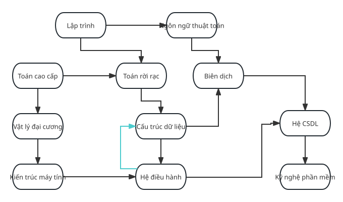

author: marscheng1

## Định nghĩa

Sắp xếp topo (Topological sorting) giải quyết bài toán sắp thứ tự tất cả các đỉnh của một đồ thị có hướng không chu trình.

Có thể mô tả quá trình này bằng ví dụ xếp lịch học theo từng học kỳ ở đại học. Giả sử các môn học gồm "Lập trình", "Ngôn ngữ thuật toán", "Giải tích cao cấp", "Toán rời rạc", "Kỹ thuật biên dịch", "Vật lý đại cương", "Cấu trúc dữ liệu", "Hệ quản trị cơ sở dữ liệu", v.v. Theo quan hệ tiên quyết trong ví dụ, muốn học "Cấu trúc dữ liệu" thì trước đó phải học "Toán rời rạc"; sau khi học xong môn này, người học có điều kiện tiên quyết để học "Kỹ thuật biên dịch". Tất nhiên, "Kỹ thuật biên dịch" còn có một môn học trước đó nữa là "Ngôn ngữ thuật toán". Các môn học này tương ứng với các đỉnh $u$, còn cạnh có hướng $(u,v)$ giữa các đỉnh tương ứng với thứ tự học. Việc phòng đào tạo sắp xếp các môn này thành một thời khóa biểu thỏa mãn các quan hệ logic chính là quá trình sắp xếp topo.



Nhưng nếu một ngày nào đó người xếp lịch lơ đãng và ghi rằng muốn học Cấu trúc dữ liệu thì phải học Hệ điều hành trước, trong khi môn tiên quyết của Hệ điều hành lại là Cấu trúc dữ liệu, vậy rốt cuộc phải học môn nào trước, nếu không xét trường hợp học đồng thời? Khi đó giữa Cấu trúc dữ liệu và Hệ điều hành đã xuất hiện một chu trình. Sinh viên không còn xác định được mình cần học gì trước, nên cũng không thể sắp xếp topo. Nếu trong đồ thị có hướng tồn tại chu trình, không thể thực hiện sắp xếp topo.

Vì vậy, trong một [DAG, tức đồ thị có hướng không chu trình](./dag.md), các đỉnh của đồ thị được sắp thành một thứ tự tuyến tính sao cho với mọi cạnh có hướng $(u,v)$ từ đỉnh $u$ đến đỉnh $v$, đỉnh $u$ đều đứng trước đỉnh $v$.

Với một DAG cho trước, nếu có cạnh từ $i$ đến $j$, nói $j$ phụ thuộc vào $i$. Nếu có đường đi từ $i$ đến $j$, tức $j$ có thể đạt được từ $i$, thì gọi $j$ là phụ thuộc gián tiếp vào $i$.

Mục tiêu của sắp xếp topo là sắp thứ tự tất cả các đỉnh sao cho một đỉnh đứng trước không phụ thuộc vào một đỉnh đứng sau.

## Mạng AOV

Trong đời sống, một công trình lớn có thể được xem là tập hợp của nhiều công việc con. Giữa các công việc con này thường tồn tại một thứ tự trước sau nhất định, nghĩa là một số công việc con chỉ có thể bắt đầu sau khi một số công việc con khác đã hoàn thành.

Dùng đồ thị có hướng để biểu diễn quan hệ trước sau giữa các công việc con, trong đó quan hệ trước sau là các cạnh có hướng. Loại đồ thị có hướng này được gọi là mạng hoạt động trên đỉnh, tức **mạng AOV (Activity On Vertex Network)**. Một mạng AOV nhất thiết là một đồ thị có hướng không chu trình, tức không có vòng. Điểm đặc trưng của AOV là các hoạt động đều được biểu diễn trên đỉnh. Hình minh họa ở trên chính là một mạng AOV.

Trong mạng AOV, đỉnh biểu diễn hoạt động, còn cung biểu diễn quan hệ ưu tiên giữa các hoạt động. Mạng AOV không nên có chu trình; khi đó có thể tìm được một dãy đỉnh sao cho mọi hoạt động tiền nhiệm của hoạt động do mỗi đỉnh biểu diễn đều đứng trước đỉnh đó. Dãy như vậy được gọi là dãy topo, và dãy topo của một mạng AOV không nhất thiết là duy nhất. Quá trình xây dựng dãy topo từ mạng AOV được gọi là sắp xếp topo. Do đó, sắp xếp topo cũng có thể được hiểu là sắp tất cả các hoạt động trong mạng AOV thành một dãy sao cho hoạt động tiền nhiệm của mỗi hoạt động đều đứng trước hoạt động đó. Kết quả sắp xếp topo trong một mạng AOV cũng không nhất thiết là duy nhất.

-   Hoạt động tiền nhiệm: hoạt động ở đầu xuất phát của cạnh có hướng được gọi là hoạt động tiền nhiệm của hoạt động ở đầu kết thúc. Một hoạt động chỉ có thể được thực hiện sau khi tất cả các hoạt động tiền nhiệm của nó đã hoàn thành.

-   Hoạt động kế nhiệm: hoạt động ở đầu kết thúc của cạnh có hướng được gọi là hoạt động kế nhiệm của hoạt động ở đầu xuất phát.

Cách kiểm tra mạng AOV có chu trình hay không là xây dựng dãy topo và xem dãy đó có chứa tất cả các đỉnh hay không.

### Các bước xây dựng dãy topo

1.  Chọn một đỉnh có bậc vào bằng không trong đồ thị.
2.  Xuất đỉnh đó, rồi xóa đỉnh này và tất cả các cạnh đi ra từ nó khỏi đồ thị.

Lặp lại hai bước trên cho đến khi tất cả các đỉnh đã được xuất ra, khi đó sắp xếp topo hoàn tất; hoặc cho đến khi trong đồ thị không còn đỉnh nào có bậc vào bằng không, khi đó đồ thị có chu trình, sắp xếp topo không thể hoàn thành và quá trình rơi vào bế tắc.

## Đường găng và mạng AOE

Tương ứng với mạng AOV là **mạng AOE (Activity On Edge Network)**, tức mạng trong đó cạnh biểu diễn hoạt động. Mạng AOE là một đồ thị có hướng không chu trình có trọng số, trong đó đỉnh biểu diễn sự kiện, còn cung biểu diễn thời gian kéo dài của hoạt động. Thông thường, mạng AOE có thể được dùng để ước lượng thời gian hoàn thành một công trình. Mạng AOE phải không có chu trình, đồng thời có đúng một đỉnh bắt đầu có bậc vào bằng không, gọi là nguồn, và đúng một đỉnh kết thúc có bậc ra bằng không, gọi là đích.


Trong mạng AOE, một số hoạt động có thể được tiến hành song song. Vì vậy thời gian ngắn nhất để hoàn thành toàn bộ công trình là độ dài của đường hoạt động dài nhất từ điểm bắt đầu đến điểm kết thúc. Trong ngữ cảnh này, độ dài đường đi là tổng thời gian kéo dài của các hoạt động trên đường đi, tức tổng trọng số của các cung, chứ không phải số lượng cung trên đường đi. Vì một công trình cần hoàn thành tất cả hoạt động bên trong nó, đường hoạt động dài nhất cũng là đường găng, và nó quyết định tổng thời gian hoàn thành công trình.

### Một số khái niệm cơ bản liên quan đến mạng AOE

-   Hoạt động: trong mạng AOE, cung biểu diễn hoạt động. Trọng số của cung biểu diễn thời gian kéo dài của hoạt động; hoạt động bắt đầu sau khi sự kiện tiền nhiệm của nó, tức đầu xuất phát của cung, được kích hoạt.

-   Sự kiện: trong mạng AOE, đỉnh biểu diễn sự kiện. Một sự kiện được kích hoạt sau khi tất cả các hoạt động tiền nhiệm của nó, tức các cung đi vào sự kiện đó, đã hoàn thành.

-   Thời điểm xảy ra sớm nhất của sự kiện, tức đỉnh $v_i$: thời điểm sớm nhất mà sự kiện này có thể xảy ra, ký hiệu là $ve(i)$. Nó quyết định thời điểm xảy ra sớm nhất của các hoạt động bắt đầu từ đỉnh này. Thời điểm xảy ra sớm nhất của nguồn là 0. Vì một sự kiện chỉ xảy ra sau khi tất cả hoạt động tiền nhiệm của nó đã hoàn thành, giá trị này bằng độ dài lớn nhất của đường đi từ điểm bắt đầu đến đỉnh đó. Viết dưới dạng truy hồi: $ve(i) = \max\{ve(j) + val^j_i ~\vert~ j \in pre_i\}$, trong đó $val^j_i$ biểu diễn trọng số cạnh từ $j$ đến $i$, tức thời gian kéo dài của hoạt động từ $j$ đến $i$, còn $pre_i$ biểu diễn tập tất cả các sự kiện tiền nhiệm của $i$.

-   Thời điểm xảy ra muộn nhất của sự kiện, tức đỉnh $v_i$: thời điểm muộn nhất mà sự kiện này còn có thể xảy ra mà không làm chậm toàn bộ tiến độ, ký hiệu là $vl(i)$. Nó quyết định thời điểm xảy ra muộn nhất của tất cả các hoạt động kết thúc tại trạng thái này. Giá trị này bằng giá trị nhỏ nhất trong các thời điểm bắt đầu muộn nhất của mọi hoạt động kế nhiệm của sự kiện, tức $vl(i) = \min\{vl(j) - val^i_j ~\vert~ j \in nxt_i\}$, trong đó $val^i_j$ biểu diễn trọng số cạnh từ $i$ đến $j$, tức thời gian kéo dài của hoạt động từ $i$ đến $j$, còn $nxt_i$ biểu diễn tập tất cả các sự kiện kế nhiệm của $i$.

-   Thời điểm bắt đầu sớm nhất của hoạt động, tức cung $(u, v)$: thời điểm sớm nhất mà hoạt động này có thể xảy ra, ký hiệu là $e(u,v)$. Nó bằng thời điểm xảy ra sớm nhất của sự kiện tiền nhiệm, tức $e(u,v)=ve(u)$.

-   Thời điểm bắt đầu muộn nhất của hoạt động, tức cung $(u, v)$: thời điểm muộn nhất mà hoạt động có thể bắt đầu mà không làm chậm toàn bộ tiến độ, ký hiệu là $l(u,v)$. Nó bằng thời điểm xảy ra muộn nhất của sự kiện kế nhiệm trừ thời gian kéo dài của hoạt động, tức trọng số của cung: $l(u,v)=vl(v)-val^u_v$, trong đó $val^u_v$ biểu diễn trọng số cạnh từ $u$ đến $v$, tức thời gian kéo dài của hoạt động từ $u$ đến $v$.

-   Đường găng: độ dài đường đi dài nhất từ nguồn đến đích trong mạng AOE.

-   Hoạt động găng: hoạt động nằm trên đường găng; thời điểm bắt đầu sớm nhất và muộn nhất của nó bằng nhau.

### Truy hồi thời điểm xảy ra sớm nhất và muộn nhất

Tính theo thứ tự topo: thời điểm xảy ra sớm nhất được truy hồi từ trước ra sau, còn thời điểm xảy ra muộn nhất được truy hồi từ sau ra trước. Công thức truy hồi đã được nêu trong phần **Một số khái niệm cơ bản liên quan đến mạng AOE** ở trên.

## Thuật toán Kahn

### Quy trình

Ban đầu, tập $S$ chứa tất cả các đỉnh có bậc vào bằng $0$, còn $L$ là một danh sách rỗng.

Mỗi lần, lấy một đỉnh $u$ bất kỳ từ $S$ và đưa vào $L$, sau đó xóa tất cả các cạnh $(u, v_1), (u, v_2), (u, v_3) \cdots$ xuất phát từ $u$. Với mỗi cạnh $(u, v)$, nếu sau khi xóa cạnh này bậc vào của đỉnh $v$ trở thành $0$, thì đưa $v$ vào $S$.

Lặp lại quá trình trên cho đến khi tập $S$ rỗng. Sau đó kiểm tra trong đồ thị còn cạnh nào không. Nếu còn, đồ thị chắc chắn có chu trình; ngược lại trả về $L$, và thứ tự các đỉnh trong $L$ chính là dãy topo đã xây dựng.

Trước hết, xét mã giả từ [Wikipedia](https://en.wikipedia.org/wiki/Topological_sorting#Kahn's_algorithm):

???+ note "Cài đặt"
    ```text
    L ← danh sách rỗng sẽ chứa các phần tử sau khi sắp xếp
    S ← tập tất cả các nút không có cạnh đi vào
    trong khi S không rỗng thực hiện
        lấy một nút n khỏi S
        đưa n vào L
        với mỗi nút m có một cạnh e từ n đến m thực hiện
            xóa cạnh e khỏi đồ thị
            nếu m không còn cạnh đi vào nào khác thì
                đưa m vào S
    nếu đồ thị còn cạnh thì
        trả về lỗi (đồ thị có ít nhất một chu trình)
    ngược lại
        trả về L (một thứ tự topo)
    ```

Cốt lõi của mã là duy trì một tập các đỉnh có bậc vào bằng 0.

Có thể tham khảo hình sau:


Một kết quả sắp xếp của đồ thị này là: 2 -> 8 -> 0 -> 3 -> 7 -> 1 -> 5 -> 6 -> 9 -> 4 -> 11 -> 10 -> 12

### Độ phức tạp thời gian

Với đồ thị $G = (V, E)$, khi khởi tạo tập $S$ gồm các đỉnh có bậc vào bằng $0$, cần duyệt toàn bộ đồ thị và kiểm tra từng cạnh, nên độ phức tạp là $O(E+V)$. Sau đó, các thao tác trên tập này cũng cần độ phức tạp thời gian $O(E+V)$.

Vì vậy tổng độ phức tạp thời gian là $O(E+V)$.

### Cài đặt

=== "C++"
    ```cpp
    int n, m;
    vector<int> G[MAXN];
    int in[MAXN];  // Lưu bậc vào của mỗi đỉnh
    
    bool toposort() {
      vector<int> L;
      queue<int> S;
      for (int i = 1; i <= n; i++)
        if (in[i] == 0) S.push(i);
      while (!S.empty()) {
        int u = S.front();
        S.pop();
        L.push_back(u);
        for (auto v : G[u]) {
          if (--in[v] == 0) {
            S.push(v);
          }
        }
      }
      if (L.size() == n) {
        for (auto i : L) cout << i << ' ';
        return true;
      }
      return false;
    }
    ```

=== "Python"
    ```python
    from collections import defaultdict, deque
    
    
    def topo_sort(graph):
        lst = []
        in_degree = defaultdict(int)
        for u in graph:
            for v in graph[u]:
                in_degree[v] += 1
    
        s = deque([u for u in graph if in_degree[u] == 0])
        while s:
            u = s.popleft()
            lst.append(u)
            for v in graph.get(u, []):
                in_degree[v] -= 1
                if in_degree[v] == 0:
                    s.append(v)
    
        return None if any(in_degree.values()) else lst
    ```

## Thuật toán DFS

### Cài đặt

=== "C++"
    ```cpp
    using Graph = vector<vector<int>>;  // Danh sách kề
    
    struct TopoSort {
      enum class Status : uint8_t { to_visit, visiting, visited };
    
      const Graph& graph;
      const int n;
      vector<Status> status;
      vector<int> order;
      vector<int>::reverse_iterator it;
    
      TopoSort(const Graph& graph)
          : graph(graph),
            n(graph.size()),
            status(n, Status::to_visit),
            order(n),
            it(order.rbegin()) {}
    
      bool sort() {
        for (int i = 0; i < n; ++i) {
          if (status[i] == Status::to_visit && !dfs(i)) return false;
        }
        return true;
      }
    
      bool dfs(const int u) {
        status[u] = Status::visiting;
        for (const int v : graph[u]) {
          if (status[v] == Status::visiting) return false;
          if (status[v] == Status::to_visit && !dfs(v)) return false;
        }
        status[u] = Status::visited;
        *it++ = u;
        return true;
      }
    };
    ```

=== "Python"
    ```python
    from enum import Enum, auto
    
    
    class Status(Enum):
        to_visit = auto()
        visiting = auto()
        visited = auto()
    
    
    def topo_sort(graph: list[list[int]]) -> list[int] | None:
        n = len(graph)
        status = [Status.to_visit] * n
        order = []
    
        def dfs(u: int) -> bool:
            status[u] = Status.visiting
            for v in graph[u]:
                if status[v] == Status.visiting:
                    return False
                if status[v] == Status.to_visit and not dfs(v):
                    return False
            status[u] = Status.visited
            order.append(u)
            return True
    
        for i in range(n):
            if status[i] == Status.to_visit and not dfs(i):
                return None
    
        return order[::-1]
    ```

Độ phức tạp thời gian: $O(E+V)$. Độ phức tạp bộ nhớ: $O(V)$.

### Chứng minh tính đúng đắn

Xét một đồ thị. Sau khi xóa một đỉnh có bậc vào bằng $0$, nếu đồ thị mới có thể sắp xếp topo, thì đồ thị ban đầu cũng chắc chắn có thể sắp xếp topo. Ngược lại, nếu đồ thị ban đầu có thể sắp xếp topo, thì sau khi xóa đỉnh đó, đồ thị còn lại cũng có thể sắp xếp topo.

### Ứng dụng

Sắp xếp topo có thể dùng để kiểm tra đồ thị có chu trình hay không, và cũng có thể dùng để kiểm tra đồ thị có phải là một đường đi tuyến tính hay không. Sắp xếp topo còn có thể dùng để tìm đường găng trong mạng AOE và ước lượng thời gian ngắn nhất để hoàn thành công trình.

### Tìm thứ tự topo lớn nhất hoặc nhỏ nhất theo thứ tự từ điển

Chỉ cần thay hàng đợi trong thuật toán Kahn bằng hàng đợi ưu tiên được cài đặt bằng heap lớn hoặc heap nhỏ. Khi đó tổng độ phức tạp thời gian là $O(E+V \log{V})$.

## Bài tập

[CF 1385E](https://codeforces.com/problemset/problem/1385/E): cần xây dựng bằng sắp xếp topo.

[Luogu P1347](https://www.luogu.com.cn/problem/P1347): bài mẫu sắp xếp topo.

## Tham khảo

1.  Toán rời rạc và ứng dụng. ISBN:9787111555391
2.  [Topological sorting - Wikipedia](https://en.wikipedia.org/wiki/Topological_sorting)
3.  [Bài giảng Cấu trúc dữ liệu số 9, đồ thị: sắp xếp topo, đường găng, đường đi ngắn nhất - chuyên mục Zhihu](https://zhuanlan.zhihu.com/p/164751109)
