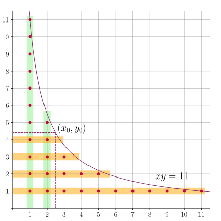

author: Backl1ght, c-forrest, Enter-tainer, Great-designer, Henry-ZHR, huayucaiji, hsfzLZH1, Ir1d, kenlig, ksyx, Marcythm, MegaOwIer, Menci, Nanarikom, nanmenyangde, ouuan, purple-vine, shawlleyw, sshwy, StudyingFather, Tiphereth-A, Xeonacid

Kiến thức cần biết: [tích chập Dirichlet](./dirichlet.md), [phân khối số
học](./sqrt-decomposition.md)

Bài viết giới thiệu phương pháp hyperbol Dirichlet để tính tổng tiền tố của
tích chập Dirichlet của hai hàm số học trong thời gian dưới tuyến tính. Từ
phân tích này, ta xây dựng khái niệm sàng khối và cách tính nhanh tích chập của
hai sàng khối. Cuối cùng là sàng Dujiao, dùng để tính tổng tiền tố của thương
hai hàm số học theo nghĩa tích chập Dirichlet.

## Phương pháp hyperbol Dirichlet

Phương pháp hyperbol Dirichlet dùng để tính tổng tiền tố của tích chập
Dirichlet của hai hàm số học.

Cho các hàm số học $f,g,h$ với $h=f\ast g$. Theo định nghĩa tích chập
Dirichlet, tổng tiền tố của $h$ là

$$
H(n) = \sum_{k=1}^nh(k) = \sum_{k=1}^n\sum_{xy=k}f(x)g(y).
$$

Tập điểm được duyệt trong tổng chính là các điểm nguyên nằm dưới hyperbol
$xy=n$ ở góc phần tư thứ nhất, không kể hai trục. Gán điểm $(x,y)$ trọng số
$f(x)g(y)$; khi đó $H(n)$ là tổng các trọng số này.



Như hình vẽ, có thể tính tổng trọng số bằng nguyên lý bao hàm–loại trừ:

$$
H(n) = \sum_{x=1}^{\lfloor x_0\rfloor}f(x)G\left(\left\lfloor\dfrac{n}{x}\right\rfloor\right) + \sum_{y=1}^{\lfloor y_0\rfloor}F\left(\left\lfloor\dfrac{n}{y}\right\rfloor\right)g(y) - F(\lfloor x_0\rfloor)G(\lfloor y_0\rfloor).
$$

Trong đó $F,G$ lần lượt là hàm tổng tiền tố của $f,g$, còn $(x_0,y_0)$ là
điểm bất kỳ trên $xy=n$. Ba hạng tương ứng với vùng xanh, vùng cam và phần
giao bị tính hai lần. Biểu thức chỉ có
$\lfloor x_0\rfloor+\lfloor y_0\rfloor+1$ hạng. Chọn $(x_0,y_0)$ thích hợp
cho độ phức tạp tốt hơn nhiều so với tính trực tiếp tổng tiền tố của $h$. Đây
là **phương pháp hyperbol Dirichlet** (Dirichlet hyperbola method).

### Tính một giá trị của tổng tiền tố tích chập

Ứng dụng cơ bản nhất là tính một giá trị $H(n)$.

Nếu đã biết (hoặc tính được trong $O(1)$) các giá trị của $F,G$, và do đó của
$f,g$, mỗi hạng trong công thức tính mất $O(1)$. Tổng thời gian là
$O(x_0+y_0)$. Vì $x_0y_0=n$, bất đẳng thức trung bình cho thấy lựa chọn tối ưu
$x_0=y_0=\sqrt n$ cho độ phức tạp $O(\sqrt n)$.

Kết quả này cũng có thể thu được bằng phân khối số học. Đặt $x_0>n$ trong
công thức hyperbol Dirichlet, ta có

$$
H(n) = \sum_{x=1}^nf(x)G\left(\left\lfloor\dfrac{n}{x}\right\rfloor\right).
$$

Khi biết các giá trị của $F,G$, [phân khối số học](./sqrt-decomposition.md)
tính biểu thức này trong $O(\sqrt n)$. Hai cách gần như tương đương: chúng
cần thông tin đầu vào và tính các biểu thức gần giống nhau.

??? note "Giải thích tính tương đương"
    Xét kỹ quá trình phân khối số học, biểu thức thực sự được tính là

    $$
    H(n) = \sum_{y\in D(n)}\left(F\left(\left\lfloor\dfrac{n}{y}\right\rfloor\right)-F\left(\left\lfloor\dfrac{n}{y+1}\right\rfloor\right)\right)G(y).
    $$

    trong đó $D(n)=\{\lfloor n/x\rfloor:1\le x\le n,\ x\in\mathbf N_+\}$
    là tập điểm then chốt của phân khối số học.

    Với $x\le\sqrt n$, các chiều cao khối $y=\lfloor n/x\rfloor$ đôi một
    khác nhau nên mỗi khối này có độ dài $1$, tức

    $$
    \left\lfloor\dfrac{n}{y+1}\right\rfloor + 1 = x = \left\lfloor\dfrac{n}{y}\right\rfloor.
    $$

    Do đó phần tổng ứng với các khối này là

    $$
    I_1 = \sum_{x=1}^{\lfloor\sqrt{n}\rfloor}\left(F(x)-F(x-1)\right)G\left(\left\lfloor\dfrac{n}{x}\right\rfloor\right) = \sum_{x=1}^{\lfloor\sqrt{n}\rfloor}f(x)G\left(\left\lfloor\dfrac{n}{x}\right\rfloor\right).
    $$

    Với các khối còn lại, $y$ chạy từ $1$ đến
    $y^*=\lfloor n/(\lfloor\sqrt n\rfloor+1)\rfloor$. Áp dụng [biến đổi
    Abel](https://en.wikipedia.org/wiki/Summation_by_parts) cho phần tổng còn
    lại, ta được

    $$
    \begin{aligned}
    I_2 &= \sum_{y=1}^{y^*}\left(F\left(\left\lfloor\dfrac{n}{y}\right\rfloor\right)-F\left(\left\lfloor\dfrac{n}{y+1}\right\rfloor\right)\right)G(y) \\
    &= \sum_{y=1}^{y^*}F\left(\left\lfloor\dfrac{n}{y}\right\rfloor\right)g(y) - F\left(\left\lfloor\dfrac{n}{y^*+1}\right\rfloor\right)G(y^*).
    \end{aligned}
    $$

    Tính chất phân khối cho
    $\lfloor n/\lfloor\sqrt n\rfloor\rfloor\ge\lfloor\sqrt n\rfloor$.
    Xét hai trường hợp:

    -   Nếu hai vế bằng nhau thì $y^*<\lfloor\sqrt n\rfloor$. Hai khối kề
        nhau chỉ có thể lệch độ cao đúng một, nên
        $y^*=\lfloor\sqrt n\rfloor-1$. Khi đó

        $$
        \begin{aligned}
        I_2 &= \sum_{y=1}^{\lfloor\sqrt{n}\rfloor-1}F\left(\left\lfloor\dfrac{n}{y}\right\rfloor\right)g(y) - F(\lfloor\sqrt{n}\rfloor)G(\lfloor\sqrt{n}\rfloor-1)\\
        &= \sum_{y=1}^{\lfloor\sqrt{n}\rfloor-1}F\left(\left\lfloor\dfrac{n}{y}\right\rfloor\right)g(y) -  F(\lfloor\sqrt{n}\rfloor)\left(G(\lfloor\sqrt{n}\rfloor) - g(\lfloor\sqrt{n}\rfloor)\right) \\
        &= \sum_{y=1}^{\lfloor\sqrt{n}\rfloor}F\left(\left\lfloor\dfrac{n}{y}\right\rfloor\right)g(y) - F(\lfloor\sqrt{n}\rfloor)G(\lfloor\sqrt{n}\rfloor).
        \end{aligned}
        $$

    -   Nếu bất đẳng thức là nghiêm ngặt thì
        $y^*=\lfloor\sqrt n\rfloor$. Thay trực tiếp vào tổng được

        $$
        I_2 = \sum_{y=1}^{\lfloor\sqrt{n}\rfloor}F\left(\left\lfloor\dfrac{n}{y}\right\rfloor\right)g(y) - F(\lfloor\sqrt{n}\rfloor)G(\lfloor\sqrt{n}\rfloor).
        $$

    Tóm lại, ngoài một biến đổi Abel, phân khối số học thực chất tính

    $$
    H(n) = \sum_{x=1}^{\lfloor\sqrt{n}\rfloor}f(x)G\left(\left\lfloor\dfrac{n}{x}\right\rfloor\right) + \sum_{y=1}^{\lfloor\sqrt{n}\rfloor}F\left(\left\lfloor\dfrac{n}{y}\right\rfloor\right)g(y) - F(\lfloor\sqrt{n}\rfloor)G(\lfloor\sqrt{n}\rfloor).
    $$

    Đây chính là công thức hyperbol Dirichlet với
    $(x_0,y_0)=(\sqrt n,\sqrt n)$. Hai thuật toán vì thế gần như tương đương;
    phương pháp hyperbol tận dụng thêm các tính chất để tránh một số phép tính
    thừa, nên thường có hằng số nhỏ hơn.

Trong thực tế, yêu cầu biết mọi giá trị của $F,G$ có thể quá mạnh. Công thức
chỉ cần giá trị của chúng tại tập điểm then chốt

$$
D(n) = \left\{\left\lfloor\dfrac{n}{x}\right\rfloor : 1 \le x \le n,~x\in\mathbf N_+\right\}
$$

Tập này vừa là tập chiều cao, vừa là tập đầu mút phải của mọi khối. Theo
[tính chất phân khối](./sqrt-decomposition.md#tính-chất), nó chứa mọi số
nguyên $1\le x\le\sqrt n$; biết $F,G$ trên $D(n)$ tương đương với biết $f,g$
trên đoạn đó. Vì $|D(n)|=\Theta(\sqrt n)$, ta chỉ cần thông tin tại một tập
thưa. Đây là quan sát then chốt để tối ưu tổng tiền tố hàm số học.

## Sàng khối và tích chập

Đôi khi $h=f\ast g$ chỉ là một kết quả trung gian. Để dùng trong các bước sau,
ta cần giá trị của $H$ trên $D(n)$. Tập giá trị đó được gọi là **sàng khối**
của hàm số học $h$:

$$
\mathcal S_h(n) = \left\{H(x) : x \in D(n)\right\}.
$$

Phần này xét bài toán **tích chập sàng khối**: từ sàng khối của $f,g$, tính
sàng khối của tích chập Dirichlet $h=f\ast g$.

### Thuật toán trực tiếp

Cách trực tiếp xem việc tính sàng khối như $|D(n)|$ lần tính một giá trị tổng
tiền tố. Tổng độ phức tạp là

$$
\begin{aligned}
O\left(\sum_{d\in D(n)}\sqrt{d}\right) &= O\left(\sum_{x=1}^{\lfloor\sqrt{n}\rfloor}\sqrt{x} + \sum_{x=1}^{\lfloor\sqrt{n}\rfloor}\sqrt{\dfrac{n}{x}}\right) \\
&= O\left(\int_1^{\sqrt{n}}\sqrt{x}\mathrm{d}x + \int_1^{\sqrt{n}}\sqrt{\dfrac{n}{x}}\mathrm{d}x\right)\\
&= O(n^{3/4}).
\end{aligned}
$$

Nhờ sàng khối là một tập thưa, toàn bộ sàng có thể được tính trong thời gian
dưới tuyến tính.

Tuy nhiên, cách này còn quá thô. Các phần tử nhỏ của $D(n)$ khá dày, nên hai
tổng tiền tố kề nhau không khác nhiều; có thể tính trực tiếp các giá trị của
$h$ rồi cộng dồn, nhanh hơn tính riêng từng tổng tiền tố. Chẳng hạn, tính riêng
cho $x=1,2,\ldots,\lfloor\sqrt n\rfloor$ cần

$$
O\left(\sum_{x=1}^{\lfloor\sqrt{n}\rfloor}\sqrt{x}\right) = O(n^{3/4})
$$

thời gian, còn tính giá trị của $h$ rồi cộng dồn chỉ cần
$O(n^{1/2}\log n)$. Dẫu vậy, nếu chỉ biết sàng khối của $f,g$ thì không thể
tiếp tục tối ưu: sàng chỉ cung cấp giá trị điểm với $x\le\sqrt n$, nên phần
tổng tiền tố còn lại vẫn tốn $O(n^{3/4})$.

### Tối ưu bằng thông tin giá trị điểm

Nếu ngoài sàng khối còn biết thêm các giá trị điểm của $f,g$, có thể cải thiện
độ phức tạp. Trong thực tế, cách này thường dùng khi có thể tiền xử lý nhanh
các giá trị điểm.

Chọn $z\ge\sqrt n$ và chia sàng khối của $h$ làm hai phần:

-   Tính $h=f\ast g$ tại $1\le x\le z$, rồi cộng dồn để có $H$ trên đoạn đó.
-   Với $x\in D(n)$ và $x>z$, tính $H(x)$ bằng phương pháp hyperbol Dirichlet.

Trong trường hợp tổng quát, độ phức tạp là

$$
\begin{aligned}
O\left(z\log z + \sum_{d\in D(n),~d\ge z}\sqrt{d}\right) &= O\left(z\log z + \sum_{x=1}^{n/z}\sqrt{\dfrac{n}{x}}\right)\\
&= O\left(z\log z + \int_1^{n/z}\sqrt{\dfrac{n}{x}}\mathrm{d}x\right)\\
&= O\left(z\log z + \dfrac{n}{\sqrt{z}}\right).
\end{aligned}
$$

Chọn $z=(n/\log n)^{2/3}$ cho độ phức tạp nhỏ nhất
$O(n^{2/3}(\log n)^{1/3})$.

Độ phức tạp [tính giá trị điểm của tích chập
Dirichlet](./dirichlet.md#tính-tích-chập-dirichlet) còn phụ thuộc vào tính chất
của $f,g,h$. Trong các trường hợp đặc biệt:

-   Nếu $f$ hoặc $g$ là hàm nhân tính, chọn
    $z=(n/\log\log n)^{2/3}$ cho thời gian
    $O(n^{2/3}(\log\log n)^{1/3})$.
-   Nếu $h$ là hàm nhân tính, chọn $z=n^{2/3}$ cho thời gian $O(n^{2/3})$.

Tối ưu này chỉ cần giá trị của $f,g$ trên $1\le x\le z$. Thuật toán đồng thời
tính $h$ trên đoạn đó, nên nếu $h$ là biến trung gian, các giá trị này tiếp tục
giúp tối ưu bước sau. Sàng khối cùng các giá trị điểm ấy tạo thành sàng khối
mở rộng: đó là toàn bộ thông tin cần để tính tổng tiền tố tích chập trong
$O(n^{2/3+\varepsilon})$.

### Tích chập sàng khối nhanh

Kiến thức cần biết: [biến đổi Fourier nhanh](../poly/fft.md)

???+ warning "Lưu ý"
    Người mới học có thể bỏ qua phần này.

Phần này trình bày thuật toán tích chập sàng khối nhanh do Zhou Kangyang đề
xuất trong luận văn đội tuyển năm 2024. Từ $\mathcal S_f,\mathcal S_g$, nó
tính $\mathcal S_h$ trong $O(\sqrt n\log^2n)$ mà không cần thêm giá trị điểm
hay giả thiết nhân tính, đổi lại cài đặt phức tạp.

Bài toán cần tính

$$
h(z) = \sum_{xy=z} f(x)g(y)
$$

tổng tiền tố tại $D(n)=\{\lfloor n/t\rfloor:1\le t\le n\}$. Một đóng góp
được đánh dấu bởi $(x,y,t)$: cộng $f(x)g(y)$ vào tổng tiền tố tại
$\lfloor n/t\rfloor$. Thuật toán chia các đóng góp thành nhiều nhóm.

Trước hết xét các đóng góp có $x>\sqrt n$; trường hợp $y>\sqrt n$ tương tự.
Vì $xy\le\lfloor n/t\rfloor$, tức $xyt\le n$, chỉ cần duyệt mọi $t,y$ rồi
dùng tổng tiền tố và $\mathcal S_f$. Phần này tốn
$O(\sum_{t,y:ty\le\sqrt n}1)=O(\sqrt n\log n)$.

Tiếp theo xét $\lfloor n/t\rfloor\le\sqrt n$. Có thể duyệt trực tiếp mọi
$x,y$ trong $O(\sum_{x,y:xy\le\sqrt n}1)=O(\sqrt n\log n)$. Qua đó thu được
$\lfloor\sqrt n\rfloor$ giá trị điểm đầu của $h$ trên $D(n)$.

Các đóng góp còn lại thỏa $x,y\le\sqrt n$ và
$\lfloor n/t\rfloor>\sqrt n$. Điều kiện $xyt\le n$ tương đương
$\ln x+\ln y\le\ln(n/t)$. Với $S>0$, xấp xỉ nó bằng
$\lceil S\ln x\rceil+\lceil S\ln y\rceil\le S\ln(n/t)$. Định nghĩa đa thức
$\sigma_f,\sigma_g$ sao cho hệ số bậc $k$ là tổng $f(x)$, tương ứng $g(y)$,
với giá trị làm tròn bằng $k$ và $x,y\le\sqrt n$. FFT tính tích của hai đa
thức; hệ số bậc $k$ của tích là tổng $f(x)g(y)$ có tổng hai giá trị làm tròn
bằng $k$. Với mỗi $\lfloor n/t\rfloor$ còn lại, lấy tổng hệ số đến
$k\le S\ln(n/t)$ để ước lượng đóng góp.

Cuối cùng cần hiệu chỉnh sai số. Điều kiện xấp xỉ mạnh hơn có thể bỏ sót đóng
góp, chỉ khi tổng hai giá trị làm tròn lớn hơn $S\ln(n/t)$. Khi đó

$$
S\ln x + 1 +  S\ln y + 1 \ge \lceil S\ln x\rceil + \lceil S\ln y\rceil >  S\ln(n/t) \ge S\ln x + S\ln y.
$$

Điều này tương đương

$$
xyt \in (n\mathrm{e}^{-2/S},n].
$$

Đây là đoạn dài $O(n/S)$. Duyệt các bộ $(x,y,t)$ trong đoạn và kiểm tra từng
đóng góp để sửa sai số. Để duyệt nhanh, sàng các số nguyên tố không vượt
$\sqrt n$, dùng chúng phân tích các số trong đoạn; thừa số còn lại phải là số
nguyên tố lớn hơn $\sqrt n$. Từ phân tích thừa số, có thể liệt kê nhanh mọi bộ.

Để ước lượng, nhân hai đa thức dài $S\log n$ tốn
$O(S\log n\log(S\log n))$. Hiệu chỉnh sai số cần
$O(\sqrt n+(n/S)\log\log n)$ để phân tích thừa số và
$O(\sum_{k\in(n\mathrm e^{-2/S},n]}d_3(k))$ để duyệt, trong đó $d_3(n)$ là số
cách viết $n$ thành tích có thứ tự của ba số nguyên. Giải tích số cho biết[^piltz]

$$
\sum_{k\le n}d_3(k) = nP(\log n) + O(n^{43/96+\varepsilon}),
$$

với $P$ là đa thức bậc hai. Hai bước đầu đã tốn $O(\sqrt n\log n)$; bỏ các
hạng $o(\sqrt n\log n)$, phần cuối có độ phức tạp

$$
O\left(S\log n\log(S\log n) + \dfrac{n}{S} \log^2n\right).
$$

Chọn $S=\sqrt n$ cho $O(\sqrt n\log^2n)$, cũng là độ phức tạp toàn thuật toán.

??? example "Cài đặt tham khảo"
    ```cpp
    --8<-- "docs/math/code/hyperbola/fast_bs_conv.cpp:core"
    ```

## Sàng Dujiao

Phần trước tính tổng tiền tố của tích chập Dirichlet. Bây giờ xét quá trình
ngược: cho $f\ast g=h$ và biết $f,h$, tính tổng tiền tố của $g$:

$$
G(n) = \sum_{x=1}^ng(x).
$$

Nói cách khác, ta tính tổng tiền tố của thương hai hàm số học theo nghĩa tích
chập Dirichlet. Luôn giả sử $f(1)\ne0$ để $f$ khả nghịch.

Đặt $x_0>n$ trong công thức hyperbol Dirichlet:

$$
H(n) = \sum_{x=1}^{n}f(x)G\left(\left\lfloor\dfrac{n}{x}\right\rfloor\right).
$$

Giải trực tiếp theo $G(n)$:

$$
G(n) = \dfrac{1}{f(1)}\left(H(n)-\sum_{x=2}^nf(x)G\left(\left\lfloor\dfrac{n}{x}\right\rfloor\right)\right).
$$

Đây là công thức sàng Dujiao. Tổng quát hơn, với $x_0\ge1$ luôn có

$$
G(n) = \dfrac{1}{f(1)}\left(H(n)-\sum_{x=2}^{\lfloor x_0\rfloor}f(x)G\left(\left\lfloor\dfrac{n}{x}\right\rfloor\right) - \sum_{y=1}^{\lfloor y_0\rfloor}F\left(\left\lfloor\dfrac{n}{y}\right\rfloor\right)g(y) + F(\lfloor x_0\rfloor)G(\lfloor y_0\rfloor)\right).
$$

Cả hai dạng đều là truy hồi theo $G(n)$ và cần $G$ tại
$D(n)\setminus\{n\}$. Nhờ [cấu trúc đệ quy](./sqrt-decomposition.md#tính-chất)
$m\in D(n)\Rightarrow D(m)\subseteq D(n)$, trong toàn bộ quá trình mỗi giá
trị $G$ trên $D(n)$ chỉ cần tính một lần. Vì vậy, tính $G(n)$ thực chất đồng
thời tạo sàng khối $\mathcal S_g(n)$.

Có thể cài đặt đệ quy với ghi nhớ để tránh lặp, hoặc lặp theo thứ tự tăng dần
trên $D(n)$. Các tổng bên trong có thể tính bằng phân khối số học hoặc phương
pháp hyperbol Dirichlet.

Các cài đặt có cùng độ phức tạp. Vì sàng Dujiao luôn tạo sàng khối, độ phức
tạp chính là độ phức tạp tính sàng khối. Nếu chỉ biết sàng khối của $F,H$ thì
là $O(n^{3/4})$. Nếu với $z\ge\sqrt n$ có thể tiền xử lý $g$ trên
$1\le x\le z$ trong $T_0(z)$, độ phức tạp là

$$
O\left(T_0(z) + \dfrac{n}{\sqrt{z}}\right).
$$

Nếu $g$ nhân tính, dùng sàng tuyến tính nên $T_0(z)=\Theta(z)$; lựa chọn tối ưu
$z=n^{2/3}$ cho tổng thời gian $O(n^{2/3})$. Trường hợp tổng quát cho
$O(n^{2/3}(\log n)^{1/3})$, đúng như phân tích sàng khối.

??? warning "Cài đặt đệ quy không ghi nhớ sẽ có độ phức tạp sai"
    Tính $G(n)$ phụ thuộc vào $G$ trên $D(n)\setminus\{n\}$. Mấu chốt của
    phân tích là $m\in D(n)\Rightarrow D(m)\subseteq D(n)$, cho phép ghi nhớ
    để mỗi giá trị chỉ tính một lần và đạt $O(n^{3/4})$. Không ghi nhớ thì
    cận này không còn đúng.

    Nếu không ghi nhớ và gọi độ phức tạp đệ quy là $T(n)$ thì

    $$
    \begin{aligned}
    T(n) &= \Theta(\sqrt{n}) + \sum_{d\in D(n),~d\neq n}T(d)\\
    &= \Theta(\sqrt{n}) + \sum_{x=1}^{\lfloor n/\lfloor\sqrt{n}\rfloor\rfloor - 1} T(x) + \sum_{x = 2}^{\lfloor\sqrt{n}\rfloor}T\left(\left\lfloor\dfrac{n}{x}\right\rfloor\right).
    \end{aligned}
    $$

    Lập luận tương tự [định lý chính](../../basic/complexity.md#định-lý-chính-master-theorem)
    cho thấy hạng cuối chi phối và $T(n)\in\Theta(n^\alpha)$, với
    $\alpha\approx1.73$ là nghiệm của $\zeta(\alpha)=2$.

Khi dùng sàng Dujiao, mấu chốt là tìm $f,h$ sao cho $h=f\ast g$ và sàng khối
của $f,h$ dễ tính. Đôi khi lựa chọn hiển nhiên; đôi khi phải dùng tính chất
tích chập hoặc hàm sinh Dirichlet. Các ví dụ sau minh họa hai trường hợp.

## Ví dụ

Phần này trình bày một số bài toán tính tổng tiền tố hàm số học.

???+ example "[AtCoder Regular Contest 116 C - Multiple Sequences](https://atcoder.jp/contests/arc116/tasks/arc116_c)"
    Cho $N,M>0$. Đếm số dãy $A$ độ dài $N$ thỏa $1\le A_i\le M$ và
    $A_i\mid A_{i+1}$. Lấy đáp án theo môđun $998244353$; $N,M\le2\cdot10^5$.

??? note "Lời giải"
    Gọi $f_n(m)$ là số dãy độ dài $n$ có $A_n=m$. Đáp án là
    $\sum_{m=1}^M f_N(m)$ và chuyển trạng thái là

    $$
    f_n(m) = \sum_{k\mid m}f_{n-1}(k).
    $$

    Theo ký hiệu tích chập Dirichlet, $f_n=f_{n-1}\ast1$, trong đó $1$ là
    hàm hằng. Vì $f_1=1$, suy ra $f_n=1^{\ast n}$. Đáp án là tổng tiền tố của
    $f_N$. Mọi hàm đều nhân tính, nên mỗi phép tích chập tổng tiền tố tốn
    $O(M^{2/3})$; dùng [lũy thừa nhanh](../binary-exponentiation.md) chỉ cần
    $O(\log N)$ phép, tổng thời gian $O(M^{2/3}\log N)$.

??? note "Cài đặt tham khảo"
    ```cpp
    --8<-- "docs/math/code/hyperbola/hyperbola.cpp"
    ```

???+ example "[P4213 - Mẫu sàng Dujiao (Sum)](https://www.luogu.com.cn/problem/P4213)"
    Với $\mu$ là hàm Möbius và $\varphi$ là hàm Euler, tính
    $S_1(n)=\sum_{i=1}^n\mu(i)$ và $S_2(n)=\sum_{i=1}^n\varphi(i)$,
    $1\le n<2^{31}$.

??? note "Lời giải"
    Dùng các quan hệ tích chập Dirichlet:

    $$
    \varepsilon = \mu \ast 1,~ \operatorname{id} = \varphi \ast 1.
    $$

    Trong đó $\varepsilon(n)=[n=1]$ là đơn vị tích chập,
    $\operatorname{id}(n)=n$ và $1(n)=1$. Tổng tiền tố của cả ba tính trong
    $O(1)$ và chúng đều nhân tính, nên sàng Dujiao cho thời gian $O(n^{2/3})$.

    Một cách khác để tính tổng tiền tố Euler là [đảo Möbius](./mobius.md):

    $$
    \begin{aligned}
    S_2(n) &= \sum_{i=1}^n\varphi(i) = \sum_{i=1}^n\sum_{j=1}^i[i\perp j] \\
    &= \sum_{i=1}^n\sum_{j=1}^i\sum_d\mu(d)[d\mid i][d\mid j] \\
    &= \sum_d\mu(d)\dfrac{1}{2}\left\lfloor\dfrac{n}{d}\right\rfloor\left(\left\lfloor\dfrac{n}{d}\right\rfloor+1\right).
    \end{aligned}
    $$

    Phân khối số học cần tổng tiền tố của $\mu(d)$, có thể tiền xử lý bằng
    sàng Dujiao. Độ phức tạp vẫn là $O(n^{2/3})$.

??? note "Cài đặt tham khảo"
    ```cpp
    --8<-- "docs/math/code/du/du_1.cpp"
    ```

???+ example "[Luogu P3768 - Bài toán đơn giản](https://www.luogu.com.cn/problem/P3768)"
    Cho $p,n$, tính

    $$
    \sum_{i=1}^n\sum_{j=1}^nij\cdot\gcd(i,j)\pmod p.
    $$

    với $n\le10^{10}$, $5\cdot10^8\le p\le1.1\cdot10^9$ và $p$ nguyên tố.

??? note "Lời giải"
    Dùng tính chất của [hàm Euler](./euler-totient.md) để biến đổi:

    $$
    \begin{aligned}
    T(n) &= \sum_{i=1}^n\sum_{j=1}^nij\cdot\gcd(i,j)\\
    &= \sum_{i=1}^n\sum_{j=1}^nij\sum_d\varphi(d)[d\mid i][d\mid j]\\
    &= \sum_d\varphi(d)\left(\sum_{i=1}^{\lfloor n/d\rfloor}id\right)\left(\sum_{j=1}^{\lfloor n/d\rfloor}jd\right)\\
    &= \sum_d d^2\varphi(d) F\left(\left\lfloor\dfrac{n}{d}\right\rfloor\right)^2.
    \end{aligned}
    $$

    Trong đó $F(n)=n(n+1)/2$. Có thể tính tổng bằng phân khối số học nếu đã
    tiền xử lý tổng tiền tố của $d^2\varphi(d)$.

    Dùng sàng Dujiao. Đặt $f(n)=(\operatorname{id}^2\varphi)(n)$ và
    $S(n)=\sum_{i=1}^nf(i)$. Cần tìm $g$ sao cho $f\ast g$ và $g$ đều dễ lấy
    tổng. Với $\varphi$ ta có $\operatorname{id}=\varphi\ast1$. Ở đây $f$
    có thêm thừa số $\operatorname{id}^2$; vì $\operatorname{id}$ hoàn toàn
    nhân tính, dùng [tính chất tích chập](./dirichlet.md#tính-chất) suy ra

    $$
    \operatorname{id}^3 = f \ast \operatorname{id}^2.
    $$

    Tổng tiền tố của $\operatorname{id}^2(n)=n^2$ và
    $\operatorname{id}^3(n)=n^3$ đều tính trong $O(1)$, nên tiền xử lý tổng
    của $f$ mất $O(n^{2/3})$. Kết hợp phân khối, tổng thời gian vẫn như vậy.

    Cũng có thể biểu diễn hàm nhân tính dạng này thành thương theo nghĩa tích
    chập bằng [hàm sinh Dirichlet](./dirichlet.md#hàm-sinh-dirichlet).

??? note "Cài đặt tham khảo"
    ```cpp
    --8<-- "docs/math/code/du/du_2.cpp"
    ```

## Bài tập

-   [AtCoder Xmas Contest 2019 D - Sum of (-1)^f(n)](https://atcoder.jp/contests/xmascon19/tasks/xmascon19_d)

## Tài liệu tham khảo và chú thích

-   Ren Zhizhou. 2016. *Một số phương pháp tính tổng hàm nhân tính*. Luận văn
    ứng viên đội tuyển Olympic Tin học Trung Quốc năm 2016.
-   Zhou Kangyang. 2024. *Một số tiến triển về bài toán tính tổng hàm nhân
    tính*. Luận văn ứng viên đội tuyển Olympic Tin học Trung Quốc năm 2024.
-   [Dirichlet hyperbola method - Wikipedia](https://en.wikipedia.org/wiki/Dirichlet_hyperbola_method)
-   [Phân tích độ phức tạp thời gian và bộ nhớ của sàng Dujiao - riteme.site](https://riteme.site/blog/2018-9-11/time-space-complexity-dyh-algo.html)
-   [Trình bày rút gọn các cách tính tổng hàm số học thường dùng trong OI - negiizhao](https://negiizhao.blog.uoj.ac/blog/7165)
-   [Tích Dirichlet và tổng tiền tố của hàm số học — maspy](https://maspypy.com/dirichlet-%e7%a9%8d%e3%81%a8%e3%80%81%e6%95%b0%e8%ab%96%e9%96%a2%e6%95%b0%e3%81%ae%e7%b4%af%e7%a9%8d%e5%92%8c)
-   [Dirichlet convolution. Part 1: Fast prefix sum computations by adamant - Codeforces](https://codeforces.com/blog/entry/117635)

[^piltz]: [Piltz divisor problem - Divisor summatory function - Wikipedia](https://en.wikipedia.org/wiki/Divisor_summatory_function#Piltz_divisor_problem)
