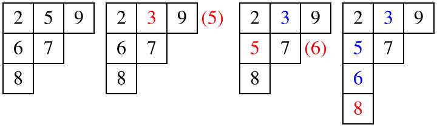

## Giới thiệu

**Bảng Young** (Young tableau), còn gọi là bảng Young, là một đối tượng tổ hợp thường gặp trong lý thuyết biểu diễn và phép tính Schubert.

Bảng Young là một dạng ma trận đặc biệt. Nó thuận tiện cho việc nghiên cứu biểu diễn nhóm và tính chất của nhóm đối xứng cũng như nhóm tuyến tính tổng quát. Bảng Young do nhà toán học Cambridge Alfred Young đưa ra lần đầu vào năm 1900, rồi được nhà toán học Đức Ferdinand Georg Frobenius áp dụng vào nghiên cứu nhóm đối xứng năm 1903.

???+ note "Ghi chú"
    **Lý thuyết biểu diễn** là một nhánh của toán học nghiên cứu các cấu trúc đại số trừu tượng bằng cách biểu diễn phần tử của chúng thành các phép biến đổi tuyến tính trên không gian vectơ. **Phép tính Schubert** là một nhánh của hình học đại số, được Hermann Schubert đưa ra vào thế kỷ 19 để giải các bài toán đếm trong hình học xạ ảnh.

## Định nghĩa

### Biểu đồ Young

**Biểu đồ Young** (Young diagram; khi dùng các điểm để biểu diễn còn gọi là [biểu đồ Ferrers](https://en.wikipedia.org/wiki/Partition_%28number_theory%29#Ferrers_diagram), đã được giới thiệu trong mục [phân hoạch số nguyên](./combinatorics/partition.md#biểu-đồ-ferrers)) là một tập hữu hạn các ô, được căn trái, với độ dài các hàng sắp theo thứ tự không tăng. Việc liệt kê số ô trên từng hàng của biểu đồ Young cho một **phân hoạch số nguyên** (integer partition) $\lambda$ của một số nguyên không âm $n$ (tổng số ô). Vì vậy, có thể xem hình dạng của biểu đồ Young là $\lambda$, bởi nó mang cùng lượng thông tin với phân hoạch số nguyên tương ứng.

Quan hệ bao hàm giữa các biểu đồ Young định nghĩa một quan hệ [thứ tự bộ phận](../math/order-theory.md#tập-có-thứ-tự-bộ-phận) trên các phân hoạch số nguyên. Quan hệ này có cấu trúc [dàn](../math/order-theory.md#tập-định-hướng-và-dàn) và được gọi là **dàn Young** (Young's lattice). Việc liệt kê số ô trên từng cột của biểu đồ Young cho "phân hoạch liên hợp" hoặc "phân hoạch chuyển vị" của phân hoạch số nguyên $\lambda$; biểu đồ Young tương ứng có thể thu được bằng cách phản xạ biểu đồ ban đầu qua đường chéo chính.

Vị trí của mỗi ô trong biểu đồ Young được xác định bởi hai tọa độ lần lượt biểu thị **số hàng** và **số cột**. Các cột được đánh theo thứ tự từ trái sang phải, còn các hàng được đánh theo hướng số ô giảm dần. Tùy quy ước, có hai cách vẽ biểu đồ Young khác nhau: cách thứ nhất đặt hàng có ít ô hơn ở bên dưới hàng có nhiều ô hơn, còn cách thứ hai xếp các hàng từ lớn đến nhỏ lên phía trên. Vì cách đầu chủ yếu được dùng trong các nước nói tiếng Anh, còn cách sau thường được dùng trong các nước nói tiếng Pháp, theo quy ước chúng được gọi lần lượt là kiểu Anh và kiểu Pháp.

Sau đây là hai cách vẽ khác nhau của biểu đồ Young ứng với phân hoạch số nguyên $(5,4,1)$:

-   Kiểu Anh: 
-   Kiểu Pháp: 

### Bảng Young

#### Định nghĩa

**Bảng Young** (Young tableau) thu được bằng cách điền các ký hiệu lấy từ một bảng chữ cái nào đó vào các ô của biểu đồ Young; thông thường bảng chữ cái này cần là một tập được sắp thứ tự toàn phần. Các phần tử được viết là $x_{1}$, $x_{2}$, $x_{3}$, $\ldots$. Tuy nhiên, để thuận tiện, các số nguyên dương thường được điền trực tiếp.

Trong cách dùng ban đầu của bảng Young trong lý thuyết biểu diễn của nhóm đối xứng, các số nguyên dương phân biệt từ $1$ đến $n$ được phép điền tùy ý vào $n$ ô của biểu đồ Young. Trong nghiên cứu hiện nay, phần lớn sử dụng bảng Young "chuẩn", tức là ngoài điều kiện trên, các số trong mỗi hàng và mỗi cột đều tăng nghiêm ngặt. Số lượng bảng Young phân biệt gồm $n$ ô tạo thành dãy [số đối hợp](https://en.wikipedia.org/wiki/Telephone_number_%28mathematics%29):

???+ note "Ghi chú"
    **Số đối hợp** (còn gọi là số điện thoại) là một dãy số nguyên trong toán học, dùng để đếm số cách nối các đường dây khi trong $n$ đường dây điện thoại mỗi đường dây được nối với nhiều nhất một đường dây khác. Nó cũng có thể mô tả số ghép cặp trên đồ thị đầy đủ $n$ đỉnh, số hoán vị là đối hợp của $n$ phần tử, tổng trị tuyệt đối các hệ số của đa thức Hermite, số bảng Young chuẩn có $n$ ô, và tổng bậc của các biểu diễn bất khả quy của nhóm đối xứng.

$1, 1, 2, 4, 10, 26, 76, 232, 764, 2620, 9496, \ldots$ (dãy [A000085](https://oeis.org/A000085) trong [OEIS](https://en.wikipedia.org/wiki/On-Line_Encyclopedia_of_Integer_Sequences))

Trong các ứng dụng khác, biểu đồ Young cũng có thể được điền các số trùng nhau. Nếu các số trong cùng một cột tăng nghiêm ngặt, còn các số trong cùng một hàng tăng không giảm, bảng Young đó được gọi là **bảng Young nửa chuẩn** (đôi khi gọi là chặt theo cột). Dãy ghi lại số lần xuất hiện của từng số trong bảng Young được xem là **trọng số** của bảng Young. Vì vậy, trọng số của bảng Young chuẩn luôn là $(1,1,\ldots,1)$, bởi trong bảng Young chuẩn, mỗi số nguyên dương từ $1$ đến $n$ xuất hiện đúng một lần.

#### Thuật toán chèn bảng Young chuẩn

Các tính chất của một hoán vị có thể được thể hiện trực quan bằng bảng Young. **Thuật toán chèn RSK** cung cấp một cách liên hệ bảng Young với hoán vị. Thuật toán này do Robinson, Schensted và Knuth đưa ra.

Gọi $S$ là một bảng Young. Ký hiệu $S \leftarrow x$ là thao tác chèn $x$ vào bảng Young từ hàng đầu tiên, cụ thể như sau:

1.  Trên hàng hiện tại, tìm số nhỏ nhất $y$ lớn hơn $x$.
2.  Nếu tìm thấy, dùng $x$ thay thế $y$, chuyển sang hàng kế tiếp, đặt $x \leftarrow y$ rồi lặp lại bước 1.
3.  Nếu không tìm thấy, đặt $x$ vào cuối hàng đó rồi kết thúc. Giả sử $x$ nằm ở hàng $s$, cột $t$; khi đó $(s, t)$ nhất định là một góc. Một ô $(s, t)$ là góc khi và chỉ khi cả hai ô $(s + 1, t)$ và $(s, t + 1)$ đều không tồn tại.

Ví dụ, các bước chèn $3$ vào bảng Young $(2, 5, 9)(6, 7)(8)$ là:

### Các biến thể

Bảng Young không hoàn toàn chuẩn theo nghĩa nghiêm ngặt có nhiều **biến thể**. Chẳng hạn, bảng Young chặt theo hàng yêu cầu các số trong cùng hàng tăng nghiêm ngặt và các số trong cùng cột tăng không giảm; nó chính là liên hợp của bảng Young chặt theo cột. Ngoài ra, trong lý thuyết phân hoạch phẳng, các điều kiện tăng trong định nghĩa trên thường được đổi thành giảm. Một biến thể khác là bảng Young dạng dải: trước hết gom một số ô thành từng nhóm, rồi yêu cầu các ô trong cùng một nhóm phải được điền cùng một số.

### Bảng Young lệch

Cho hai biểu đồ Young $\lambda = (\lambda_{1}, \lambda_{2}, \ldots)$ và $\mu = (\mu_{1}, \mu_{2},\ldots)$, trong đó $\lambda$ chứa $\mu$, tức là $\mu_{i} \leq \lambda_{i}$ với mọi $i$. Định nghĩa **biểu đồ Young lệch** $\lambda/\mu$ là tập các ô của $\lambda$ sau khi bỏ đi tất cả các ô của $\mu$, tức là hiệu tập hợp $\lambda$ trừ $\mu$. Điền phần tử vào các ô của biểu đồ Young lệch sẽ tạo thành **bảng Young lệch**.

Ví dụ, hình sau là một bảng Young lệch chuẩn ứng với phân hoạch số nguyên $(5,4,1)$:

Tương tự, nếu các số trong cùng một cột tăng nghiêm ngặt và các số trong cùng một hàng tăng không giảm, bảng Young lệch đó được gọi là **bảng Young lệch nửa chuẩn**; nếu bảng Young lệch nửa chuẩn điền các số không lặp từ $1$ đến $n$ (tổng số ô), nó được gọi là **bảng Young lệch chuẩn**. Lưu ý rằng các cặp $\lambda$ và $\mu$ khác nhau có thể cho cùng một $\lambda/\mu$. Mặc dù phần lớn tính chất của bảng Young lệch chỉ phụ thuộc vào các ô còn lại sau khi lấy hiệu, vẫn có một số phép toán phụ thuộc vào lựa chọn $\lambda$ và $\mu$. Vì vậy, $\lambda/\mu$ phải được xem là chứa thông tin của hai đối tượng: $\lambda$ và $\mu$. Khi $\mu$ là phân hoạch rỗng (phân hoạch duy nhất của $0$), bảng Young lệch $\lambda/\mu$ trở thành bảng Young $\lambda$.

## Ứng dụng

Bảng Young thường được dùng trong tổ hợp, lý thuyết biểu diễn và hình học đại số để định nghĩa hàm Schur và suy ra các đồng nhất thức liên quan thông qua nhiều cách đếm số bảng Young khác nhau. Trong lập trình thi đấu, các bài toán kiểm tra công thức độ dài móc của bảng Young cũng khá thường gặp.

### Độ dài móc

Cho một bảng Young $\pi_{\lambda}$ có tổng cộng $n$ ô. Điền $n$ số từ $1$ đến $n$ vào bảng Young sao cho mỗi hàng tăng từ trái sang phải và mỗi cột tăng từ dưới lên trên. Dùng $\dim_{\pi_{\lambda}}$ để chỉ số cách điền như vậy.

Với một ô $v$ trong bảng Young, định nghĩa **độ dài móc** $\mathrm{hook}(v)$ bằng số ô ở bên phải trên cùng hàng cộng với số ô ở phía trên trên cùng cột, rồi cộng thêm 1 (chính ô đó).

### Công thức độ dài móc

Nếu dùng $\dim_{\lambda}$ để chỉ số cách điền như trên, **công thức độ dài móc** nói rằng số cách bằng $n!$ chia cho tích độ dài móc của tất cả các ô.

$$
\dim \pi _{\lambda}={\frac {n!}{\prod_{{x\in Y(\lambda)}}{\mathrm {hook}}(x)}}.
$$

Vì vậy, với bảng Young của phân hoạch số nguyên $10 = 5 + 4 + 1$ như hình trên, số cách điền là

$$
\dim \pi _{\lambda }={\frac  {10!}{7\cdot 5\cdot 4\cdot 3\cdot 1\cdot 5\cdot 3\cdot 2\cdot 1\cdot 1}}=288.
$$

cách điền.

## Bài tập

### Bài toán dãy con

Với bảng Young $P$, xét một hoán vị $X = x_{1}, \ldots , x_{n}$ của các số từ $1$ đến $n$.

1.  Độ dài hàng đầu tiên của $P_{X}$ chính là độ dài **dãy con tăng dài nhất (LIS)** của hoán vị $X$. Lưu ý rằng hàng đầu tiên của $P$ không nhất thiết là chính LIS, nên không thể trực tiếp dùng tính chất của bảng Young để giải các bài như "phân hoạch LIS".

2.  Với một hoán vị $X$ và bảng Young $P_{X}$ do nó sinh ra, nếu $X^R$ là hoán vị đảo ngược của $X$, thì bảng Young $P_{X^R}$ do $X^R$ sinh ra chính là bảng nhận được từ $P_{X}$ sau khi hoán đổi hàng và cột.

    Ví dụ, với hoán vị $X = 1, 5, 7, 2, 8, 6, 3, 4$ và $X^R = 4, 3, 6, 8, 2, 7, 5, 1$, bảng Young $P_{X}$ thu được như sau:

    

3.  Độ dài cột đầu tiên của bảng Young $P_{X}$ chính là độ dài **dãy con giảm dài nhất (LDS)** của hoán vị $X$.

Định nghĩa độ dài $LIS/LDS$ gồm không quá $k$ dãy là $k-LIS$ và $k-LDS$. Loại bài toán này cũng có thể giải bằng bảng Young. Với $1-LIS$, dãy con $1-LIS$ dài nhất chính là $LDS$ của dãy, cũng chính là cột đầu tiên của bảng Young; tương tự, độ dài của $k$ cột đầu tiên trong bảng Young là độ dài dãy con $k-LIS$ dài nhất. Chứng minh như sau:

Với một hoán vị $X$ và bảng Young $P$ gồm $m$ hàng của nó, đặt hoán vị $X^*$ là $(P_{m,1}\ldots,P_{m,\lambda_{m}},P_{m-1,1}\ldots,P_{1,1}\ldots P_{1,\lambda_{1}})$, tức là viết lần lượt từng hàng của bảng Young từ dưới lên trên. Khi đó $X$ có thể được biến đổi thành $X^*$ bằng các phép đổi chỗ.

Vì vậy, độ dài dãy con $k-LIS$ dài nhất có thể biểu diễn là $F(k)=\sum_{i=1}^{m} \min(k,\lambda_{i})$, tức là tổng độ dài của $k$ cột đầu tiên.

???+ note "[CTSC2017 Dãy con tăng dài nhất](https://uoj.ac/problem/301)"
    Có một dãy số $b$ độ dài $n$. Với dãy $B_{m} = (b_{1}, b_{2},\ldots, b_{m})$, gọi $C$ là một dãy con của $B_{m}$ sao cho độ dài dãy con tăng dài nhất của $C$ không vượt quá $k$. Hỏi độ dài lớn nhất của $C$ là bao nhiêu.

??? note "Hướng giải"
    Với nhiều truy vấn, xét dùng phương pháp đường quét. Khi đó cần duy trì bảng Young của từng tiền tố. Theo kết luận trên, bài toán trở thành cách duy trì nhanh tổng độ dài của $k$ cột đầu tiên trong bảng Young. Nếu duy trì trực tiếp thì độ phức tạp $O(n^2 \log n)$ là không chấp nhận được. Có thể duy trì đồng thời $\sqrt{n}$ cột đầu tiên và $\sqrt{n}$ hàng đầu tiên.

    Bảng Young không phủ kín hoàn toàn hình chữ nhật $W \times H$ này. Nếu $K \leq W$, có thể trả lời trực tiếp; nếu $K > W$, phần vượt quá $W$ nằm trong $H$ hàng. Vì vậy có thể xét cách duy trì đồng thời $\sqrt{n}$ cột đầu tiên và $\sqrt{n}$ hàng đầu tiên. Đảo ngược hoán vị sẽ nhận được bảng Young chuyển vị, nên chỉ cần đồng thời duy trì thêm $-A_{i}$ là đủ; độ phức tạp là $O(n \sqrt{n} \log n)$.

???+ note "[BJWC2018 Dãy con tăng dài nhất](https://www.luogu.com.cn/problem/P4484)"
    Cho một hoán vị ngẫu nhiên độ dài $n$, tính kỳ vọng độ dài dãy con tăng dài nhất của nó.

???+ note "[CF1268B Domino trên biểu đồ Young](https://codeforces.com/problemset/problem/1268/B)"
    Cho một histogram gồm $n$ cột có độ dài $a_{1} ,a_{2},\ldots,a_{n}\,(a_{1} \geq a_{2} \geq \ldots \geq a_{n} \geq 1)$. Đây là biểu đồ Young của $a=[3,2,2,2,1]$. Tìm số lượng domino không giao nhau lớn nhất có thể vẽ trong histogram này, trong đó mỗi domino là một hình chữ nhật $1 \times 2$ hoặc $2 \times 1$.

## Tài liệu tham khảo và đọc thêm

1.  [Bảng Young - Wolfram MathWorld](https://mathworld.wolfram.com/YoungTableau.html)
2.  [Bảng Young - Wikipedia](https://en.wikipedia.org/wiki/Young_tableau)
3.  [Công thức độ dài móc - Wikipedia](https://en.wikipedia.org/wiki/Hook_length_formula)
4.  Yuan Fangzhou, ["Bàn về ứng dụng của bảng Young trong lập trình thi đấu" IOI2019](https://github.com/OI-wiki/libs/blob/master/%E9%9B%86%E8%AE%AD%E9%98%9F%E5%8E%86%E5%B9%B4%E8%AE%BA%E6%96%87/%E5%9B%BD%E5%AE%B6%E9%9B%86%E8%AE%AD%E9%98%9F2019%E8%AE%BA%E6%96%87%E9%9B%86.pdf), tuyển tập luận văn đội tuyển dự tuyển quốc gia Trung Quốc, tr. 202-229
