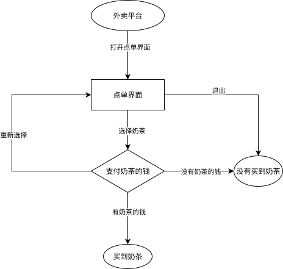
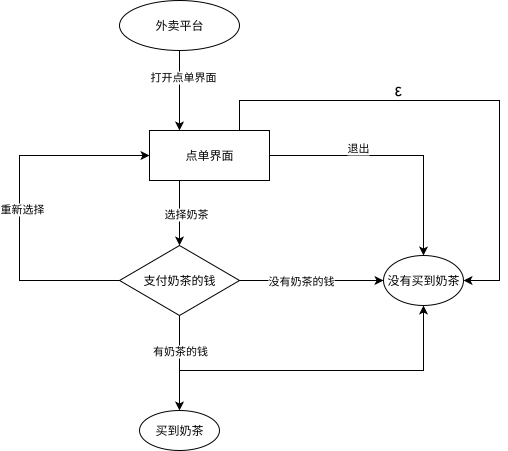

author: CCXXXI, countercurrent-time, Enter-tainer, FFjet, H-J-Granger, Ir1d, mgt, NachtgeistW, orzAtalod, ouuan, SukkaW

Kiến thức nền: [Ngôn ngữ và bài toán quyết định](./cc-basic.md#bài-toán)

**Ô-tô-mát trạng thái hữu hạn** (Finite State Machine, FSM, dưới đây cũng gọi tắt là ô-tô-mát) là một trong những mô hình tính toán đơn giản nhất: cả khả năng mô tả lẫn tài nguyên của nó đều rất hạn chế. Ô-tô-mát được dùng rộng rãi trong OI và khoa học máy tính; tư tưởng của nó xuất hiện trong nhiều thuật toán chuỗi, vì vậy nên học ô-tô-mát trước một số thuật toán chuỗi như [KMP](../string/kmp.md), [ô-tô-mát AC](../string/ac-automaton.md), [SAM](../string/sam.md).

## Nhập môn ô-tô-mát

Trước hết, cần hiểu ô-tô-mát dùng để làm gì: ô-tô-mát là một mô hình toán học dùng để xác định một dãy tín hiệu có thỏa một mẫu hoặc quy tắc cụ thể nào đó hay không.

Có thể giải thích cụ thể hơn vài thuật ngữ trong câu trên. "Dãy tín hiệu" là một dãy các tín hiệu được sắp theo thứ tự, chẳng hạn từng ký tự của một chuỗi từ đầu đến cuối, từng số của một mảng từ $1$ đến $n$, hoặc từng chữ số của một số từ cao xuống thấp. "Xác định có thỏa một quy tắc nào đó hay không" có thể hiểu là: cần biết dãy này có thuộc một tập cụ thể nào đó hay không. Tập này được định nghĩa bởi các quy tắc đã đặt trước, chẳng hạn "mọi chuỗi nhị phân có độ dài chẵn" hoặc "mọi chuỗi đối xứng".

Đôi khi cần trả lời các câu hỏi kiểu này: một dãy cho trước có thỏa tính chất nào đó không? Ví dụ, một số nhị phân có phải số lẻ không, một chuỗi có phải chuỗi đối xứng không, hoặc có phải dãy con của một chuỗi khác không, v.v. Ô-tô-mát chính là công cụ toán học dùng để giải quyết các vấn đề như vậy.

Cách hoạt động của ô-tô-mát rất giống lưu đồ. Giả sử cần đặt mua một cốc trà sữa trên nền tảng giao đồ ăn, toàn bộ lựa chọn trong quá trình đó tạo thành một dãy. Lưu đồ sau là một ví dụ:



Ví dụ, dãy lựa chọn là "mở giao diện đặt món -> chọn trà sữa -> có tiền mua trà sữa", thì các trạng thái đi qua theo thứ tự có thể là "nền tảng giao đồ ăn -> giao diện đặt món -> thanh toán tiền trà sữa -> mua được trà sữa". Như vậy, "ô-tô-mát trà sữa" này dựa vào lựa chọn để xác định có mua được trà sữa hay không. Cùng một trạng thái có thể được đi tới theo nhiều cách khác nhau. Chẳng hạn, cùng là không mua được trà sữa, có thể thoát ngay ở giao diện đặt món, hoặc không mua được vì không đủ tiền mua trà sữa.

Thông qua ô-tô-mát này, các dãy tín hiệu được chia thành hai loại: dãy tín hiệu mua được trà sữa và dãy tín hiệu không mua được trà sữa. Dựa vào trạng thái cuối cùng, bài toán quyết định được hoàn thành.

Dù vừa dùng lưu đồ để so sánh với quá trình hoạt động của ô-tô-mát, bản thân lưu đồ chỉ là một công cụ trực quan hóa dễ hiểu, không phải định nghĩa toán học của ô-tô-mát. Để mô tả chính xác hơn cấu trúc của ô-tô-mát, cần trừu tượng hóa các phần tử trong lưu đồ. Sau khi trừu tượng hóa, cấu trúc của lưu đồ có thể rút gọn thành một đồ thị có hướng, trong đó mỗi đỉnh biểu diễn một trạng thái, mỗi cạnh có hướng biểu diễn một phép chuyển giữa các trạng thái.

Vì vậy, cấu trúc cốt lõi của ô-tô-mát có thể được hình thức hóa như một đồ thị có hướng, gọi là **đồ thị trạng thái**.

Cách hoạt động của ô-tô-mát tương tự lưu đồ, nhưng vẫn có các điểm khác: mỗi đỉnh của ô-tô-mát đều biểu diễn một trạng thái quyết định; đỉnh của ô-tô-mát chỉ là một trạng thái đơn thuần chứ không phải nhiệm vụ; cạnh của ô-tô-mát có thể nhận nhiều loại ký tự (không chỉ giới hạn ở `T` hoặc `F`).

Ví dụ, ô-tô-mát để "kiểm tra một số nhị phân có phải số chẵn hay không" như sau:


Bắt đầu từ đỉnh khởi đầu, đọc dãy nhị phân của số đó từ bit cao xuống bit thấp, rồi xem cuối cùng dừng ở đâu. Nếu cuối cùng dừng tại đỉnh được khoanh đỏ thì đó là số chẵn; ngược lại thì không.

Trong phần dưới, bài viết sẽ nhiều lần nhắc tới các khái niệm như "ký tự", "bảng chữ cái". Điều này không có nghĩa ô-tô-mát chỉ áp dụng cho lĩnh vực chuỗi; ký tự không nhất thiết là các chữ cái kiểu $\tt abc\cdots z$, mà cũng có thể là một lựa chọn nào đó.

Nếu cần xác định quan hệ giữa một dãy tín hiệu hữu hạn và một dãy tín hiệu khác (ví dụ dãy tín hiệu kia có phải dãy con của một dãy tín hiệu nào đó hay không), cách thường dùng là xây dựng một ô-tô-mát cho dãy tín hiệu hữu hạn đó. Nội dung này sẽ được nói tới khi học KMP.

Ô-tô-mát chỉ là một **mô hình toán học**, **không phải thuật toán**, và cũng **không phải cấu trúc dữ liệu**. Có nhiều cách hiện thực cùng một ô-tô-mát, có thể có độ phức tạp thời gian và không gian khác nhau.

Tiếp theo, có thể tiếp tục nghiên cứu sâu hơn về ô-tô-mát trên trang này, hoặc học các ví dụ cụ thể như [KMP](../string/kmp.md), [ô-tô-mát AC](../string/ac-automaton.md), [SAM](../string/sam.md).

FSM được chia thành hai loại: ô-tô-mát trạng thái hữu hạn xác định và ô-tô-mát trạng thái hữu hạn không xác định.

<span id="automaton-trạng-thái-hữu-hạn-xác-định"></span>
## Ô-tô-mát trạng thái hữu hạn xác định

**Ô-tô-mát trạng thái hữu hạn xác định** (Deterministic Finite Automaton, DFA) có quá trình tính toán hoàn toàn xác định. Lấy "ô-tô-mát trà sữa" làm ví dụ: chỉ cần mở giao diện đặt món thì sẽ đi vào giao diện đặt món, không xuất hiện các tình huống ngoài ý muốn như mạng sập không mở được, điện thoại hết pin đen màn hình, v.v.

???+ abstract "DFA"
    DFA là một bộ năm $(Q,\Sigma,\delta,q_0,F)$, bao gồm:
    
    1.  **Tập trạng thái hữu hạn** $Q$. Nếu xem một DFA như một đồ thị có hướng, thì các trạng thái trong DFA tương ứng với các đỉnh trên đồ thị.
    2.  **Bảng chữ cái** $\Sigma$. Ô-tô-mát này chỉ có thể nhận các ký tự này làm đầu vào.
    3.  **Hàm chuyển** $\delta:Q\times \Sigma \to Q$ là một hàm nhận hai tham số và trả về một giá trị; tham số thứ nhất và giá trị trả về đều là một trạng thái, tham số thứ hai là một ký tự trong bảng chữ cái. Nếu xem một DFA như một đồ thị có hướng, thì hàm chuyển của DFA tương ứng với các cạnh giữa các đỉnh, và trên mỗi cạnh có một ký tự.
    4.  **Trạng thái khởi đầu** $q_0\in Q$ là một trạng thái đặc biệt. Trong các bài viết khác nhau, trạng thái khởi đầu thường được ký hiệu là $s$, $\textit{start}$ hoặc $q_0$; trong bài này dùng $q_0$.
    5.  **Tập trạng thái chấp nhận** $F\subseteq Q$ là một nhóm trạng thái đặc biệt.

DFA có thể được biểu diễn đơn giản bằng cấu trúc dữ liệu sau:

???+ example "Hiện thực tham khảo"
    ```cpp
    --8<-- "docs/misc/code/fsm/dfa.hpp:dfa"
    ```

Quá trình tìm dãy trạng thái của xâu đầu vào $w$ trong DFA và xác định nó có được chấp nhận hay không được gọi là **tính toán**.

???+ abstract "Quy trình tính toán của DFA"
    Giả sử $M=(Q,\Sigma,\delta,q_0,F)$ là một DFA, $w=w_1w_2\cdots w_n\in\Sigma^*$ là một xâu. Nếu tồn tại dãy trạng thái $r_0,r_1,\cdots,r_n$ trong $Q$ thỏa mãn
    
    -   $r_0=q_0$,
    -   $\delta(r_i,w_{i+1})=r_{i+1}$ đúng với mọi $i=0,1,\cdots,n-1$,
    -   $r_n\in F$,
    
    thì nói rằng $M$ **chấp nhận** (accepts) $w$. Ngược lại, nói rằng $M$ **không chấp nhận** $w$.

Khi một DFA đọc một chuỗi, nó bắt đầu từ trạng thái ban đầu và chuyển trạng thái theo từng ký tự dựa trên hàm chuyển. Nếu sau khi đọc hết mọi ký tự của chuỗi mà nó nằm ở một trạng thái chấp nhận, nói DFA này **chấp nhận** chuỗi đó; ngược lại, nói DFA này **không chấp nhận** chuỗi đó.

???+ abstract "Ngôn ngữ hình thức"
    Một **ngôn ngữ hình thức** (language), hay gọi tắt là **ngôn ngữ**, trên tập ký tự $\Sigma$ là một tập hợp các chuỗi trên $\Sigma$, ký hiệu là $L$.

???+ abstract "Ngôn ngữ được ô-tô-mát nhận dạng"
    Với một ô-tô-mát $M$, ngôn ngữ $L(M)$ mà nó nhận dạng được định nghĩa là tập tất cả các chuỗi mà nó chấp nhận: $\{w\mid M\text{ chấp nhận }w\}$.

Không phải mọi ngôn ngữ đều có thể được nhận dạng bởi DFA.

???+ abstract "Ngôn ngữ chính quy"
    Nếu một ngôn ngữ có thể được nhận dạng bởi một DFA nào đó, thì gọi nó là **ngôn ngữ chính quy** (regular language).

Như đã nói ở trên, một ô-tô-mát có thể được biểu diễn bằng đồ thị trạng thái. Sau đây là một DFA chấp nhận và chỉ chấp nhận các chuỗi $\tt a$, $\tt ab$, $\tt aac$:


(Trong hình đã lược bỏ trạng thái thất bại; mọi chuyển trạng thái không được vẽ đều trỏ tới trạng thái thất bại đó.)

## Ô-tô-mát trạng thái hữu hạn không xác định

**Ô-tô-mát trạng thái hữu hạn không xác định**[^nfa-and-nfaepsilon] (Nondeterministic Finite Automaton, NFA) là mở rộng tự nhiên của DFA. Trong NFA, với một trạng thái bất kỳ và một ký tự bất kỳ, có thể tồn tại không, một hoặc nhiều trạng thái kế tiếp. Đồng thời, NFA được thảo luận trong mục này cho phép nhận ký tự rỗng, nghĩa là có thể chuyển từ một trạng thái sang một trạng thái kế tiếp nào đó mà không tiêu thụ ký tự nào.

Ví dụ, vẫn là "ô-tô-mát trà sữa". Sau khi đặt hàng, dù có tiền mua trà sữa, vẫn có thể vì mạng kém mà không mua được trà sữa, đây là trường hợp tồn tại nhiều trạng thái kế tiếp; cũng có thể vì thao tác chậm, dù chuỗi đầu vào (tức dãy thao tác) là như nhau, nhưng trà sữa đã bán hết nên không mua được, đây là sự tồn tại của ký tự rỗng: cạnh ký tự rỗng có thể đi hoặc không đi. Chỉ cần sửa nhẹ ô-tô-mát ở trên là có thể mô tả các chức năng này:



Mọi DFA đều là một NFA, nên NFA ít nhất có thể nhận dạng mọi ngôn ngữ chính quy. Nhưng với vai trò là một mở rộng của DFA, liệu NFA có thể nhận dạng nhiều ngôn ngữ hơn không? Câu trả lời là không; sau đây sẽ bàn về tính tương đương giữa DFA và NFA.

???+ abstract "NFA"
    Gọi $\mathcal{P}(Q)$ là tập lũy thừa của $Q$. Gọi $\varepsilon\notin\Sigma$ là xâu rỗng, và ký hiệu $\Sigma_\varepsilon = \Sigma\cup\{\varepsilon\}$. NFA là một bộ năm $(Q,\Sigma,\delta,q_0,F)$, bao gồm:
    
    1.  **Tập trạng thái hữu hạn** $Q$,
    2.  **Bảng chữ cái** $\Sigma$,
    3.  **Hàm chuyển** $\delta:Q\times \Sigma_{\varepsilon} \to \mathcal{P}(Q)$, một hàm nhận hai tham số và trả về một **tập trạng thái**; tham số thứ nhất là một trạng thái, tham số thứ hai là một ký tự trong bảng chữ cái, còn giá trị trả về là tập hợp gồm tất cả các trạng thái kế tiếp có thể có (có thể rỗng),
    4.  **Trạng thái khởi đầu** $q_0\in Q$,
    5.  **Tập trạng thái chấp nhận** $F\subseteq Q$.

Quá trình tính toán của NFA tương đương với việc chạy nhiều DFA cùng lúc. Mỗi bước đều liệt kê mọi khả năng; cuối cùng, chỉ cần có một nhánh đi tới trạng thái chấp nhận thì NFA chấp nhận toàn bộ chuỗi.

???+ abstract "Quy trình tính toán của NFA"
    Giả sử $N=(Q,\Sigma,\delta,q_0,F)$ là một NFA, chuỗi $w$ có thể được biểu diễn thành $y_1y_2\cdots y_m\in\Sigma^*_\varepsilon$. Nếu tồn tại dãy trạng thái $r_0,r_1,\cdots,r_m$ trong $Q$ thỏa mãn
    
    -   $r_0=q_0$,
    -   $r_{i+1}\in\delta(r_i,y_{i+1})$ đúng với mọi $i=0,1,\cdots,m-1$,
    -   $r_m\in F$,
    
    thì nói rằng $N$ **chấp nhận** $w$. Ngược lại, nói rằng $N$ **không chấp nhận** $w$.

Do cho phép ký tự rỗng, khi biểu diễn chuỗi $w$ thành $y_1y_2\cdots y_m\in\Sigma^*_\varepsilon$, có thể chèn tùy ý nhiều ký tự rỗng. Ví dụ, chuỗi $\texttt{abc}$ có thể được biểu diễn thành $\texttt{a}\varepsilon\texttt{bc}\varepsilon\varepsilon\in\Sigma^*_\varepsilon$. So với DFA, trong đó mỗi đầu vào chỉ tương ứng với một kết quả, mỗi đầu vào của NFA có thể tương ứng với nhiều kết quả và tạo thành một tập kết quả.

## Tính tương đương giữa DFA và NFA

Hai ô-tô-mát được gọi là tương đương khi và chỉ khi chúng nhận dạng cùng một ngôn ngữ. DFA và NFA là tương đương, tức là mỗi NFA đều tương đương với một DFA nào đó; vì vậy, lớp ngôn ngữ mà NFA nhận dạng được cũng chính là toàn bộ ngôn ngữ chính quy. Mỗi DFA có thể được xem trực tiếp như một NFA; ngược lại, có thể chuyển một NFA thành DFA bằng phương pháp **xây dựng tập lũy thừa** (powerset construction).

???+ abstract "Xây dựng tập lũy thừa"
    Giả sử NFA là $N = (Q, \Sigma, \delta, q_0, F)$. Định nghĩa $E(q)$ là tập trạng thái có thể đi tới từ trạng thái $q$ nếu chỉ đi theo các chuyển $\varepsilon$.
    
    Xây dựng DFA $M = (Q', \Sigma, \delta', E(q_0), F')$, trong đó:
    
    -   **Tập trạng thái hữu hạn** $Q' = \mathcal{P}(Q)$,
    -   **Hàm chuyển** $\delta' : Q' \times \Sigma \to Q'$ thỏa $\delta'(S, c) = \bigcup_{q \in S,~q' \in \delta(q, c)} E(q')$,
    -   **Tập trạng thái chấp nhận** $F' = \{ S \subseteq Q \mid S \cap F \neq \varnothing \}$.
    
    Ở mỗi bước tính toán, trạng thái của $M$ tương ứng với tập các trạng thái mà $N$ có thể đang ở.

Dù NFA và DFA có cùng khả năng nhận dạng ngôn ngữ, NFA vẫn hữu ích. Lý do là với một số ngôn ngữ chính quy, số trạng thái cần để biểu diễn bằng NFA nhỏ hơn rất nhiều so với số trạng thái cần cho DFA. Ví dụ, có thể dựng một NFA có $n$ trạng thái sao cho DFA nhỏ nhất tương ứng với nó có $\Theta(2^n)$ trạng thái. Khi đó tính toán trực tiếp trên NFA có độ phức tạp thời gian tốt hơn.

## Độ phức tạp thời gian khi tính toán DFA và NFA

Giả sử độ dài chuỗi cho trước là $n$, số trạng thái của ô-tô-mát là $s$, và kích thước bảng chữ cái là hằng số. Khi đó độ phức tạp thời gian để tính toán DFA là $O(n)$, chỉ cần mô phỏng quá trình nêu trên.

Tính toán NFA một cách đơn giản có độ phức tạp $O(ns^2)$, vì cần xét mọi trạng thái kế tiếp và chi phí hợp nhất các trạng thái. Có thể dùng bitset hoặc phương pháp Four Russians để tối ưu độ phức tạp tính toán xuống $O\left(\dfrac{ns^2}{w}\right)$ hoặc $O\left(\dfrac{ns^2}{w\cdot \log n}\right)$.

## Biểu thức chính quy và ngôn ngữ chính quy

Mục này sẽ thảo luận định nghĩa và tính chất của biểu thức chính quy, ngôn ngữ chính quy, đồng thời nghiên cứu quan hệ giữa biểu thức chính quy và FSM.

### Biểu thức chính quy

**Biểu thức chính quy** (regular expression) là một cách mô tả ngôn ngữ chính quy thường dùng khác. Tên gọi này xuất hiện trong nhiều ngôn ngữ hiện đại (ví dụ Python), nhưng các ngôn ngữ đó thường hiện thực một siêu tập của biểu thức chính quy.

???+ abstract "Biểu thức chính quy"
    Với một bảng chữ cái $\Sigma$ cho trước, biểu thức chính quy là các chuỗi ký hiệu được định nghĩa quy nạp bởi các quy tắc sau:
    
    1.  Mọi ký tự $c \in \Sigma$ là một biểu thức chính quy;
    2.  Ký hiệu xâu rỗng $\varepsilon$ là biểu thức chính quy;
    3.  Ký hiệu ngôn ngữ rỗng $\varnothing$ là biểu thức chính quy;
    4.  Nếu $R_1$ và $R_2$ là biểu thức chính quy, thì $(R_1 + R_2)$, $(R_1 R_2)$ (cũng viết là $(R_1 \cdot R_2)$), $(R_1^\ast)$ đều là biểu thức chính quy.

Mục tiêu của biểu thức chính quy là mô tả một ngôn ngữ bằng các ký hiệu này. Mỗi biểu thức chính quy đều có một ngôn ngữ hình thức tương ứng.

???+ abstract "Ngôn ngữ được biểu thức chính quy biểu diễn"
    Giả sử mỗi biểu thức chính quy $R$ tương ứng với ngôn ngữ hình thức $L(R)$, có:
    
    1.  Nếu $R = c$, trong đó $c \in \Sigma$, thì $L(R) = \{c\}$;
    2.  Nếu $R = \varepsilon$, thì $L(R) = \{\varepsilon\}$;
    3.  Nếu $R = \varnothing$, thì $L(R) = \varnothing$;
    4.  Nếu $R = (R_1 + R_2)$, thì $L(R) = L(R_1) \cup L(R_2)$;
    5.  Nếu $R = (R_1 R_2) = (R_1\cdot R_2)$, thì $L(R) = \{ uv \mid u \in L(R_1),~ v \in L(R_2) \}$, trong đó $uv$ chỉ việc nối hai chuỗi trước sau với nhau;
    6.  Nếu $R = (R_1^\ast)$, thì $L(R) = \{u_1 u_2 \cdots u_n \mid u_i \in L(R_1),\ n \in \mathbf{N}_+\}\cup\{\varepsilon\}$, còn gọi là **ngôi sao Kleene** (Kleene star) hoặc **bao đóng Kleene** (Kleene closure), gọi tắt là bao đóng.

Sau khi quy định thứ tự ưu tiên của các phép toán, có thể lược bỏ các dấu ngoặc tròn này nếu không gây nhầm lẫn.

???+ example "Ví dụ"
    Giả sử $L(R_1) = \{0,\ 01\}$, $L(R_2) = \{\varepsilon,\ 1,\ 11,\ 111,\ \dots\}$, có:
    
    -   $L(R_1R_2) = \{0,\ 01,\ 011,\ 0111,\ \dots\}$,
    -   $R_2^\ast = R_2$,
    -   $L(R_1 + R_2) = \{0,\ 01,\ \varepsilon,\ 1,\ 11,\ 111,\ \dots\}$.

Mỗi biểu thức chính quy đều có thể được chuyển thành một NFA bằng [phép xây dựng Thompson](https://en.wikipedia.org/wiki/Thompson%27s_construction). Mỗi DFA cũng có thể được chuyển thành một biểu thức chính quy bằng phương pháp loại bỏ trạng thái[^state-elimination-method] (State Elimination Method). Vì vậy, biểu thức chính quy và FSM là tương đương.

### Ngôn ngữ chính quy

Trong tiểu mục này, không xét các biểu thức chính quy cụ thể, mà chuyển sang xét biểu thức chính quy có biến làm tham số (biến có thể là ngôn ngữ chính quy bất kỳ). Vận dụng các luật đại số của biểu thức chính quy giúp rút gọn biểu thức chính quy.

???+ note "Tính chất đại số của ngôn ngữ chính quy"
    1.  Tính giao hoán của hợp: $L + M = M + L$
    2.  Tính kết hợp của hợp: $(L + M) + N = L + (M + N)$
    3.  Tính kết hợp của phép nối: $(LM)N = L(MN)$
    4.  $\varnothing$ là phần tử đơn vị của phép hợp: $\varnothing + L = L + \varnothing = L$
    5.  $\varepsilon$ là phần tử đơn vị của phép nối: $\varepsilon L = L \varepsilon = L$
    6.  $\varnothing$ là phần tử hấp thụ của phép nối: $\varnothing L = L \varnothing = \varnothing$
    7.  Luật phân phối: $L(M + N) = LM + LN$, $(M + N)L = ML + NL$
    8.  Tính lũy đẳng của hợp: $L + L = L$
    9.  Các luật liên quan đến bao đóng: $(L^\ast)^\ast = L^\ast$, $\varnothing^\ast = \varepsilon$, $\varepsilon^\ast = \varepsilon$

**Tính đóng** của ngôn ngữ chính quy cũng là một tính chất quan trọng. Các tính chất này cho phép xuất phát từ một số ô-tô-mát đơn giản, thông qua một số phép toán, xây dựng các máy trạng thái hữu hạn (FSM) có thể nhận dạng những ngôn ngữ khác. Nói ngắn gọn, tính đóng có thể được dùng như công cụ để xây dựng FSM phức tạp.

Về tính đóng của ngôn ngữ chính quy, có:

???+ note "Tính đóng của ngôn ngữ chính quy"
    Giả sử $L,M$ là hai ngôn ngữ chính quy trên bảng chữ cái $\Sigma$, và ánh xạ $h:\Sigma\to\Sigma^*$. Định nghĩa đồng cấu của chuỗi $s=s_1s_2\cdots s_n$ là $h(s)=h(s_1)h(s_2)\cdots h(s_n)$. Khi đó,
    
    1.  Hợp $L + M$ của hai ngôn ngữ chính quy là chính quy,
    2.  Phép nối $LM$ của hai ngôn ngữ chính quy là chính quy,
    3.  Bao đóng $L^*$ của ngôn ngữ chính quy là chính quy,
    4.  Phần bù $\Sigma^*\setminus L$ của ngôn ngữ chính quy là chính quy,
    5.  Giao $L\cap M$ của hai ngôn ngữ chính quy là chính quy,
    6.  Hiệu $L\setminus M$ của hai ngôn ngữ chính quy là chính quy,
    7.  Đảo ngược $L^R=\{s_n\cdots s_2s_1 \mid s=s_1s_2\cdots s_n\in L\}$ của ngôn ngữ chính quy là chính quy,
    8.  Đồng cấu $h(L)=\{h(s)\mid s\in L\}$ của ngôn ngữ chính quy là chính quy,
    9.  Nghịch đồng cấu $h^{-1}(L) = \{ s \in \Sigma^\ast \mid h(s) \in L \}$ của ngôn ngữ chính quy là chính quy.

Một hệ quả đơn giản là mọi ngôn ngữ hữu hạn đều là ngôn ngữ chính quy. Thực tế, [Trie](../string/trie.md) chính là một ô-tô-mát nhận dạng chúng.

## Định lý Myhill-Nerode

Định lý Myhill-Nerode đưa ra tiêu chuẩn để xác định một ngôn ngữ có phải ngôn ngữ chính quy hay không. Định lý này mô tả đặc trưng cấu trúc của ngôn ngữ chính quy thông qua khái niệm lớp tương đương.

???+ abstract "Quan hệ tương đương Nerode"
    Với một ngôn ngữ $L$ và hai chuỗi bất kỳ $x,y\in \Sigma^\ast$, nếu với mọi $z\in\Sigma^*$ đều có $xz\in L\iff yz\in L$, thì nói rằng hai chuỗi $x$ và $y$ tương đương đối với $L$, ký hiệu $x\equiv_L y$.

Nói cách khác, nếu với hai chuỗi $x$ và $y$, khi nối cùng một chuỗi tùy ý $z$ (kể cả xâu rỗng) vào sau $x$ và $y$, chúng luôn hoặc cùng thuộc $L$ hoặc cùng không thuộc $L$, thì $x$ và $y$ tương đương đối với $L$.

Theo định nghĩa trên, tập mọi chuỗi hữu hạn được chia thành một hoặc nhiều lớp tương đương. Khi và chỉ khi số lớp tương đương này là hữu hạn, có thể dùng các lớp tương đương đó để xây dựng một DFA nhận dạng ngôn ngữ này. Số trạng thái của DFA đó bằng số lớp tương đương. Hơn nữa, số trạng thái này là nhỏ nhất trong mọi DFA có thể nhận dạng ngôn ngữ đó. Đây chính là định lý Myhill-Nerode.

???+ note "Định lý Myhill-Nerode"
    Một ngôn ngữ $L$ là chính quy khi và chỉ khi số lượng lớp tương đương thu được bằng cách chia $\Sigma^\ast$ theo quan hệ tương đương $\equiv_L$ là hữu hạn.
    
    Với mọi DFA nhận dạng ngôn ngữ $L$, hai chuỗi bất kỳ $x$ và $y$ khiến nó đi tới cùng một trạng thái đều nằm trong cùng một lớp tương đương.
    
    Do đó, số lượng lớp tương đương chính là số trạng thái của DFA nhỏ nhất có thể nhận dạng $L$. Mỗi lớp tương đương tương ứng đúng với một trạng thái trong DFA nhỏ nhất. DFA nhỏ nhất này là duy nhất theo nghĩa đẳng cấu.

Định lý này cung cấp một phương pháp dùng quan hệ tương đương để xây dựng DFA:

-   Tập trạng thái là tất cả các lớp tương đương thu được từ phép chia theo quan hệ tương đương. Với mỗi lớp tương đương, chọn tùy ý một chuỗi đại diện (ví dụ một chuỗi có độ dài nhỏ nhất).
-   Để xây dựng hàm chuyển, chỉ cần thêm ký tự chuyển vào sau chuỗi đại diện đã chọn, rồi tìm trạng thái tương ứng với lớp tương đương chứa chuỗi thu được; đó chính là trạng thái kế tiếp của chuyển tương ứng. Vì mọi chuỗi trong cùng một lớp tương đương đều tương đương, nên việc chọn tùy ý chuỗi đại diện không ảnh hưởng đến kết quả chuyển.
-   Trạng thái ban đầu là lớp tương đương tương ứng với xâu rỗng $\varepsilon$.
-   Tập trạng thái chấp nhận là tập các lớp tương đương mà chuỗi đại diện thuộc ngôn ngữ đã cho.

Một ví dụ kinh điển là [ô-tô-mát hậu tố](../string/sam.md), được xây dựng thành DFA nhỏ nhất bằng định lý Myhill-Nerode.

Định lý Myhill-Nerode thường được áp dụng để xây dựng DFA tương ứng với một số ngôn ngữ chính quy vô hạn. Trong nhiều trường hợp, điều kiện của bài toán khá đơn giản; chỉ cần khảo sát tập các chuỗi có độ dài không quá lớn là đã có thể xây dựng ô-tô-mát nhận dạng toàn bộ ngôn ngữ.

### Ví dụ

Mục này giới thiệu cách áp dụng thực tế định lý Myhill-Nerode thông qua một bài ví dụ.

???+ example "[P12294 \[THUPC 2025 Final\] Một xâu 01, n lần toán tử ba ngôi, giá trị cuối là 1 (bản tăng cường)](https://www.luogu.com.cn/problem/P12294)"
    Bảng toán tử ba ngôi $s_0s_1\cdots s_7$ (trong đó $s$ chỉ gồm $0,1$) theo các biến $a,b,c$ có ý nghĩa như sau: nếu bit thứ $a+2b+4c$ của $s$ là $1$, thì trả về $1$, ngược lại trả về $0$.
    
    Cho bảng toán tử $s$ và $q$ chuỗi $01$ có độ dài $2n+1$, với mỗi chuỗi $01$ cần trả lời riêng:
    
    Có thể thực hiện $n$ lần thao tác, mỗi lần thay ba chữ số liên tiếp bằng giá trị phép toán tương ứng, sao cho kết quả phép toán là $1$ hay không; cần đưa ra phương án, hoặc phán định vô nghiệm.
    
    $1\le 2n+1\le 10^5,~\sum(2n+1)\le 3\times 10^5$.

??? note "Lời giải"
    Tập các chuỗi $01$ có thể tổng hợp ra $1$ là một ngôn ngữ chính quy (tức là tồn tại một DFA có thể xác định một chuỗi $01$ có thể tổng hợp ra $1$ hay không)[^prove-regular-language]. Vì vậy xét dùng định lý Myhill-Nerode. Do điều kiện khá đơn giản, qua thực nghiệm chỉ cần chia lớp tương đương cho các chuỗi $01$ có độ dài $\le 9$; khi kiểm tra hai chuỗi có tương đương không, chỉ cần liệt kê thêm các hậu tố có độ dài $\le 6$. Chỉ cần với hai chuỗi, sau khi nối vào mọi hậu tố có độ dài $\le 6$, chúng hoặc đều có thể tổng hợp ra chuỗi mong muốn, hoặc đều không thể tổng hợp ra chuỗi mong muốn, thì hai chuỗi đó là tương đương.
    
    Mỗi lần chuyển tương đương với việc thêm một ký tự $01$ mới vào sau chuỗi hiện tại, rồi biến chuỗi mới này thành chuỗi có độ dài nhỏ nhất trong lớp tương đương chứa chuỗi mới đó. Dựa trên cách thiết kế chuyển này, xây dựng một ô-tô-mát. Ô-tô-mát này có thể xác định trong độ phức tạp $O(n)$ xem một chuỗi độ dài $n$ có tồn tại cách thực hiện phép toán để kết quả là $1$ hay không. Đồng thời số trạng thái của ô-tô-mát rất ít.
    
    Để thuận tiện, dựng $6$ ô-tô-mát; $6$ ô-tô-mát này lần lượt biểu diễn việc có thể dùng một cách thực hiện phép toán để tạo ra $0,1,00,01,10,11$ hay không. Với mọi bảng toán tử có thể, số trạng thái lớn nhất của ô-tô-mát là $47$.
    
    Dùng ô-tô-mát, thông qua tiền xử lý thích hợp, có thể dùng nhảy nhị phân hoặc cat tree để hiện thực truy vấn tĩnh trên đoạn: một đoạn có tồn tại cách thực hiện phép toán để kết quả là $1$ hay không. Cách trước truy vấn một lần là $O(\log n)$, cách sau truy vấn một lần là $O(1)$.
    
    Xét dùng chia để trị để giải bài toán dựng phương án. Gọi $f(l,r,t)$ biểu diễn phương án gộp đoạn $[l,r]$ thành $t\in\{{0,1,00,01,10,11}\}$. Lúc này dùng cách tách theo kinh nghiệm, duy trì hai con trỏ $i,j$, một con trỏ quét từ trái sang phải, một con trỏ quét từ phải sang trái, để liệt kê điểm cắt $\textit{mid}$ là $i$ hoặc $j$. Với $t\in\{{0,1}\}$, liệt kê $t$ được tách thành hai phần trái phải như thế nào, trong đó một phần có độ dài $2$ và phần còn lại có độ dài $1$. (Ví dụ với bảng toán tử lấy trung vị $s=00010111$, $1$ có thể tách thành $01$ và $1$.) Với $t\in\{{00,01,10,11}\}$, $type$ được tách trực tiếp thành hai phần trái phải.
    
    Nếu lúc này hai phần trái phải được tách ra lần lượt là $t_1$ và $t_2$, thì tiếp tục kiểm tra $[l,mid]$ có thể sinh $t_1$ và $[\textit{mid}+1,r]$ có thể sinh $t_2$ hay không; nếu có thì chia để trị tiếp. Nếu dùng cat tree để kiểm tra $O(1)$, độ phức tạp của cách dựng bằng cách tách theo kinh nghiệm này là $O(n\log n)$; nếu dùng nhảy nhị phân để kiểm tra, độ phức tạp dựng là $O(n\log^2n)$.
    
    Nếu dùng cat tree, tổng độ phức tạp là $O(n|Q|\log n+n\log n)$, trong đó $|Q|\le 47$. Mã tham khảo để thuận tiện đã dùng nhảy nhị phân, đồng thời giảm hằng số bằng cách chia khối ở tầng dưới; tổng độ phức tạp tương ứng là $O(n|Q|\log n+n\log^2 n)$.

??? note "Mã tham khảo"
    ```cpp
    --8<-- "docs/misc/code/fsm/fsm_1.cpp:main"
    ```

### Bài tập

-   [Median Replace Hard](https://qoj.ac/problem/12010)
-   [JOISC 2024 Card Collection](https://www.luogu.com.cn/problem/P10436) (xây dựng ô-tô-mát bằng định lý Myhill-Nerode; bài này có thể xử lý nhiều truy vấn đoạn)

## Tối thiểu hóa DFA

Ở trên đã nói rằng hai DFA tương đương khi và chỉ khi chúng nhận dạng cùng một ngôn ngữ chính quy. Theo ngôn ngữ được nhận dạng, toàn bộ DFA được chia thành vô số lớp tương đương. Khi thực hiện các thuật toán kiểu DP lồng DP, $|Q|$ của DFA dựng ra có thể quá lớn, khiến độ phức tạp chuyển của DP tầng ngoài quá lớn. Vì vậy, thường cần tìm DFA nhỏ nhất trong lớp tương đương mà DFA đó thuộc về, nhằm giảm độ phức tạp chuyển của DP tầng ngoài.

Định lý Myhill-Nerode ở mục trước đã cung cấp một phương pháp xây dựng. Nhưng với một số bài toán phức tạp hơn, nếu trực tiếp xây dựng bằng định lý Myhill-Nerode thì cần duyệt tập các chuỗi khá dài, tốn nhiều thời gian. Vì vậy cần một phương pháp có thể xuất phát từ một DFA đã dựng sẵn (thường dễ dựng hơn) và trực tiếp xây dựng một DFA nhỏ nhất. Đây được gọi là bài toán **tối thiểu hóa DFA** (DFA minimization).

Thuật toán thường dùng cho tối thiểu hóa DFA là **thuật toán Hopcroft**. Vì định lý Myhill-Nerode chỉ ra rằng, với một DFA bất kỳ có thể nhận dạng một ngôn ngữ, các chuỗi khiến nó đi tới cùng một trạng thái đều tương đương Nerode. Mọi chuỗi tương đương Nerode ứng với cùng một trạng thái trong DFA nhỏ nhất; vì vậy, mỗi trạng thái của DFA nhỏ nhất nhất định là một tập gồm một số trạng thái trong DFA hiện tại. Có thể xuất phát từ tập trạng thái của DFA đã có, chia chúng thành một số lớp tương đương mà không cần khảo sát các chuỗi cụ thể. Thuật toán Hopcroft bắt đầu từ phép chia thô nhất $\{F,Q\setminus F\}$, rồi dùng một loạt chứng cứ $A$ để tinh chỉnh phép chia này cho đến khi không thể tinh chỉnh thêm. Đây là ý tưởng cốt lõi của thuật toán Hopcroft.

**Chứng cứ** $A$ trong ngữ cảnh này là một tập trạng thái, và nó cùng phần bù $Q\setminus A$ tương ứng với các lớp tương đương Nerode khác nhau. Nói cách khác, tồn tại một chuỗi nào đó $s\in\Sigma^*$ sao cho khi lần lượt xuất phát từ các trạng thái trong $A$ và trong $Q\setminus A$, sau khi đọc chuỗi $s$, mọi trạng thái trong $A$ đều ở trạng thái chấp nhận còn mọi trạng thái trong $Q\setminus A$ đều ở trạng thái không chấp nhận, hoặc ngược lại. Vì vậy, nếu có hai trạng thái $u,v\in Q$ mà dưới một ký tự $c$ nào đó, đúng một trong hai chuyển vào chứng cứ $A$, còn trạng thái kia chuyển ra ngoài chứng cứ $A$, tức là $\delta(u,c)\in A$ và $\delta(v,c)\in A$ đúng với đúng một mệnh đề, thì $u,v$ cũng không thuộc cùng một lớp tương đương Nerode: trong hai trạng thái $\delta(u,cs)$ và $\delta(v,cs)$ có đúng một trạng thái là trạng thái chấp nhận. Do đó, có thể dùng việc $\delta(u,c)\in A$ có đúng hay không để tinh chỉnh phép chia. Cụ thể, đặt

$$
S_x = \{u\mid u\in P_x,~\delta(u,c)\in A\}.
$$

Nếu $S_x$ và $P_x\setminus S_x$ đều không rỗng, thì trong phép chia hiện tại, tập trạng thái $P_x$ có thể được tinh chỉnh thành $S_x$ và $P_x\setminus S_x$.

Ban đầu, đưa tập trạng thái chấp nhận $F$ vào tập chứng cứ $W$, tức $W\gets\{F\}$, và duy trì phép chia hiện tại là $P\gets\{F,~Q\setminus F\}$. Chứng cứ ban đầu đúng trực tiếp: các trạng thái trong $F$ và $Q\setminus F$ tuyệt đối không thể tương đương. Mỗi lần tùy ý lấy một tập $A$ từ tập chứng cứ $W$ để tinh chỉnh phép chia hiện tại. Liệt kê mọi ký tự $c\in\Sigma$. Với mỗi tập trạng thái $P_x$ trong phép chia hiện tại $P$, tính $S_x$ như đã mô tả ở trên. Nếu $S_x\neq\varnothing$ và $|S_x|\neq|P_x|$, nghĩa là $P_x$ có thể tiếp tục được tách thành hai tập $S_x$ và $P_x\setminus S_x$; khi đó trực tiếp dùng chúng thay thế $P_x$ trong $P$.

Mỗi khi thu được phép chia tinh hơn, tức là đã thu được chứng cứ mới. Về nguyên tắc, có thể đưa cả $S_x$ và $P_x\setminus S_x$ mới thu được vào tập chứng cứ $W$, chờ các bước kiểm tra tiếp theo. Nhưng làm như vậy là không cần thiết. Với ba chứng cứ $P_x,S_x,P_x\setminus S_x$, chỉ cần kiểm tra hai chứng cứ bất kỳ là đã đủ bảo đảm tính đúng đắn: vì kết quả chỉ có ba loại $\delta(u,c)\in S_x$, $\delta(u,c)\in P_x\setminus S_x$ và $\delta(u,c)\notin P_x$, còn chia một tập thành ba phần chỉ cần hai lần kiểm tra. Vì vậy, khi chia $P_x$ thành $S_x$ và $P_x\setminus S_x$, nếu $P_x$ vẫn nằm trong tập chứng cứ $W$, điều này nghĩa là chứng cứ $P_x$ vẫn chưa được kiểm tra, nên cần thay $P_x$ trong tập chứng cứ $W$ bằng cả $S_x$ và $P_x\setminus S_x$; ngược lại, phép chia hiện tại tương đương với[^smaller-evidence] kết quả sau khi đã kiểm tra $P_x$, nên chỉ cần đưa tập nhỏ hơn trong $S_x$ và $P_x\setminus S_x$ vào tập chứng cứ $W$. Tương tự cách tách theo kinh nghiệm, cách làm này cho độ phức tạp tốt.

Viết quá trình trên thành mã giả:

$$
\begin{array}{l}
\textbf{Thuật toán } \text{Hopcroft}(Q, \Sigma, \delta, q_0, F): \\
\textbf{Đầu vào. } \text{DFA } A=(Q, \Sigma, \delta, q_0, F). \\
\textbf{Đầu ra. } \text{Một phân hoạch của } Q \text{ thành các lớp tương đương của DFA tối thiểu.} \\
\textbf{Phương pháp. } \\
\begin{array}{ll}
1 & P \gets \{F,\; Q \setminus F\} \\
2 & W \gets \{F\} \\
3 & \textbf{trong khi } W \ne \varnothing \\
4 & \quad \text{chọn và xóa một } A \in W \text{ bất kỳ} \\
5 & \quad \textbf{với mỗi } c \in \Sigma \\
6 & \quad \quad S \gets \{ q \in Q \mid \delta(q,c) \in A \} \\
7 & \quad \quad \textbf{với mỗi } Y \in P \text{ sao cho } S \cap Y \ne \varnothing \text{ và } Y \setminus S \ne \varnothing \\
8 & \quad \quad \quad Y_1 \gets S \cap Y,~Y_2 \gets Y \setminus S \\
9 & \quad \quad \quad P \gets (P \setminus \{Y\}) \cup \{Y_1, Y_2\} \\
10 & \quad \quad \quad \textbf{nếu } Y \in W \\
11 & \quad \quad \quad \quad W \gets (W \setminus \{Y\}) \cup \{Y_1, Y_2\} \\
12 & \quad \quad \quad \textbf{ngược lại} \\
13 & \quad \quad \quad \quad \text{thêm tập nhỏ hơn trong } Y_1 \text{ và } Y_2 \text{ vào } W \\
14 & \textbf{trả về } P
\end{array}
\end{array}
$$

Khi hiện thực thuật toán, nút thắt độ phức tạp nằm ở việc tính $S$. Trực tiếp duyệt mọi $q\in Q$ rồi kiểm tra $\delta(q,c)\in A$ có đúng hay không là không khả thi. Vì vậy, trước khi chạy thuật toán, cần tiền xử lý các cạnh chuyển ngược $\{q\in Q\mid \delta(q,c)=a\}$; nhờ đó, dùng các chuyển ngược này và duyệt $a\in A$ là có thể thu được tập $S$. Cách này bảo đảm mỗi chuyển $\delta(q,c)=a$ chỉ bị duyệt khi $a$ thuộc một chứng cứ nào đó; còn cách lọc chứng cứ ở trên bảo đảm rằng trong dãy chứng cứ chứa $a$ thực sự được dùng trong thuật toán $A_1\supset A_2\supset\cdots\supset A_k$, phần tử trước có kích thước ít nhất gấp đôi phần tử sau, nên $k\in O(\log n)$. Nói cách khác, mỗi cạnh chuyển nhiều nhất chỉ bị duyệt $O(\log n)$ lần, mà tổng số chuyển là $n|\Sigma|$, vì vậy tổng độ phức tạp là $O(n|\Sigma|\log n)$.

Hiện thực tham khảo như sau:[^detail]

??? example "Hiện thực tham khảo"
    ```cpp
    --8<-- "docs/misc/code/fsm/dfa.hpp:hopcroft"
    ```

Hiện thực tham khảo này cho phép trạng thái của ô-tô-mát mang nhãn là giá trị nguyên bất kỳ, chứ không chỉ là nhãn nhị phân "chấp nhận" và "không chấp nhận". Điểm khác duy nhất so với thuật toán Hopcroft cơ bản nằm ở cách xây dựng phép chia ban đầu và tập chứng cứ. Ô-tô-mát mở rộng kiểu này cũng được gọi là [máy Moore](https://en.wikipedia.org/wiki/Moore_machine). Một ứng dụng của nó có thể xem ở ví dụ thứ hai của mục này.

### Ví dụ

Mục này giới thiệu cách áp dụng thực tế kỹ thuật tối thiểu hóa DFA thông qua hai bài ví dụ.

???+ example "Bài ví dụ"
    Cho một chuỗi $01?$ độ dài $n$ là $a$, biến ban đầu $x = 0$. Duyệt từng vị trí $a_i$ theo thứ tự và thực hiện thao tác sau:
    
    1.  Nếu $a_i = 0$, đặt $x \gets x - \text{lowbit}(x)$;
    2.  Nếu $a_i = 1$, đặt $x \gets x + \text{lowbit}(2^k - 1 - x)$;
    3.  Nếu $a_i = ?$, có thể tùy ý chọn $0$ hoặc $1$, tương ứng với một trong hai thao tác trên.
    
    Nếu cuối cùng $x \in [0, r]$, gọi dãy thao tác này là tốt.
    
    Bây giờ cần với mỗi $j = 1 \ldots n$, tính số lượng dãy đầy đủ "tốt" với điều kiện bắt buộc $a_j = 0$. Đặc biệt, khi $a_j = 1$, đáp án là $0$.
    
    $1\le n\le 10^5,~1\le k\le 20,~0\le r<2^k$. In kết quả modulo $998244353$.

??? note "Lời giải"
    Xét DP đơn giản. Gọi $f_{i,j}$ là số phương án bắt đầu từ $x=0$, sau khi thực hiện các thao tác trên $[1,i]$, số hiện tại là $j$. Gọi $g_{i,j}$ là số phương án bắt đầu từ $x=j$, sau khi thực hiện các thao tác trên $[i,n]$, cuối cùng có $x \in [0, r]$. Đáp án khi bắt buộc $a_i=0$ là $\sum_j f_{i-1,j}g_{i+1,j - \text{lowbit}(j)}$. Độ phức tạp là $O(n2^k)$.
    
    Xét trực tiếp xây dựng chuyển của $j$ thành DFA, sau đó chạy tối thiểu hóa DFA, rồi làm DP.

??? note "Mã tham khảo"
    ```cpp
    --8<-- "docs/misc/code/fsm/fsm_2.cpp:main"
    ```

???+ example "[Minimal Subset Difference](https://codeforces.com/contest/956/problem/F)"
    Định nghĩa $f(n)$ là giá trị tuyệt đối nhỏ nhất của kết quả thu được sau khi chèn dấu cộng hoặc dấu trừ giữa mọi chữ số thập phân của $n$.
    
    Có $T$ truy vấn. Mỗi truy vấn cho $l, r, k$, tính số lượng $m$ thỏa $l \le m \le r$ và $f(m) \le k$.
    
    $1 \le T \le 5\times 10^4$, $1 \le l \le r \le 10^{18}$, $0 \le k \le 9$.

??? note "Lời giải"
    Trước hết đưa ra một cách tính $f(n)$ tham lam. Xét một số từ chữ số cao xuống chữ số thấp. Ban đầu, đặt tổng của số thu được là $0$. Khi tính tới một chữ số, nếu số hiện tại đã ghép được là âm thì cộng chữ số hiện tại vào, nếu là dương thì trừ chữ số hiện tại đi. Với cách xử lý này, giá trị tuyệt đối của $f(n)$ do tham lam tính được không quá $9$. Vì vậy, giá trị tuyệt đối của $f(n)$ thật sự cũng không quá $9$.
    
    Tiếp tục xét câu hỏi: để ghép ra đáp án cuối cùng, số có thể ghép được trong quá trình trung gian lớn nhất là bao nhiêu? Vì đáp án không quá $9$, mà số chỉ có $18$ chữ số, mỗi lần nhiều nhất chỉ cộng hoặc trừ $9$, nên số có thể ghép ra trong quá trình không quá $90$; nếu lớn hơn thì cuối cùng không thể trừ về được. Trên thực tế, cận trên này còn có thể thấp hơn[^upper-bound].
    
    Xét DP lồng DP đơn giản. Trước hết, thiết kế DP tầng trong để xác định đáp án của một số: định nghĩa $g_{i,c}$ biểu diễn việc chỉ dựa vào $i$ chữ số đầu của số này thì có thể ghép ra $c$ hay không. Theo phần trên, $c$ chỉ cần giữ các số không quá $90$. Nếu chữ số hiện tại điền là $v$, thì có các chuyển:
    
    $$
    g_{i+1,c+v}\gets g_{i,c},~
    g_{i+1,|c-v|}\gets g_{i,c}.
    $$
    
    DP tầng ngoài xét digit DP. Lấy hiệu các truy vấn. Gọi trạng thái là $f_{\textit{len},\textit{lim},\textit{sta}}$, các chỉ số lần lượt biểu diễn đã xét tới vị trí thứ $\textit{len}$, có đang bị giới hạn trên hay không, trạng thái hiện tại của ô-tô-mát là $\textit{sta}$, v.v.
    
    Khác với DFA thông thường, cần ghi lại đáp án tương ứng cho mỗi trạng thái của ô-tô-mát. Chạy một lần tìm kiếm vét cạn sẽ thấy số trạng thái của DP tầng trong chỉ là $19564$. Sau đó chạy trực tiếp tối thiểu hóa DFA, có thể giảm số trạng thái xuống $715$.
    
    Lúc này tiền xử lý toàn bộ đáp án digit DP với $\textit{lim}=0$; khi có nhiều test chỉ cần chạy trường hợp $\textit{lim}=1$, nên có thể tính đáp án rất nhanh.
    
    Độ phức tạp thời gian $O(|S||\Sigma|\log |S|+(|Q||\Sigma|+T)|\Sigma|\log_{10} V)$ ($|S|=19564$, $|Q|=715$).

??? note "Mã tham khảo"
    ```cpp
    --8<-- "docs/misc/code/fsm/fsm_3.cpp:main"
    ```

### Bài tập

-   [Language Recognition](http://poj.org/problem?id=3576)
-   [Equanimous](https://qoj.ac/problem/7083)

## Ứng dụng thường gặp của ô-tô-mát

Mục này liệt kê một số ứng dụng thường gặp của ô-tô-mát trong lập trình thi đấu[^is-dfa].

### Trie

[Trie](../string/trie.md) là ô-tô-mát đầu tiên mà phần lớn OIer tiếp xúc, chấp nhận và chỉ chấp nhận các phần tử trong tập chuỗi được chỉ định. Hàm chuyển chính là các cạnh trên Trie, còn trạng thái chấp nhận là trạng thái đi tới khi chèn từng chuỗi vào Trie.

### Ô-tô-mát KMP

[Thuật toán KMP](../string/kmp.md) có thể được xem như ô-tô-mát. Ô-tô-mát KMP dựa trên chuỗi $s$ chấp nhận và chỉ chấp nhận các chuỗi có $s$ là hậu tố; trạng thái chấp nhận của nó là $|s|$.

Hàm chuyển:

$$
\delta(i, c)=
\begin{cases}
i+1&s[i+1]=c\\
0&s[1]\ne c\land i=0\\
\delta(\pi(i),c)&s[i+1]\ne c\land i>0
\end{cases}
$$

### Ô-tô-mát AC

[Ô-tô-mát AC](../string/ac-automaton.md) chấp nhận và chỉ chấp nhận các chuỗi có hậu tố là một phần tử trong tập chuỗi được chỉ định. Nói cách khác là Trie + KMP.

### Ô-tô-mát hậu tố

[Ô-tô-mát hậu tố](../string/sam.md) chấp nhận và chỉ chấp nhận các hậu tố của chuỗi được chỉ định.

### Ô-tô-mát hậu tố tổng quát

[Ô-tô-mát hậu tố tổng quát](../string/general-sam.md) chấp nhận và chỉ chấp nhận các hậu tố của một phần tử nào đó trong tập chuỗi được chỉ định. Nói cách khác là Trie + SAM.

Quan hệ giữa generalized SAM và SAM chính là quan hệ giữa ô-tô-mát AC và ô-tô-mát KMP.

### Ô-tô-mát đối xứng

[Ô-tô-mát đối xứng](../string/pam.md) khá đặc biệt, nó không thể được định nghĩa rất thuận tiện như một ô-tô-mát.

Nếu cần định nghĩa, nó chấp nhận và chỉ chấp nhận **tâm và nửa phải** của mọi chuỗi con đối xứng của một chuỗi nào đó.

"Tâm và phần bên phải" trong chuỗi đối xứng lẻ là ý nghĩa theo mặt chữ; trong chuỗi đối xứng chẵn, nó được định nghĩa là một ký tự đặc biệt cộng với phần bên phải. Định nghĩa này trông hơi lạ, nhưng nó giúp PAM thực sự trở thành một ô-tô-mát, chứ không chỉ là hai cây.

### Ô-tô-mát dãy con

[Ô-tô-mát dãy con](../string/seq-automaton.md) chấp nhận và chỉ chấp nhận các dãy con của chuỗi được chỉ định.

### DP lồng DP

[DP lồng DP](../dp/dp-of-dp.md) là một ứng dụng của ô-tô-mát, có thể xem như kỹ thuật trước hết xây dựng ô-tô-mát bằng DP tầng trong, rồi ở tầng ngoài thực hiện các nhiệm vụ đếm hoặc tối ưu hóa bằng DP trên ô-tô-mát.

## Liên kết hậu tố

Vì ô-tô-mát và so khớp có quan hệ rất chặt chẽ, mà một tư tưởng cơ bản của so khớp là "chuỗi này không được thì thử xem hậu tố của nó có được không", nên trong nhiều ô-tô-mát (KMP, ô-tô-mát AC, SAM, PAM) đều có khái niệm liên kết hậu tố.

Một trạng thái sẽ tương ứng với một số chuỗi. Liên kết hậu tố của nó trỏ tới trạng thái tương ứng với hậu tố thực chung dài nhất trong các chuỗi mà trạng thái đó biểu diễn. Nói chung, các liên kết hậu tố sẽ tạo thành một cây, và cây liên kết hậu tố của các ô-tô-mát khác nhau có một số tính chất giống nhau; điểm này đáng được lưu ý thêm khi học.

## Đọc thêm

-   [Computational Complexity (1) Warming Up: mô hình ô-tô-mát](https://lingeros-tot.github.io/2019/03/05/Warming-Up-%E8%87%AA%E5%8A%A8%E6%9C%BA%E6%A8%A1%E5%9E%8B/)
-   [Bài báo đội tuyển quốc gia 2021, Xu Zhean: Bàn về ô-tô-mát trạng thái hữu hạn và ứng dụng](https://github.com/OIerTFX/IOI/blob/master/%E5%9B%BD%E5%AE%B6%E9%9B%86%E8%AE%AD%E9%98%9F2021%E8%AE%BA%E6%96%87%E9%9B%86/pdf-files/%E5%BE%90%E5%93%B2%E5%AE%89%20%E6%B5%85%E8%B0%88%E6%9C%89%E9%99%90%E7%8A%B6%E6%80%81%E8%87%AA%E5%8A%A8%E6%9C%BA%E5%8F%8A%E5%85%B6%E5%BA%94%E7%94%A8.pdf)
-   [Myhill-Nerode theorem - Wikipedia](https://en.wikipedia.org/wiki/Myhill%E2%80%93Nerode_theorem)
-   Knuutila, Timo. "Re-describing an algorithm by Hopcroft." Theoretical Computer Science 250, no. 1-2 (2001): 333-363.
-   Hopcroft, John E., Rajeev Motwani, and Jeffrey D. Ullman. "Introduction to automata theory, languages, and computation." Acm Sigact News 32, no. 1 (2001): 60-65.

[^nfa-and-nfaepsilon]: Trong định nghĩa này, cho phép chuyển giữa các trạng thái bằng ký tự rỗng ($\varepsilon$), nên nói chính xác hơn, đây là ô-tô-mát hữu hạn không xác định có chuyển $\varepsilon$ (NFA-$\varepsilon$). Một số giáo trình gọi trực tiếp nó là NFA; để ngắn gọn, bài này dùng cách gọi đó. Về mặt lý thuyết, NFA và NFA-$\varepsilon$ có phân biệt, nhưng trong thực tế khả năng tính toán của chúng là như nhau.

[^state-elimination-method]: Xem chi tiết mục 3.2 trong [Bài báo đội tuyển quốc gia 2021, Xu Zhean: Bàn về ô-tô-mát trạng thái hữu hạn và ứng dụng](https://github.com/OIerTFX/IOI/blob/master/%E5%9B%BD%E5%AE%B6%E9%9B%86%E8%AE%AD%E9%98%9F2021%E8%AE%BA%E6%96%87%E9%9B%86/pdf-files/%E5%BE%90%E5%93%B2%E5%AE%89%20%E6%B5%85%E8%B0%88%E6%9C%89%E9%99%90%E7%8A%B6%E6%80%81%E8%87%AA%E5%8A%A8%E6%9C%BA%E5%8F%8A%E5%85%B6%E5%BA%94%E7%94%A8.pdf).

[^prove-regular-language]: Xem chi tiết trong [lời giải chính thức](https://qoj.ac/download.php?type=attachments&id=2079&r=1).

[^smaller-evidence]: "Tương đương với" trong ngữ cảnh này có nghĩa là dù trên thực tế $P_x$ có thể chưa thật sự được kiểm tra, nhưng ngay cả khi kiểm tra $P_x$ trên phép chia hiện tại thì cũng không tạo ra bất kỳ tinh chỉnh nào. Hiểu đơn giản, trên cây các tập chứng cứ thu được bằng cách tách tập, một tổ tiên nào đó của nó và mọi nhánh bên trên đường đi đều đã được kiểm tra; vì vậy, có thể chứng minh quy nạp rằng điều này tương đương với việc chính nó cũng đã được kiểm tra.

[^detail]: Có một chi tiết trong hiện thực thuật toán: với một chứng cứ $A$, có thể sau khi kiểm tra xong một phần ký tự thì tập chứng cứ này đã bị tách thành $B$ và $C$. Giả sử $|B|\ge |C|$. Trong hiện thực tham khảo, tập nhỏ hơn $C$ được chèn vào cuối hàng đợi chứng cứ, còn tập chứng cứ lớn hơn $B$ thay thế vị trí ban đầu của tập $A$. Khi thuật toán tiếp tục chạy, thực tế chỉ dùng chứng cứ $B$ để kiểm tra các ký tự còn lại. Cách làm này là đúng, vì với các ký tự đã kiểm tra xong, ít nhất đã kiểm chứng hai tập $A$ và $C$; còn với các ký tự chưa kiểm tra, ít nhất kiểm chứng hai tập $B$ và $C$.

[^upper-bound]: Xem chi tiết bài ví dụ 5.2 trong [Bài báo đội tuyển quốc gia 2021, Xu Zhean: Bàn về ô-tô-mát trạng thái hữu hạn và ứng dụng](https://github.com/OIerTFX/IOI/blob/master/%E5%9B%BD%E5%AE%B6%E9%9B%86%E8%AE%AD%E9%98%9F2021%E8%AE%BA%E6%96%87%E9%9B%86/pdf-files/%E5%BE%90%E5%93%B2%E5%AE%89%20%E6%B5%85%E8%B0%88%E6%9C%89%E9%99%90%E7%8A%B6%E6%80%81%E8%87%AA%E5%8A%A8%E6%9C%BA%E5%8F%8A%E5%85%B6%E5%BA%94%E7%94%A8.pdf).

[^is-dfa]: Định nghĩa ô-tô-mát trong bài này yêu cầu nó là đầy đủ, tức là mọi trạng thái dưới mọi ký tự đều phải có chuyển. Trong mô tả các ô-tô-mát liên quan đến chuỗi này, trạng thái thất bại thường bị lược bỏ. Trie, SAM, v.v. đều là các ví dụ như vậy. Để phù hợp với định nghĩa trong bài này, cần thêm tường minh trạng thái thất bại vào mô tả các ô-tô-mát đó.
